```{r settings, include = FALSE}
options(htmltools.dir.version = FALSE)
knitr::opts_chunk$set(fig.retina = 3, out.width = "100%", cache = FALSE,
                      comment = ">", echo = TRUE, message = FALSE,
                      warning = FALSE, hiline = TRUE, dpi = 300)

# xaringan Extra
# devtools::install_github("gadenbuie/xaringanExtra")
library(xaringanExtra)
use_xaringan_extra(c("tile_view", "animate_css", "tachyons"))
use_tile_view() # panel
# xaringanExtra::use_scribble() # scribble
use_extra_styles(hover_code_line = TRUE,
                 mute_unhighlighted_code = FALSE) # Hover triangle code line
use_clipboard( # About clipboard
  button_text = "Click para copiar código",
  success_text = "Código copiado",
  error_text = "Ctrl+C para copiar"
)
use_freezeframe() # restarting gifs
use_animate_all("fade") # animates
use_panelset() # panels 
```

class: inverse center middle

# PRESENTACIÓN DEL CURSO


$$\\[2.7in]$$

.left[Pulsa <kbd-black>O</kbd-black> para ver el panel de diapositivas]
.left[Pulsa <kbd-black>H</kbd-black> para ver otros atajos]

---


# Material del curso


- **Web** del curso:

<https://dadosdelaplace.github.io/curso-dataviz-ECI-2022>


- **Diapositivas** del curso ([**código R de las diapositivas**](https://github.com/dadosdelaplace/slides-ECI-2022)):

<https://dadosdelaplace.github.io/slides-ECI-2022>


- **Manual** del curso ([**código R del manual**](https://github.com/dadosdelaplace/courses-ECI-2022)):

<https://dadosdelaplace.github.io/courses-ECI-2022>


- **Scripts** del curso:

<https://github.com/dadosdelaplace/courses-ECI-2022/tree/main/scripts>


&nbsp;

- **Canal de Teams** para dudas, preguntas y demás cosicas

---


# Objetivos


¡Bienvenidos/as/es!

Tomen asiento, entren a la secta del **software libre** y dejen sus Excel en la entrada


El **objetivo** del curso no es ser un/a sesudo/a programador/a de `R`, sino adquirir los suficientes conocimientos como para lograr 5 objetivos:


- **Perder el miedo** a programar.
- Entender los [**conceptos básicos de R**](https://cran.rstudio.com/), lenguaje estadístico por excelencia, desde cero.
- Dotarnos de **autonomía en el análisis** de datos.
- Crear programas y flujos de trabajo **reproducibles** y mantenibles.
- Adquirir habilidades en la **visualización de datos** en `R` (haciendo uso también de otras herramientas como [**Datawrapper**](https://www.datawrapper.de/)), incluyendo la visualización de datos en **mapas**.


&nbsp;

📚 Estas **diapositivas** han sido elaboradas con el propio `R` haciendo uso del paquete `{xaringan}`
y `{xaringanExtra}`.

---

# A programar se aprende programando

<video width = "1000" height = "480" align = "middle" controls>
  <source src = "./img/programming_skills.mp4" type = "video/mp4">
</video>

**Desmitifiquemos** la programación: es cuestión de práctica, de tiempo, de pruebas y de muchos errores. **Desdramaticemos** equivocarnos con un ordenador.

---

class: inverse middle

### BLOQUE I. Introducción a R desde cero

* Instalación de R y RStudio. Primeros pasos. Tipos de datos.
* Datos estructurados: matrices y data.frame
* Extras: estructuras de control, proyectos, funciones y datos en formato tibble


### BLOQUE II. Introducción a dataviz y  estadística con R

* Introducción a estadística básica: centralización y dispersión, conceptos de regresión e inferencia.
* Tidy data. Introducción a Tidyverse
* Dataviz: la importancia de visualizar datos. Introducción a ggplot2. Visualización en tablas

### BLOQUE III. Periodismo de datos

Impartido por Borja Andrino, Javier Álvarez Liébana y Gabriel Valverde Castilla.

### BLOQUE IV. Story Telling

Impartido por Victòria Oliveres, Javier Álvarez Liébana y Gabriel Valverde Castilla.

### BLOQUE V. Visualización de datos en mapas

Impartido por Dominic Royé, Javier Álvarez Liébana y Gabriel Valverde Castilla.

---

class: inverse center middle

# Bloque I: introducción a R desde cero.

&nbsp;

### [Instalación y primeros pasos](#instalacion-primeros-pasos)

### [Celdas: tipos de datos](#tipos-datos)

### [Columnas: vectores](#vectores)

### [Tablas: estructuras de datos](#matrices-dataframes)

### [Extras: estructuras de control](#estructuras)

### [Primer proyecto. Funciones](#proyecto-funciones)

### [Mejorando los datos: tibble](#tibble)

### [Caso práctico: informe RMarkdown](#rmarkdown)

### [🏅Evaluación](#evaluacion)

---
name: instalacion-primeros-pasos
class: center, middle

# Instalación y primeros pasos

## **Instalación de R**

&nbsp;

Programaremos como escribimos un libro: necesitamos una **gramática** (`R`) y un **Word** (`RStudio`).

---

# Requisitos del curso

Para el presente curso los únicos **requisitos** serán:

1. **Conexión a internet** (para la descarga de algunos datos y paquetes).

2. **Instalar R**: será nuestro **lenguaje**, nuestro **castellano** para poder «comunicarnos con el ordenador. La descarga la haremos (gratuitamente) desde <https://cran.r-project.org/>

3. **Instalar R Studio**. De la misma manera que podemos escribir castellano en un ordenador, en un Word, en un papel o en un tuit, podemos usar distintos IDE (entornos de desarrollo integrados, nuestro Office), para que el trabajo sea más cómodo. Nuestro **Word** para nosotros será **RStudio**.

.left[
  
]
.right[
  
]

---

# Instalación de R

El **lenguaje de programación R** será nuestra **gramática**, nuestra ortografía y nuestro diccionario

&nbsp;


* **Paso 1**: entra en la [web oficial de R](https://cran.r-project.org/) y selecciona la instalación acorde a tu sistema operativo.

* **Paso 2**: para **Mac** basta con que hacer click en el archivo **.pkg**, y abrirlo una vez descargado. Para sistemas **Windows**, debemos clickar en `install R for the first time` y en la siguiente pantalla hacer click en `Download R for Windows`. Una vez descargado, **abrirlo como cualquier archivo de instalación**.

* **Paso 3**: abrir el **ejecutable** de tu escritorio o en tu Launchap (en Windows puede que tengas dos ejecutables i386 y x64, la versión de 32 y de 64 bits; haz click preferiblemente en el de x64).

---

# Primera operación

Para comprobar que se ha instalado correctamente, tras abrir `R`, deberías ver una **pantalla blanca** similar a esta (en realidad se llama **consola**)


Vamos a escribir **nuestra primera operación** en la consola:

* Una variable llamada `a` le asignaremos el valor `1`. En `R` asignaremos valores con `<-`, como una flecha: `a <- 1` significa que a una variable que llamamos a le asignamos el valor 1.

* Una variable llamada `b` le asignaremos el valor `2`.

* **Sumamos las variables** haciendo `a + b`.

```{r eval = FALSE}
# Primera operación
a <- 1 # Una variable a con valor --> 1
b <- 2 # Una variable b con valor --> 2
a + b #<<
```

El **resultado** que nos devuelve la consola será 3 (2 + 1).

```{r echo = FALSE}
a <- 1
b <- 2
a + b
```


---

# Instalación de R Studio

El **Word**  que usaremos para trabajar y escribir en nuestro lenguaje será **RStudio** (lo que se conoce como un IDE: entorno integrado de desarrollo).

&nbsp;


* **Paso 1**: entra la [web oficial de RStudio](https://www.rstudio.com/products/rstudio/download/#download) y selecciona la descarga gratuita.

* **Paso 2**: selecciona el ejecutable que te aparezca acorde a tu sistema operativo. 

* **Paso 3**: tras descargar el ejecutable, hay que abrirlo como otro cualquier otro ejecutable y dejar que termine la instalación.


---

# Organización de RStudio


&nbsp;


* **Consola**: es el nombre para llamar a la ventana grande que te ocupa buena parte de tu pantalla. Prueba a escribir el mismo código que antes (la suma) en ella. La consola será donde **ejecutaremos órdenes y mostraremos resultados**.

* **Environment (entorno de variables)**: la pantalla pequeña (puedes ajustar los márgenes con el ratón a tu gusto) que tenemos en la parte superior derecha. Nos mostrará las **variables que tenemos definidas, el tipo y su valor**.

* **Panel multiusos**: la ventana que tenemos en la parte inferior derecha no servirá para buscar **ayuda de funciones**, además de para **visualizar gráficos**. 


---

# Tips de RStudio: modo oscuro


**Consejo**: cambiar en tu `RStudio` la tonalidad del fondo de tu programa, en tonos oscuros y no blancos.

---

# ¿Qué es R?


&nbsp;


`R` es un **lenguaje estadístico**, creado por y para la estadística, con 4 ventajas fundamentales:

--

* **Software libre** (como C++, Python, Fortran, y otros tantos lenguajes). El software libre no solo tiene una ventaja evidente (es gratis, ok) sino que permite **acceder libremente a código ajeno**.

--

* **Lenguaje modular**: en la instalación que hemos realizado no se han instalado todas las funcionalidades, solo el mínimo para poder funcionar, de forma que se ahorra espacio en disco y en memoria. Al ser software libre, existen trozos de **código hechos por otras personas llamados paquetes**, que podemos ir instalando a nuestro gusto según los vayamos necesitando.

--

* **Gran comunidad de usuarios**: `R` tiene una comunidad de usuarios gigante para hacer estadística (Python tiene una enorme comunidad pero más enfocada al Machine Learning), con más de 18 000 paquetes.

--

* **Lenguaje de alto nivel**. Los lenguajes de alto nivel, como `R` o `Python`, facilitan la programación al usuario, teniendo que preocuparte solo de la tarea de programar. Son lenguajes con una menor curva de aprendizaje aunque suelen ser más lentos en su ejecución en comparación con lenguajes de bajo nivel (`C`, `C++` o `Fortran`).

---

class: inverse center middle

COMPRAR un libro --> instalar un paquete (una sola vez) `install.packages()`
<figure>

</figure>

SELECCIONAR un libro (ya comprado) --> acceder a un paquete ya instalado (en cada sesión que queramos usarlo) `library()`
<figure>

</figure>


---

# Paquetes en R

Como hemos mencionado, existen trozos de **código hechos por otras personas llamados paquetes**, que podemos ir instalando a nuestro gusto según los vayamos necesitando.


&nbsp;


A lo largo del curso usaremos varios de esos paquetes, pero el más importante para nuestro objetivo es el paquete `{ggplot2}`, un paquete para la **elaboración de visualizaciones de datps**. Vamos a instalarlo (necesitamos internet para ello) con la orden `install.packages("ggplot")`

```{r eval = FALSE}
install.packages("ggplot2")
```


&nbsp;


La **instalación de un paquete** es el equivalente a comprar a un libro: solo lo debemos hacer **la primera vez** que lo usemos en un ordenador (descargándose los archivos del paquete a nuestro local). Una vez que tenemos comprado nuestro libro, para poder usarlo, simplemente debemos **indicar al programa que nos lo acerque de la estantería** con `library(ggplot2)`.

```{r eval = FALSE}
library(ggplot2)
```

---

class: center middle

# ¿Por qué no usar Excel?


---

class: inverse center middle

# ¿Por qué no usar Excel?


Excel es una excelente cuchara: puedes ser el mejor partiendo un filete con una cuchara, pero seguirás siendo una persona comiendo filete con cuchara.

---

# ¿Por qué no usar Excel?

Excel es una **hoja de cálculo**, ni más ni menos, y el propio **Microsoft desaconseja el uso de Excel para el análisis de datos**. El Excel es una herramienta maravillosa para ser usada como una sencilla hoja de cálculo:

* Llevar las cuentas de tu familia.
* Una declaración de Renta sencilla.
* Planificar viajes

&nbsp;

**NO ESTÁ DISEÑADO** para ser una base de datos, y muchos menos pensado para generar un entorno flexible para el análisis estadístico y la visualización de datos, con algunas desventajas:


* **Software de pago** (bien por el usuario, bien por la administración o empresa).

* **Software cerrado**: solo podemos hacer lo que Excel ha creído que interesante que podamos hacer. Incluso con la programación de macros, las funcionalidades de Excel siguen siendo mucho más limitadas

* **Alto consumo de memoria**.

* **No es universal**: no solo es de pago sino que además, dependiendo de la versión que tengas de Excel, tendrá un formato distinto para datos como fechas, teniendo incluso extensiones distintas.

---


# Epic fails en Excel


.pull-left[


]

.pull-right[


&nbsp;


## Problemas de **versiones**


&nbsp;


&nbsp;


## Problemas de **memoria**


&nbsp;


## Problemas de **codificación**


]

---

# Incel vs excel

```{r echo = FALSE, out.width = '85%', fig.align = "center"}
knitr::include_graphics("./img/incel.jpg")
```

---

# Primeros pasos en R: calculadora

Empecemos por lo sencillo: **¿cómo usar R como una calculadora?** Si escribimos `2 + 1` en la consola y pulsamos ENTER, la consola nos mostrará el resultado de la suma.

```{r}
2 + 1
```

&nbsp;

Si dicha suma la quisiéramos utilizar para un segundo cálculo: ¿y si la **almacenamos en alguna variable**?

```{r}
x <- 2 + 1 #<<
x + 3
```


```{r}
y <- 5
x + y
```

---

# Primeros pasos en R: calculadora

### Multiplicación

```{r eval = FALSE}
x * y
```

### Elevar al cuadrado

```{r eval = FALSE}
x^2
```

### Valor absoluto

```{r eval = FALSE}
abs(x)
```

### Raíz cuadrada

```{r warning = TRUE}
sqrt(-1)
```

---

# Errores

Durante tu aprendizaje va a ser **muy habitual que las cosas no salgan a la primera**, apareciendo en consola mensajes en un color rojo. Un miedo muy habitual cuando se empieza a programar es pensar que si haces algo mal o aparece algún mensaje de error, el **ordenador puede explotar en cualquier momento**. 

A **programar se aprende programando**, así que haz las pruebas que quieras.

---

# Mensajes de «error»


* **Mensajes de ERROR**: irán precedidos de la frase `«Error in…»`, y serán aquellos **fallos que impidan la ejecución del código** (un error muy habitual es intentar acceder a funciones de algún paquete sin tenerlo instalado: estás intentando leerte un libro de tu biblioteca pero ni siquiera has ido a la tienda a «comprarlo»). Veamos un ejemplo intentando sumar un número a un texto.

```{r error = TRUE}
"a" + 1
```

&nbsp;

* Mensajes **WARNING**: irán precedidos de la frase `«Warning in…»`, y son los fallos más delicados ya que son posibles incoherencias pero que no van a hacer que tu código deje de ejecutarse.

```{r warning = TRUE}
sqrt(-1)
```


**¿Ha ejecutado la orden?** Sí, pero te advierte de que el resultado de la operación es un NaN, _Not A Number_, un valor que no existe (al menos dentro de los números reales).


---

# ¿Dónde programamos? Script

Un **script** será el documento en el que programamos, nuestro equivalente a un archivo `.doc`, pero aquí será un archivo con extensión `.R`, donde escribiremos las órdenes.

&nbsp;

Es **importante no abusar de la consola**: todo lo que no escribas en un script, cuando cierres `RStudio`, lo habrás perdido (cómo si en lugar de escribir en un Word y guardarlo, nunca guardases el documento).

&nbsp;

Para **abrir nuestro primero script**, haz click en el menú superior en `File << New File << R Script`.


---

# Ejecutar nuestros scripts

Ahora tenemos una **cuarta ventana**: la ventana donde **escribiremos nuestros códigos**

&nbsp;

### ¿Cómo ejecutar nuestro script?


1. Escribimos el código que queremos ejecutar (en este caso, la suma de antes).

2. Guardamos el archivo `.R` haciendo click en el botón de guardar (`Save current document`)

3. El código **no se ejecuta salvo que se lo indiquemos**. Tenemos tres opciones:

  - **Copiar y pegar en consola** el código.
  - **Seleccionar las líneas de código** a ejecutar y clickar en `Run` (o con su atajo).
  - Activar el cuadrado `Source on save` a la **derecha del botón de guardar**: no solo se nos guarda sino que se ejecuta el código completo.


---

# Primeros ejercicios: trasteando con la consola


.panelset[
.panel[.panel-name[Ejercicios]


* 📝 **Ejercicio 1**: en tu consola asigna los valores 2 y 5 a dos variables `a` y `b`. Tras asignarles valores, multiplica los números en consola.

* 📝 **Ejercicio 2**: modifica el código inferior para definir dos variables `c` y `d`, con valores 3 y -1, y calcular la división `c/d`.

```{r eval = FALSE}
c <- # deberías asignarle el valor 3
d <- # deberías asignarle el valor -1

c ? d # modifica el código para realizar una división 
```

* 📝 **Ejercicio 3**: repite el ejercicio 1 pero ahora guarda el resultado de la multiplicación final en una variable `c`. Para ver el resultado guardado en `c` escribe dicha variable en consola.

* 📝 **Ejercicio 5**: repite el ejercicio 3 pero ahora escribe el código en un script (`script01.R`). Ejecuta el código.

]

.panel[.panel-name[Solución ej. 1]

```{r}
# Para poner comentarios en el código se usa #

# Definición de variables
a <- 2
b <- 5

# Multiplicación
a * b
```
]

.panel[.panel-name[Solución ej. 2]

```{r}
# Definición de variables
c <- 3
d <- -1

# División
a / b
```
]

.panel[.panel-name[Solución ej. 3]

```{r}
# Variables
a <- 2
b <- 5

# Resultado
c <- a * b

# Muestro en consola
c
```
]

.panel[.panel-name[Solución ej. 5]


Tienes todos los scripts en <https://github.com/dadosdelaplace/courses-ECI-2022/blob/main/scripts/> (el  `script01.R` en concreto en <https://github.com/dadosdelaplace/courses-ECI-2022/blob/main/scripts/script01.R>

]
]


---
name: tipos-datos
class: center, middle

# Tipos de datos 

## **Celdas: tipos de datos individuales**

&nbsp;

¿De qué tipo pueden ser los datos que tenemos contenidos en cada celda de una «tabla»?

---

# Datos: de la celda a la tabla


* **Celda**: un dato de un tipo concreto.
* **Variable**: concatenación de datos del mismo tipo.
* **Matriz**: concatenación de variables del mismo tipo y longitud.
* **Tabla**: concatenación de variables de distinto tipo pero igual longitud.

---

# Celdas: tipos de datos individuales

**¿Existen variables más allá de los números?**


&nbsp;

Piensa por ejemplo en los **datos guardados de una persona**:

* La edad o el peso será un **número**.
* Su nombre será una cadena de **texto**.
* Su fecha de nacimiento será precisamente eso, una **fecha**.
* A la pregunta «¿está usted soltero/a?» la respuesta será lo que llamamos una **variable binaria o lógica** (`TRUE` si está soltero/a o `FALSE` en otro caso).


---

# Variables numéricas

El **dato más sencillo**, dato que ya hemos usado en nuestros primeros pasos como calculadora.

```{r eval = FALSE}
a <- 1
b <- 2
a + b
```

&nbsp;

En el código anterior, tanto `a` como `b`, como la suma `a + b`**, son de tipo numérico**

```{r}
# Clase de las variables
class(a)

# Tipología interna
typeof(a) #<<
```

**Operaciones**: con los datos numéricos podemos realizar todas las **operaciones aritméticas** que se nos ocurriría hacer en una **calculadora**.

```{r}
b^3
```


---

# Variables de texto

No solo de números viven los datos: imagina que además de la edad de una persona queremos guardar su nombre.

```{r}
edad <- 32
nombre <- "Javier"

class(nombre)
typeof(nombre)
```

&nbsp;

La variable `nombre` es de **tipo caracter**: una **cadena de texto** (conocido en otros lenguajes como string o char) entre **comillas**.

Las cadenas de texto son un **tipo especial de dato** con los que obviamente no podremos hacer operaciones aritméticas, pero si podemos hacer **otras operaciones**.

---

# Nuestra primera función: paste

Una **función** es un **código encapsulado**: ejecuta un código en función de unos **argumentos de entrada**. Nuestra primera función será `paste()`: dadas **dos cadenas de texto como argumento de entrada** nos permite pegarlas, indicándole en el **argumento** `sep = ` el caracter que queremos entre medias.

```{r}
# todo junto, sin espacios, igual a paste0("Javier", "Álvarez")
paste("Javier", "Álvarez", sep = "") 
```

```{r}
paste("Javier", "Álvarez") # separados por un espacio
```

```{r}
paste("Javier", "Álvarez", sep = ".") # separados por un punto .
```

**Argumentos por defecto**: `paste(nombre, apellido)` es equivalente a `paste(nombre, apellido, sep = " ")`. El argumento `sep` tiene un **valor por defecto** `sep = " "`: si no se le asigna otro, tomará ese por defecto

---

# Nuestro primer paquete: glue

Otra forma **más intuitiva de trabajar con textos** es usar el **paquete** `{glue}`.


```{r eval = FALSE}
install.packages("glue") # solo la primera vez
library(glue)
```

```{r echo = FALSE}
library(glue)
```

Recuerda que `install.packages()` es solo necesario la primera que «compramos el libro»: cada vez que queramos usarlo bastará con `library()`.

&nbsp;

Con dicho paquete podemos **usar variables dentro de cadenas de texto**. Por ejemplo, vamos a crear «la edad es de ... años», donde la edad concreta la tenemos guardada en una variable `edad`.

```{r}
edad <- 32
glue("La edad es de {edad} años")
```

---

# Variables lógicas

Una **variable lógica, binaria o booleana** es aquella que **solo puede tomar dos valores (en realidad pueden tomar un tercer valor, ausente):

* `TRUE`, verdadero, guardado internamente como un 1.
* `FALSE`, verdadero, guardado internamente como un 1.

```{r}
soltero <- TRUE # ¿Es soltero? --> SÍ
class(soltero)
```

&nbsp;

**NO son variables de texto**: "TRUE" es un texto (como rojo o azul), `TRUE` es una valor lógico.

```{r error = TRUE}
TRUE + 1
"TRUE" + 1
```

---

# Condiciones lógicas

Los valores lógicos suelen ser **resultado de evaluar condiciones lógicas**. Por ejemplo, imaginemos que queremos comprobar si una persona está o no soltero, con el **operador lógico** `==` (¿lo de la izquierda es igual a lo de la derecha) y su opuesto `!=` (distinto de).

```{r}
soltero <- TRUE # persona soltera
soltero == TRUE # ¿está soltero?
soltero != TRUE # ¿no está soltero?
```


Por el mismo razonamiento podemos **comparar si una variable numérica** cumple una condición. ¿Tiene la persona menos de 32 años? Además de las comparaciones «igual a»  frente «distinto», también comparaciones de orden como `<, <=, > o >=`.

```{r}
edad <- 38
edad < 32
```

---

# Combinar condiciones lógicas

Las **condiciones lógicas pueden ser combinadas**, principalmente de dos maneras:

* **Intersección**: **todas** las condiciones concatenadas se deben cumplir (conjunción y, operador `&`) para devolver un `TRUE`.

* **Unión**: basta con que **una** de las condiciones concatenadas se cumpla (conjunción o, operador `|`) para devolver un `TRUE`.

&nbsp;

Ejemplo: podríamos preguntarnos si la persona tiene menos de 32 años y está soltero (AMBAS deben cumplirse).

```{r}
edad < 32 & soltero
```

El resultado es `FALSE` ya que solo se cumple una de las condiciones. Si nos bastase con una («¿está soltero y/o tiene menos de 32 años?»), el valor devuelto sería `TRUE`

```{r}
edad < 32 | soltero
```

---

# Variables de tipo fecha

Las **variables de tipo fecha** son de un tipo muy especial: no son una simple cadena de texto "2021-04-21", representan un **instante temporal**.

```{r error = TRUE}
# Cadena de texto
fecha_char <- "2021-04-21"
fecha_char + 1
```

Para **convertirlo a una fecha** podemos usar la función `as.Date()` 

```{r}
fecha_date <- as.Date("2021-04-21")
fecha_date 
fecha_date + 1
```

Dado que internamente es un número, **podemos restar fechas** (días entre ambas), podemos sumar números a fechas (fecha días después), etc.

```{r}
as.Date("2021-04-21") - as.Date("2021-02-15")
```

---

# Funcionalidades de fechas

**¿Cómo obtener automáticamente la fecha de hoy?**

```{r}
Sys.Date()
```

&nbsp;

**¿Cómo convertir una cadena de texto a fecha?** Basta usar la función `as.Date()`, pasándole como argumento la fecha y su formato .

```{r}
as.Date("10-03-2020", "%d-%m-%Y") # con día-mes-año (4 cifras)
as.Date("10-03-20", "%d-%m-%y")  # con día-mes-año (2 cifras)
```


Dentro del **paquete `{lubridate}` tenemos bastantes **funciones útiles** para trabajar con fechas como las siguientes.

---

# Paquete lubridate


```{r eval = FALSE}
install.packages("lubridate") # solo la primera vez
library(lubridate)
```

```{r echo = FALSE}
library(lubridate)
```

```{r}
today()
fecha <- now()
year(fecha)
month(fecha)
fecha > ymd(20170131)
```

---

# Tips

El **paquete `{stringr}`** permite un **manejo más complejo de cadenas de texto** (como el uso de expresiones regulares).


---

# Tips

Si haces click en la consola y pulsas la flecha «arriba» del teclado, te irá apareciendo todo el **historial de órdenes ejecutadas**. Es una manera de ahorrar tiempo para ejecutar órdenes similares a las ya ejecutadas. Si empiezas a escribir el nombre de una variable pero no te acuerdas exactamente de su nombre, pulsando tabulador te autocompletará solo.

&nbsp;

Siempre que veas el símbolo `>` como última línea en la consola significa que está listo para que le escribamos otra orden.


---

# Ejercicios

.panelset[
.panel[.panel-name[Ejercicios]

* 📝 **Ejercicio 1**: define una variable que guarde tu edad, otra con tu nombre, otra respondiendo a la pregunta «¿tengo hermanos?» y otra con la fecha de tu nacimiento.
 

* 📝 **Ejercicio 2**: define otra variable con tus apellidos y junta las variables nombre y apellidos en una sola variable `nombre_completo`.
 

* 📝 **Ejercicio 4**: calcula los días que han pasado desde la fecha de tu nacimiento
 

* 📝 **Ejercicio 5**: obtén una variable lógica que nos diga si se cumplen (todas) las condiciones i) menor de 30 años (`edad < 30`); ii) con hermanos (`hermanos == TRUE`); iii) nacido en 1990 o posterior (`fecha_nacimiento >= as.Date("1990-01-01")`).

* 📝 **Ejercicio 6**: modifica el código del ejercicio anterior para obtener una variable lógica que nos diga si se cumplen (al menos) alguna de las condiciones i) menor de 30 años; ii) con hermanos; iii) nacido en 1990 o posterior. Nos basta con que se cumple al menos una.
]

.panel[.panel-name[Solución ej. 1]
```{r}
edad <- 32 # tipo numeric
nombre <- "Javier" # tipo caracter
hermanos <- TRUE # tipo hermanos
fecha_nacimiento <- as.Date("1989-09-10") # tipo fecha
```
]


.panel[.panel-name[Solución ej. 2]

```{r}
# Nombre
nombre <- "Javier"
# Apellidos
apellidos <- "Álvarez Liébana"

# Pegamos
library(glue)
nombre_completo <- glue("{nombre} {apellidos}")
nombre_completo

# Otra forma
nombre_completo <- paste(nombre, apellidos)
nombre_completo
```
]

.panel[.panel-name[Solución ej. 4]

```{r}
library(lubridate)
fecha_nacimiento <- as.Date("1989-09-10")
days(today() - fecha_nacimiento)
```
]

.panel[.panel-name[Solución ej. 5]

```{r}
# Se tienen que cumplir todas
edad < 30 & fecha_nacimiento >= as.Date("1990-01-01") & hermanos

# otra forma
edad < 30 & fecha_nacimiento >= as.Date("1990-01-01") & hermanos == TRUE
```

]

.panel[.panel-name[Solución ej. 6]

```{r}
# Se tienen que cumplir todas
edad < 30 | fecha_nacimiento >= as.Date("1990-01-01") | hermanos
```
]
]


---

name: vectores
class: center, middle

# Vectores


## **Variables: colección de datos individuales de igual tipo**

&nbsp;

¿Cómo **concatenar** edades de varias personas? ¿Cómo ordenarlas?

---

# Vectores: concatenar elementos

Los **vectores o arrays** no son más que una **concatenación de elementos del mismo tipo** (de hecho un número individual `x <- 1` es en realidad un vector de longitud uno).

Los crearemos con `c()` (c de concatenar), con sus **elementos entre paréntesis y separados por comas**. 

```{r}
edades <- c(32, 27, 60, 61)
edades
```


La **longitud de un vector** se puede calcular con `length()`

```{r}
length(edades)
```

Dado que un número y un vector es lo mismo (con distinta longitud), podemos **concatenar a vectores uno tras otro**.

```{r}
c(edades, edades, 8)
```


---

# Secuencias numéricas

Es habitual **crear vectores numéricos con un patrón** repetido. Hay un **atajo**: `seq()` nos permite crear una **secuencia desde un elemento inicial hasta un elemento final**, avanzando de uno en uno.

```{r}
seq(1, 11) # secuencia desde 1 hasta 11 de 1 en 1 (equivalente: 1:11)
11:1 # orden inverso
```

También podemos definir **otro tipo de distancia entre dos elementos consecutivos**

```{r}
seq(1, 7, by = 0.5) # secuencia desde 1 a 7 de 0.5 en 0.5
```

Otras veces nos interesará definir una secuencia con un **número concreto de elementos**.

```{r}
seq(1, 50, l = 7) # secuencia desde 1 a 50 de longitud 11
```

---

# Secuencias numéricas

**Vectores repetidos**: otro atajo, para definir vectores de elementos repetidos, es la función `rep()` nos permite repetir un elemento un número fijado de veces.

```{r}
rep(0, 7) # vector de 7 ceros
```

No solo podemos repetir un número sino que podemos **repetir vectores enteros**.

```{r}
rep(c(0, 1, 2), 4) # repetimos el vector c(0, 1, 2) 4 veces
```

Esa repetición además podemos definirla también de **forma intercalada**

```{r}
rep(c(0, 1, 2), each = 4) # cuatro 0, luego cuatro 1, luego cuatro 2
```

---

# Vectores de texto


El concepto de vectores **no solo atañe a los números**

```{r}
mi_nombre <- c("Mi", "nombre", "es", "Javier")
mi_nombre
```

Cuando tenemos un vector de caracteres podemos colapsarlos con `paste()`, esta vez con `collapse = ...`

```{r}
paste(mi_nombre, collapse = ".") # separados por un punto .
```

Podemos también combinar vectores numéricos con caracteres.

```{r}
paste("persona", 1:5, sep = "_") # separado por una barra baja
```

---

# Vectores lógicos

Los **vectores lógicos** suelen aparecer de nuevo como la evaluación de condiciones lógicas.  Por ejemplo, si definimos el vector `x <- c(1.5, -1, 2, 4, 3, -4)`, ¿qué numeros de x son menores que 2?

```{r}
x <- c(1.5, -1, 2, 4, 3, -4)
x < 2 
``` 

El primer, segundo y sexto elemento del vector son los únicos elementos (estrictamente) menores que 2, de ahí que en el primer, segundo y sexto elemento aparezca un TRUE y en el resto un FALSE.

&nbsp;

Al igual que antes, las condiciones pueden ser **combinadas**

```{r}
x <- c(1.5, -1, 2, 4, 3, -4)
x < 3 & x > 0 # Solo los que cumplen ambas condiciones
```

---

# Datos ausentes

* **NA** (not available): valores que no tenemos (por ejemplo, el dato de contagios covid los fines de semana).

```{r}
x <- c(1, NA, 3, NA, NA, 5, 6) # Vector numérico con datos faltante
x
2 * x
```

--

* **NaN** (not a number): resultado no permitido

```{r}
sqrt(-1)
```

```{r}
x <- c(1, NA, 3, 4, 6, 7, NaN, NA)
is.na(x)
```

---

# Operaciones aritméticas con vectores

Toda **operación aritmética** que podamos hacer con un número la vamos a poder a hacer con un vector de números: la operación se realizará en **CADA ELEMENTO** del vector (en otros lenguajes no siempre es así).

```{r}
# Multiplicamos por 2 a CADA ELEMENTO del vector
z <- c(2, 4, 6)
2 * z
```

De la misma manera se pueden definir **sumas** de vectores.

```{r}
x <- c(1, 3, 5)
x + z
```

--

Dado que los valores lógicos son guardados internamente como `0/1`  podemos usar operaciones aritméticas con ellos.

```{r}
x <- c(1, 3, 5)
sum(x < 2) # sumamos el vector lógico --> número de valores TRUE
```

---

# Operaciones estadísticas con vectores
 
También podemos realizar **operaciones estadísticas** como la suma, la media o la mediana.

```{r}
y <- c(1, -4, 5, 0, 7)
sum(y)  # suma
mean(y) # media
```

**IMPORTANTE**: las operaciones con ausentes no funcionan (salvo que los eliminemos antes con `na.rm = TRUE`).

```{r error = TRUE}
y <- c(1, 2, NA, -5, 0)
sum(y)
sum(y, na.rm = TRUE)
```


---

# Seleccionar elementos

¿Y si del vector original queremos **EXTRAER UN SUBCONJUNTO**? La forma más sencilla es **acceder al elemento i-ésimo** con el operador de selección `[i]`, o en base a una **condición lógica**


```{r}
edades <- c(20, 30, 32, NA, 61)
edades[3] # accedemos a la edad de la tercera persona
edades[c(3, 4)] #<<
edades[edades > 30]
```

Otras veces no querremos seleccionar un elemento sino **filtrarlo**, con el operador `[-i]`

```{r}
edades[-1]
```


---

# Nombrando vectores


`R` nos permite dar **significado léxico a nuestros datos**, pudiendo poner **nombres a los elementos** de un vector.

```{r}
x <- c("edad" = 31, "tlf" = 613910687, "cp" = 33007) # cada número tiene un significado distinto
x
```

Esto es una ventaja ya que nos permite su **selección usando dichos nombres**: los números ya representan algo.

```{r}
x[c("edad", "cp")] # seleccionamos los elementos que tienen ese nombre asignado
```

Con la función `names()` podemos, no solo consultar sino cambiar los nombres.

```{r}
names(x) # Consultamos nombres antiguos
names(x) <- c("años", "móvil", "dirección") # Cambiamos nombres
```

---

# Ordenar vectores

Una acción **muy habitual** es **ordenar los datos**: de menor a mayor edad, datos más recientes vs antiguos, etc. Para ello tenemos la función `sort()`: vamos a ordenar, por ejemplo, una colección de edades.

```{r}
edades <- c(81, 7, 25, 41, 65, 20, 32, 23, 77)
sort(edades) # orden de joven a mayor
```

Por defecto `sort()` ordena de menor a mayor: con `decreasing = TRUE` podemos ordenar de mayor a menor.

```{r}
sort(edades, decreasing = TRUE) 
```

Otra forma de ordenar un vector es **pedirle nos devuelva los índices de los elementos ordenados** con `order`, y luego usar dichos índices.

```{r}
x <- c(7, 1, 2, 6)
x[order(x)]
```

---

# Ejercicios con vectores

.panelset[
.panel[.panel-name[Ejercicios]

* 📝 **Ejercicio 1**: modifica el código para crear un vector de nombre `vector_num` que contenga los números 1, 5 y -7.

```{r eval = FALSE}
# Vector de números
vector_num <- c(1)
```

* 📝 **Ejercicio 2**: define un vector que contenga los números `1, 10, -1 y 2`, y obtén la longitud del vector anterior vector_num.
 

* 📝 **Ejercicio 4**: crea un vector con las palabras “Hola”, “me”, “llamo” (y tu nombre y apellidos), y pega luego sus elementos de forma que la frase esté correctamente escrita en castellano. Tras hacerlo, añade “y tengo 30 años”.
 
 
* 📝 **Ejercicio 7**: crea una secuencia que empiece en 1 y recorra todos los naturales hasta el 10. Después crea otra secuencia de longitud 7 que todos los números sean 3.
 

* 📝 **Ejercicio 9**: crea un vector con las edades de cuatro conocidos o familiares. Tras ello, determina cuáles de ellos tienen menos de 20 años, 30 años o más, menos de 40 años y más de 65 años.

]

.panel[.panel-name[Solución ej. 1]

```{r}
# Vector de números
vector_num <- c(1, 5, -7)
vector_num
```
]

.panel[.panel-name[Solución ej. 2]

```{r}
# Vector de números
vector_num <- c(1, 10, -1, 2)
vector_num
```
]

.panel[.panel-name[Solución ej. 4]

```{r}
# Definiendo el vector
vector_char <- c("Hola", "me", "llamo", "Javier",
                 "Álvarez", "Liébana")

# Pegamos
frase <- paste(vector_char, collapse = " ")
frase

# Añadimos frase
glue("{frase} y tengo 30 años.")
```
]

.panel[.panel-name[Solución ej. 7]

```{r}
1:10
rep(3, 7) # secuencia repetida de treses
```
]

.panel[.panel-name[Solución ej. 9]

```{r}
edades <- c(27, 32, 60, 61) # en mi caso, por ejemplo
edades < 20 # menos de 20 años
edades >= 30 # 30 años o más
edades < 40 # menos de 40 años
```
]
]


---

name: matrices-datafroames
class: center, middle


# Datos estructurados: colección de variables


## **matrices: igual tipo y longitud**

&nbsp;

## **data.frame o tabla: distinto tipo pero igual longitud**

---

# Datos estructurados: colección de variables


Ya sabemos:

✅ Los **tipos de datos** que puede contener una **celda**.

✅ Como **concatenar celdas** obteniendo variables (vectores, datos del mismo tipo).

Lo que haremos a continuación será **juntar esas variables**: bien del **mismo tipo** (matrices), bien de **distinto tipo** (`data.frame`), en cualquier caso de **igual longitud**.

---

# Matrices: variables del mismo tipo

Cuando analizamos datos solemos tener **varias variables distintas de cada individuo**. Necesitamos una «tabla» que una distintas variables (de IGUAL longitud). Las **matrices** son una **concatenación de variables, del mismo tipo e igual longitud**, dispuestas en columnas (normalmente cada fila representa un individuo y cada columna una variable). La concatenación en columnas la haremos con `cbind()`.

```{r}
estaturas <- c(150, 160, 170, 180)
pesos <- c(60, 70, 80, 90)
datos_matriz <- cbind(estaturas, pesos) # Construimos la matriz por columnas
datos_matriz # nuestra primera matriz
```

```{r echo = FALSE}
knitr::kable(datos_matriz)
```

---

# Matrices


También podemos **construir la matriz por filas** con `rbind()`, que nos permite **añadir filas a una matriz o construirla desde cero** (aunque lo habitual es tener cada variable en una columna y cada individuo en una fila).

```{r}
rbind(estaturas, pesos) # Construimos la matriz por filas
```

```{r echo = FALSE}
knitr::kable(rbind(estaturas, pesos))
```


--

Podemos **visualizar la matriz** en un formato «excelizado» con la función `View()`

```{r eval = FALSE}
View(datos_matriz)
```

---

# Matrices

.panelset[
.panel[.panel-name[Ejemplo] 

Veamos un ejemplo más jugoso para practicar: una matriz con las edades, teléfonos y códigos postales.


```{r}
edades <- c(14, 56, 31, 20, 68) # vector numérico de longitud 4
tlf <- c(NA, 683839390, 621539732, NA, NA)
cp <- c(33007, 28019, 37005, 18003, 28045)

# Construimos la matriz por columnas
datos_matriz <- cbind(edades, tlf, cp) 
datos_matriz
```
]

.panel[.panel-name[Añadir columna] 

Con `cbind()` también podemos **añadir una columna**

```{r}
cbind(datos_matriz, "estaturas" = c(160, NA, 181, 165, 173))
```
]

.panel[.panel-name[Dimensiones] 
Y podemos **ver sus dimensiones** con `dim()`, o por separado con `nrow()` y `ncol()`

```{r}
dim(datos_matriz)
c(nrow(datos_matriz), ncol(datos_matriz))
```

Dada una matriz también podemos **«darle vuelta»** (lo que se conoce como **matriz transpuesta**) con `t()`.

```{r}
t(datos_matriz)
```

]

.panel[.panel-name[matrix()] 

Igual que a veces es útil generar un vector de elementos repetidos, también podemos definir una **matriz de números repetidos** (por ejemplo, de ceros), con la función `matrix()`, indicándole el número de filas y columnas.

```{r}
matrix(0, nrow = 4, ncol = 2) # 4 filas, 2 columnas, todo 0's
```

También podemos **definir una matriz a partir de un vector numérico**, reorganizando los valores en forma de matriz, sabiendo que los elementos se van colocando por columnas.

```{r}
z <- matrix(1:15, ncol = 5) # Matriz con el vector 1:5 con 5 columnas (ergo 3 filas)
z
```

]

.panel[.panel-name[Operaciones] 

Con las matrices sucede como con los vectores: cuando **aplicamos una operación aritmética se la estamos aplicando elemento a elemento**, por ejemplo, dividir entre 5 o sumar una constante

```{r}
datos_matriz / 5
datos_matriz + 3
```
]

.panel[.panel-name[Otras matrices] 

También podemos **crear matrices de otros tipos de datos**, siempre y cuando las columnas sean del mismo tipo e igual longitud.

```{r}
nombres <- c("Javier", "Carlos", "María", "Paloma")
apellidos <- c("Álvarez", "García", "Pérez", "Liébana")
cbind(nombres, apellidos)
```

]
]

---

# Matrices

Las matrices son objetos **bidimensionales**: para acceder a la **fila i-ésima** se usa el operador `[i, ]` (dejando el otro sin rellenar), para acceder a la **columna j-ésima** se usa el operador `[, j]`. Para acceder **conjuntamente al elemento (i, j)** se  `[i, j]`. También podemos **acceder por nombres de las columnas**.


```{r}
datos_matriz[2, 3]
datos_matriz[1, ] # fila 1
datos_matriz[, 3] # columna 3
datos_matriz[1, c("edades", "tlf")] # por nombres
```

---

# Operaciones por filas y columnas (apply)

Imagina que tuviésemos nuestra matriz de estaturas y pesos.

```{r}
datos_matriz <- cbind(estaturas, pesos)
datos_matriz
```

¿Cómo podemos **obtener la media de cada columna**? Con la función `apply()` le indicaremos

* la matriz
* el sentido de la operación (`MARGIN = 1` por filas, `MARGIN = 2` por columnas)
* la función a aplicar (en este caso, `mean`).

```{r}
# Media por columnas (MARGIN = 2)
apply(datos_matriz, MARGIN = 2, FUN = "mean")
```

---

# Ejercicios

.panelset[
.panel[.panel-name[Ejercicios]


* 📝 **Ejercicio 1**: modifica el código para definir una matriz x de ceros de 3 filas y 7 columnas.
 
```{r eval = FALSE}
# Matriz
x <- matrix(0, nrow = 2, ncol = 3)
x
```

* 📝 **Ejercicio 2**: a la matriz anterior, suma un 1 a cada número de la matriz y divide el resultado entre 5.
 
 
* 📝 **Ejercicio 4**: el siguiente código define una matriz de dimensiones `4 x 3` y calcula la suma por columnas. Modifica el código para que realice la suma por filas.
 
```{r eval = FALSE}
# Matriz
matriz <- matrix(1:12, nrow = 4)

# Suma por columnas
apply(matriz, MARGIN = 2, FUN = "sum")
```


* 📝 **Ejercicio 5**: con la matriz anterior definida como `matrix(1:12, nrow = 4)`, calcula la media de todos los elementos, la media de cada fila y la media de cada columna.
]

.panel[.panel-name[Solución Ej. 1]

```{r}
# Matriz
x <- matrix(0, nrow = 3, ncol = 7)
x
```

]

.panel[.panel-name[Solución Ej. 2]

```{r}
(x + 1) / 5
```

]

.panel[.panel-name[Solución Ej. 4]

```{r}
# Matriz
matriz <- matrix(1:12, nrow = 4)

# Suma por filas
apply(matriz, MARGIN = 1, FUN = "sum")
```

]

.panel[.panel-name[Solución Ej. 5]

```{r}
# Matriz
matriz <- matrix(1:12, nrow = 4)

#  media de todos
mean(matriz)

# Media por filas (MARGIN = 1 ya que es una operación por filas)
apply(matriz, MARGIN = 1, FUN = "mean")

# Media por filas (MARGIN = 2 ya que es una operación por filas)
apply(matriz, MARGIN = 2, FUN = "mean")
```

]
]
 
---

# data.frame: tablas

**¿Qué sucede si añadimos una columna con los nombres de cada persona en nuestra matriz `datos_matriz`?** En dicha matriz teníamos guardadas las edades, códigos postales y teléfonos de una serie de personas, todas ellas variables numéricas.

```{r}
nombres <- c("Sonia", "Carla", "Pepito", "Carlos")
datos_matriz_nueva <- cbind(nombres, datos_matriz)
datos_matriz_nueva
```

Como una **matriz SOLO puede tener un tipo de dato**, al añadir una variable de tipo texto, `R` se ha visto obligado a convertir los números en texto: hemos **roto la integridad** de los datos.

```{r, error = TRUE} 
datos_matriz_nueva[, "pesos"] + 1
```


---

# data.frame: tablas

El formato de tabla de datos en `R` que vamos a empezar a usar se llama `data.frame`, y no es más que una **colección de variables de igual longitud pero cada una puede ser de un tipo distinto**. Para crear un `data.frame` basta con usar la función `data.frame()`.

```{r}
# Nombres
nombres <- c("Sonia", "Carla", "Pepito", "Carlos")
# Edades
edades <- c(45, 67, NA, 31)
# Estado civil (no lo sabemos de una persona)
casado <- c(TRUE, FALSE, FALSE, NA)
# Fecha de creación (fecha en el que esa persona entra en el sistema)
# lo convertimos a tipo fecha
f_creacion <-
  as.Date(c("2021-03-04", "2020-10-12", "1990-04-05", "2019-09-10"))

# Creamos nuestro primer data.frame
tabla <- data.frame(nombres, edades, casado, f_creacion)
tabla
```

---

# data.frame: tablas

Al igual que con las matrices, podemos **crearlos** indicando además el **nombre de las columnas**.

```{r}
tabla <- data.frame("nombre" = nombres, "edad" = edades,
                    "casado" = casado, "fecha_registro" = f_creacion)
```


Si tenemos un `data.frame` ya creado podemos usar `data.frame()` también para añadir una columna.

```{r}
# Añadimos una nueva columna con nº de hermanos/as
tabla <- data.frame(tabla, "n_hermanos" = c(0, 0, 1, 5))
```

Con `View()` podemos **visualizar nuestra tabla**.

```{r echo = FALSE}
knitr::kable(tabla)
```

---

# Selección de columnas y filas

Si queremos **acceder a una columna, fila o elemento** en concreto, los `data.frame` tienen las mismas ventajas que una matriz, así que bastaría con usar los mismos operadores.

```{r}
tabla[, 3] # Accedemos a la tercera columna
tabla[4, ] # Accedemos a la cuarta fila
```

No solo tiene las ventajas de una matriz si no que también tiene las ventajas de una **«base» de datos**: podemos **aceder a las variables** por su nombre poniendo el nombre de la tabla más el símbolo `$` y, con el tabulador, nos aparecerá un **menú de columnas** a elegir.


---

# Ejercicios


.panelset[
.panel[.panel-name[Ejercicios]


* 📝 **Ejercicio 6**: el `data.frame` llamado `airquality`, del paquete `{datasets}`, contiene variables de la calidad del aire de la ciudad de Nueva York desde mayo hasta septiembre de 1973. Obtén el nombre de las variables.
 

* 📝 **Ejercicio 7**: obtén las dimensiones del anterior conjunto de datos. ¿Cuántas variables hay? ¿Cuántos días se han medido?
 

* 📝 **Ejercicio 8**: filtra del conjunto anterior solo los datos del mes de julio.

* 📝 **Ejercicio 10**: qúedate solo con las variable Ozone y Temp.
 
* 📝 **Ejercicio 13**: añade a los datos originales una columna con la fecha completa (recuerda que es del año 1973 todas las observaciones.

]

.panel[.panel-name[Solución Ej. 6]

```{r}
# install.packages("datasets") si no estuviera ya instalado
library(datasets)
names(airquality)
```

]

.panel[.panel-name[Solución Ej. 7]

```{r}
# Dimensiones
dim(airquality)
nrow(airquality)
ncol(airquality)
```

]

.panel[.panel-name[Solución Ej. 8]

```{r}
filtro_filas <- airquality[airquality$Month == 7, ]
filtro_filas
```

]

.panel[.panel-name[Solución Ej. 10]

```{r}
# Filtramos columnas
filtro_cols <- airquality[, c("Ozone", "Temp")]
filtro_cols
```

]

.panel[.panel-name[Solución Ej. 13]

```{r}
# Construimos las fechas (pegamos año-mes-día con "-")
fechas <- 
  as.Date(paste("1973", airquality$Month, airquality$Day,
                sep = "-"))

# Añadimos
data.frame(airquality, fechas)
```

]

]

---

# Primer análisis: datos de arrestos de EE.UU.


.panelset[
.panel[.panel-name[Carga]

El paquete llamado `{datasets}` contiene distintos conjuntos de datos reales

```{r}
# install.packages("datasets") # Descomentar si nunca se ha instalado
library(datasets)
```

Tras instalarlo, si escribimos `datasets::` y pulsamos tabulador, se nos abre un **desplegable con distintos conjuntos**. Vamos a practicar lo aprendido con `datasets::USArrests`, que contiene **estadísticas de arrestos en 1973 (por cada 100 000 habitantes)**  en cada uno de los 50 estados de Estaods Unidos.

```{r}
datasets::USArrests
```

]

.panel[.panel-name[Detalles de datos]

**¿Qué tipo de objeto es?**

```{r}
class(datasets::USArrests)
```

**¿Cómo buscar información de los datos?**

```{r eval = FALSE}
? datasets::USArrests
```

**¿Qué variables tenemos?**

```{r}
names(datasets::USArrests)
```

]

.panel[.panel-name[Dimensiones]

**¿Qué dimensiones tiene nuestro objeto?**
```{r}
dim(datasets::USArrests)
```

**¿Cuántos estados tenemos con estadísticas?**
```{r}
nrow(datasets::USArrests)
```

**¿Cuántas variables se han medido en cada uno?**
```{r}
ncol(datasets::USArrests)
```
]


.panel[.panel-name[Añadir columna]

En el conjunto de datos tenemos las **filas nombradas** (pero sin ser una variable).

```{r}
row.names(datasets::USArrests)[1:5] # los 5 primeros
```

**¿Cómo podemos incluir dicho nombre como nueva columna?**

```{r}
tabla_nueva <- data.frame("estado" = row.names(datasets::USArrests),
                          datasets::USArrests)
row.names(tabla_nueva) <- NULL # ya no necesitamos los nombres de las filas
head(tabla_nueva) # Cabecera de la tabla
```

]

.panel[.panel-name[Selección «clásica»]

**¿Cómo seleccionar solo las columnas `Murder` y `Assault` para el segundo y el décimo estado?**

```{r}
USArrests[c(2, 10), c("Murder", "Assault")]
```

]

.panel[.panel-name[Subset]

Tenemos además a nuestro disposición una **herramienta muy potente**: la función `subset()`. Dicha función nos va a permitir **seleccionar filas y columnas a la vez** con argumentos:

* `x`: un `data.frame` de entrada.
* `subset`: **condición lógica** para **seleccionar registros (filas)**.
* `select`: un vector que contenga el **nombre de las columnas que queremos seleccionar**.

Por ejemplo, vamos a seleccionar solo los **delitos de asesinato y agresión** de aquellos **estados** cuyo porcentaje de **población urbana sea superior al 80%**.

```{r}
subset(USArrests, subset = UrbanPop > 80, select = c("Murder", "Assault"))
```


]
]

---

name: estructuras
class: center, middle

# Extra: estructuras de control

## **if-else y bucles**

&nbsp;

A veces necesitaremos algunas estructuras de control para guiar nuestro código

---

# Estructuras if-else

`if-else` es una de las **estructuras de control** más famosas: **SI** las condiciones impuestas se cumplen (`TRUE`), ejecuta las **órdenes que tengamos dentro del `if {}`. 

```{r}
edades <- c(14, 17, 24, 56, 31, 20, 87, 73)
if (any(edades < 18)) { # TRUE si al menos una persona mayor de edad
  print("existe alguna persona mayor de edad")
}
```

```{r}
if (all(edades >= 18)) { # TRUE si TODOS son mayores de edad
  print("todas las personas son mayores de edad")
}
```

Si no se cumple no hace nada salvo que añadamos un `else {}` (con lo que sucede cuando no sucede)

```{r}
if (all(edades >= 18)) { # TRUE si TODOS son mayores de edad
  print("todas las personas son mayores de edad")
} else { # si hay alguno menor de edad 
  print("existe alguna persona menor de edad")
}
```


---

# Bucles (a evitar)

* `for`: bucle que permite **repetir** el mismo código un **número fijo** de veces.

```{r}
library(glue)
nombres <- c("Javi", "Laura")
edades <- c(32, 51)

# Recorremos cada uno de los nombres e imprimimos un mensaje que depende de i
for (i in 1:length(nombres)) { #<<
  print(glue("{nombres[i]} tiene {edades[i]} años")) 
}
```

* `while`: **repetir** un **número indeterminado** de veces hasta que se **deje de cumplir una condición**.

```{r}
ciclos <- 1
while(ciclos <= 3) { #<<
  print(paste("Todavía no, vamos por el ciclo ", ciclos))
  ciclos <- ciclos + 1
}
```

---

name: proyecto-funciones
class: center, middle

# Primer proyecto. Uso de funciones

## **encapsulando y ordenando nuestro código**

&nbsp;

Un proyecto será una «carpeta» dentro de `RStudio`. Las funciones nos servirán para encapsular nuestro código.

---

# Proyecto

Cuando se empieza a programar para un trabajo concreto de `R` es recomendable crearnos lo que se conoce como un **proyecto de trabajo**: en lugar de ir abriendo ventanas sueltas para programar, podemos agruparlos en proyectos, de forma que podamos acceder a ellos de forma **ordenada**


---

# Funciones

No solo podemos usar las funciones predeterminadas, como `sum()` o `paste()`, sino que además podemos **crear nuestras propias funciones**, para automatizar **tareas que vayamos a repetir**

**¿Cómo crear nuestra propia función?** Veamos su **esquema básico**:

* Un **nombre**, por ejemplo `nombre_funcion`.
* A dicho nombre le asignamos `<-` la palabra reservada `function()`.
* Dentro de `function()` definimos los **argumentos de entrada**.
* Dentro de `{}` incluiremos las órdenes.
* Finalizaremos la función con `return()` indicando lo que queremos **devolver**.

```{r eval = FALSE}
nombre_funcion <- function(argumento_1, argumento_2, ... ) {
  
  # Código que queramos ejecutar en la función
  código
  
  # Salida
  return(variable_salida)
}
```

**IMPORTANTE**: todas las variables que definamos dentro de la función son **variables locales, solo existirán dentro de la función** salvo que especifiquemos lo contrario.

---

# Funciones

Un **ejemplo muy simple**: una función para **calcular el área de un rectángulo**. Los **argumentos de entrada** serán los **lados** y el valor a **devolver** será el área (el producto de los lados).

```{r}
# Definición del nombre de función y argumentos de entrada
calcular_area <- function(lado_1, lado_2) {

  # Resultado que devolvemos
  return(lado_1 * lado_2)
  
}
```

**¿Cómo aplicar la función?**

```{r}
# Aplicación de la función con los parámetros por defecto
calcular_area(5, 3) # área de un rectángulo 5 x 3 
```

---

# Funciones

Imagina que nos damos cuenta que el **90% de las veces el área que nos toca calcular fuese la de un cuadrado**, es decir, solo necesitamos un argumento, un lado: `R` nos permite **definir argumentos por defecto** en la función (tomarán dicho valor salvo que le asignemos otro).

**¿Por qué no asignar `lado_2 = lado_1` por defecto?**

```{r}
# Definición del nombre de función y argumentos de entrada
calcular_area <- function(lado_1, lado_2 = lado_1) {
  
  # Cuerpo de la función
  area <- lado_1 * lado_2
  
  # Resultado que devolvemos
  return(area)
  
}
```

Ahora, **si no indicamos nada por defecto el segundo lado será igual al primero** (un cuadrado).

```{r}
calcular_area(lado_1 = 5)
```

---

# Funciones

**Compliquemos un poco la función** y añadamos en la salida los valores de cada lado.

```{r}
calcular_area <- function(lado_1, lado_2 = lado_1) {
  
  # Cuerpo de la función
  area <- lado_1 * lado_2
  
  # Resultado
  return(c("area" = area, "lado_1" = lado_1, "lado_2" = lado_2))
}

salida <- calcular_area(lado_1 = 5, lado_2 = 3)
salida
salida["area"]
```

---

# Ejercicios


.panelset[
.panel[.panel-name[Ejercicios]


* 📝 **Ejercicio 1**: modifica el código inferior para definir una función llamada `funcion_suma`, de forma que dados dos elementos, devuelve su suma.

```{r eval = FALSE}
# Definimos función
nombre <- function(x, y) {
  # Sumamos
  suma <- # código a ejecutar
  # ¿Qué devolvemos?
  return()
}
```

* 📝 **Ejercicio 2**: modifica el código para definir una función llamada `funcion_producto`, de forma que dados dos elementos, devuelve su producto.

* 📝 **Ejercicio 3**: modifica el código para definir una función llamada `funcion_producto`, pero que por defecto calcule el cuadrado.

* 📝 **Ejercicio 4**: define una función llamada igualdad_nombres que, dados dos `nombres persona_1` e `persona_2`, nos diga si son iguales o no. Hazlo considerando importantes las mayúsculas, y sin que importen las mayúsculas. Recuerda que con `toupper()` podemos pasar todo un texto a mayúscula.

]

.panel[.panel-name[Solución Ej. 1]

```{r}
# Definimos función
funcion_suma <- function(x, y) {
  
  # Sumamos
  suma <- x + y
  
  # Devolvemos la salida
  return(suma)
}

# Aplicamos la función
funcion_suma(3, 7)
```

]

.panel[.panel-name[Solución Ej. 2]

```{r}
# Definimos función
funcion_producto <- function(x, y) {
  
  # Multiplicamos
  producto <- x * y
  
  # Devolvemos la salida
  return(producto)
}

# Aplicamos la función
funcion_producto(3, -7)
```

]

.panel[.panel-name[Solución Ej. 3]

```{r}
# Definimos función
funcion_producto <- function(x, y = x) {
  
  # Multiplicamos
  producto <- x * y
  
  # Devolvemos la salida
  return(producto)
}

# Aplicamos la función
funcion_producto(3) # por defecto x = 3, y = 3
funcion_producto(3, -7)
```
]

.panel[.panel-name[Solución Ej. 4]
```{r}
# Distinguiendo mayúsculas
igualdad_nombres <- function(persona_1, persona_2) {
  
  return(persona_1 == persona_2)
}
igualdad_nombres("Javi", "javi")
igualdad_nombres("Javi", "Lucía")

# Sin importar mayúsculas
igualdad_nombres <- function(persona_1, persona_2) {
  
  return(toupper(persona_1) == toupper(persona_2))
}
igualdad_nombres("Javi", "javi")
igualdad_nombres("Javi", "Lucía")
```
]

]
---

name: tibble
class: center, middle

# Mejorando los datos: tibble


## **mejorando los data.frame**

&nbsp;

Un **dato de tipo tibble** será un `data.frame` mejorado: más ágil, más rápido y más cómodo.

---

# Resumen de datos

.pull-left[

Imagen de https://medium.com/@tiwarigaurav2512
]

.pull-right[

* **Celdas**: numéricas, texto, lógicas, fecha, etc.
* **Vectores**: variables, colección de celdas del mismo tipo.
* **Matrices**: colección de variables, del mismo tipo e igual longitud.
* **data.frame**: colección de variables, de igual longitud pero cualquier tipo.


* `if-else`, bucles, funciones
]

Un dato que no hemos comentado son las **listas**: una colección de variables de cualquier tipo y longitud.

```{r}
list("a" = 1:2, "b" = data.frame("d1" = 1:2, "d2" = 3:4))
```

---

# Tibble

Los **datos en formato tibble** (del paquete `{tibble}`) son un tipo de `data.frame` mejorado, para una **gestión más ágil, eficiente y coherente**. Las tablas en formato `tibble` tienen **4 ventajas principales**:

* Imprime **mayor información de las variables**, y solo **imprime por defecto las primeras filas**.

```{r}
library(tibble)
# tibble
tabla_tb <- tibble("x" = 1:30, "y" = rep(c("a", "b", "c"), 10),
                   "z" = 31:60, "logica" = rep(c(TRUE, TRUE, FALSE), 10))
tabla_tb
```

---

# Tibble

Los **datos en formato tibble** (del paquete `{tibble}`) son un tipo de `data.frame` mejorado, para una **gestión más ágil, eficiente y coherente**. Las tablas en formato `tibble` tienen **4 ventajas principales**:

* Mantiene la **integridad de los datos** (no cambia los tipos de las variables y hace una carga de datos inteligente).

```{r}
tibble("fecha" = as.Date(c("1989-01-01", "1989-02-01", "1989-03-01")),
       "valores" = 1:3)
```

---

# Tibble

Los **datos en formato tibble** (del paquete `{tibble}`) son un tipo de `data.frame` mejorado, para una **gestión más ágil, eficiente y coherente**. Las tablas en formato `tibble` tienen **4 ventajas principales**:

* La función `tibble()` **construye las variables secuencialmente**.

```{r error = TRUE}
# data.frame
data.frame("x" = 1:3, "z" = 11:13, "x*z" = x * z)
```

```{r}
# tibble
tabla_tb <- tibble("x" = 1:3, "z" = 11:13, "x*z" = x * z)
tabla_tb
```

---

# Tibble

Puedes consultar **más funcionalidades** de dichos datos en <https://tibble.tidyverse.org/>

Ahora además de poder ver una cabecera de las filas con `head()` tenemos la función `glimpse()`, que nos permite **obtener el resumen de columnas**

```{r}
head(tabla_tb)
glimpse(tabla_tb)
```

Si ya tienes un `data.frame` es altamente recomendable **convertirlo a tibble** con `as_tibble()`

---

# Ejercicios

.panelset[
.panel[.panel-name[Ejercicios]


* 📝 **Ejercicio 1**: ¿es el conjunto de datos `airquality` (del paquete `{datasets}`) de tipo tibble?
 

* 📝 **Ejercicio 2**: convierte el conjunto `airquality` de `data.frame` a `tibble`.
 
* 📝 **Ejercicio 3**: define un tibble con tres variables numéricas `a, b, c`, tal que la tercera sea el producto de las dos primeras `c = a * b`.
 

* 📝 **Ejercicio 4**: define un `tibble` con tres variables de nombres variable, 2, tercera :), e intenta acceder a ellas.
 

* 📝 **Ejercicio 5**: obten de los paquetes `{dplyr}` y `{gapminder}` los conjuntos de datos `starwars` y `gapminder`. Comprueba el número de variables, de registros e imprime los datos.
]


.panel[.panel-name[Solución Ej. 1]

```{r}
library(datasets)
head(airquality)
class(airquality)
```
]

.panel[.panel-name[Solución Ej. 2]

```{r}
as_tibble(airquality)
class(as_tibble(airquality))
glimpse(as_tibble(airquality))
```

]

.panel[.panel-name[Solución Ej. 3]

```{r}
tibble("a" = 1:5, "b" = 11:15, "c" = a * b)
```

]

.panel[.panel-name[Solución Ej. 4]

```{r}
# Definimos el tibble
datos_tb <- tibble("variable" = 1:7, "tercera falsa :)" = 0, "2" = 11:17)
# Accedemos a sus columnas
datos_tb$variable
datos_tb$`tercera falsa :)`
datos_tb$`2`
```

]

.panel[.panel-name[5a]

```{r}
dplyr::starwars
dim(dplyr::starwars)
```

]

.panel[.panel-name[5b]

```{r}
library(gapminder)
gapminder
dim(gapminder)
```

]

]


---

# Listado de paquetes útiles usados (en manual o diapos)


```{r echo = FALSE}
DT::datatable(tibble("Paquete" = c("glue, stringr",
                                   "tibble, tidyr, dplyr",
                                   "readr, readxl, rvest",
                                   "purrr", 
                                   "ggplot2", "lubridate",
                                   "rmarkdown, knitr",
                                   "DT",
                                   "xaringan",
                                   "microbenchmark",
                                   "devtools",
                                   "eurostat", "gapminder",
                                   "datasets",
                                   "owidR",
                                   "ropenspain/climaemet",
                                   "ropenspain/infoelectoral",
                                   "JaseZiv/chessR"),
                     "Detalles" =
                       c("Manejo de textos",
                         "Manejo de datos (tidyverse)",
                         "Importación de archivos (tidyverse)",
                         "Manejo de listas (tidyverse)",
                         "Dataviz (tidyverse)",
                         "Manejo de fechas (tidyverse)",
                         "Generación de informes/docs",
                         "Tablas interactivas en .Rmd",
                         "Generación de diapositivas",
                         "Comparación de tiempos",
                         "Instalar paquetes desde Github",
                         "Datos del Eurostat",
                         "Datos socioeconómicos de países",
                         "Paquete con datos",
                         "Datos de Our World in Data",
                         "Datos del AEMET",
                         "Datos electorales (España)",
                         "Datos de partidas de ajedrez")),
              options = list(pageLength = 8,
                             hover = TRUE),
              rownames = FALSE, editable = 'cell',
              caption = "Tabla (editable en cada celda)") %>%
  DT::formatStyle(c("Paquete", "Detalles"),
                  target = 'row', backgroundColor = "white")
```


---

name: rmarkdown
class: center, middle

# Caso práctico: informe RMarkdown

## **presentado nuestros análisis**

&nbsp;

`Rmarkdown` es una herramienta para juntar en un mismo documento `markdown` (como el lenguaje marcado que se usa para wordpress o newsletter), código `R`, imágenes, fórmulas, etc

---

# Rmarkdown

Vamos acabar nuestra primera sesión de `R` con una **forma práctica de presentar** nuestros análisis y resultados, y que será el formato en el que pedirán las **prácticas evaluables**: hablemos de **Rmarkdown**.


Una de las principales **fortalezas** de `R` frente a `Python` es, no solo la visualización de datos, sino sus **opciones para generar informes**, incluso **libros**, **webs**, apuntes y hasta **diapositivas** (tanto el manual como estas mismas diapositivas han sido basadas en paquetes usan `{rmarkdown}`.

```{r eval = FALSE}
install.packages("rmarkdown")
```


---


# Rmarkdown

**¿Cuál es la ventaja de generarlos desde rmarkdown?**

La más obvia: lo podemos hacer desde `RStudio` sin salirnos del entorno de programación, e integrar fácilmente **código R**.


**¿Qué es Rmarkdown?**

Una **herramienta** que nos permite crear de forma sencilla documentos:

* **Markdown**: creado en 2004 por John Gruber, y de uso libre, es un **«lenguaje» que nos permite crear contenido** con un diseño legible, permitiendo la inclusión sencilla de párrafos, negritas, cursivas, etc. Si acostumbras a escribir en **wordpress, blogs u otras plataformas**, seguramente hayas escrito de esta forma (sin saberlo quizás).
* **Latex**:  para escribir notación matemática como $x^2$.
* **Código y salidas de R**.
* **Imágenes**
* **Estilos (css, js, etc)**

---

# Rmarkdown


**Crear un Rmarkdown**: para crear el primero fichero con extensión `.rmd` (la extensión de los archivos `R Markdown`). Tras hacer click en el botón `File << New File << R Markdown`, nos aparecerá un menú con varias opciones.


* **Formatos de salida**: `.pdf`, `.html` (documento dinámico, permite la interacción con el usuario, como una «página web»), `.doc` (nada recomendable)
* **Título (title)**: título de nuestro documento. 
* **Autor (author)**: autor del documento.

---

# Rmarkdown


```{r echo = FALSE, out.width = '55%'}
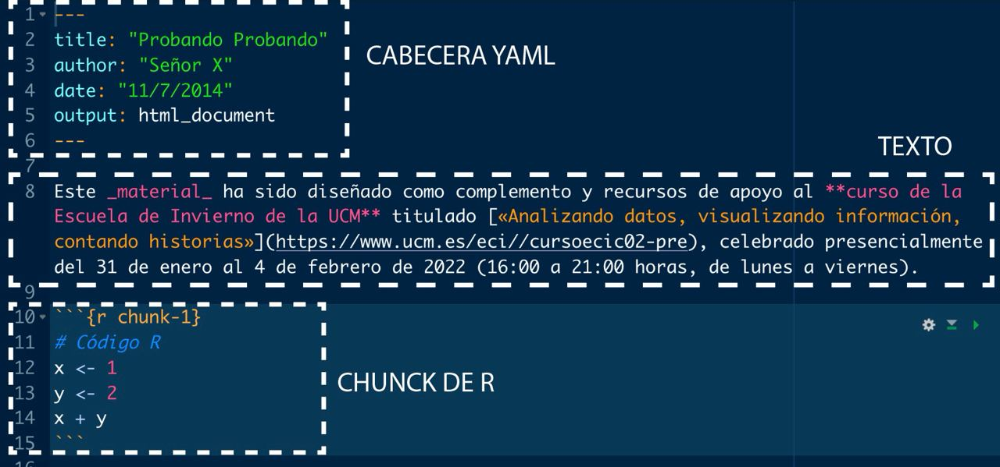
```


Un fichero `.Rmd` se divide básicamente en **tres partes**

* **Cabecera**: el inicio que hay entre `---` (los ajustes del documento general).
* **Texto**: texto escrito que con markdown podremos mejorar con **negritas** (escrito como `**negritas**`, con doble astérisco al inicio y final), _cursivas_ (`_cursivas_`, con barra baja al inicio y final) o destacar nombres de funciones o `variables de R`. Recuerda que puedes añadir además **ecuaciones** como $x^2$ (he escrito `$x^2$`, la ecuación entre dólares).
* **Código R**: las cajitas donde metamos nuestro código `R` se llamarán **chunks**.

**IMPORTANTE**: salvo que indiquemos lo contrario con **chunks**, todo lo que vamos a escribir en el documento es texto. No código R.

---

# Cabecera

La **cabecera están en formato YAML**, y contiene los **metadatos** del documento: título, autor, fecha, estilos (si los tuviésemos), etc. Vamos a cambiar la cabecera que nos ha generado por defecto de la siguiente forma:

* **Title**: `"Probando Probando"`
* **author**: `"Señor X"`
* **date**: `"11/7/2014"`
* **output**: `html_document`

Le indicamos el **formato de salida**, en este caso un **documento HTML**.


---

# Cuerpo de texto

Para empezar nuestro documento escribiremos, por ejemplo, la siguiente frase

> Este material ha sido diseñado como complemento y recursos de apoyo al curso de la Escuela de Invierno de la UCM titulado «Analizando datos, visualizando información, contando historias», celebrado presencialmente del 31 de enero al 4 de febrero de 2022 (16:00 a 21:00 horas, de lunes a viernes).

**Guardamos** el archivo `.Rmd` haciendo click en el botón Guardar y **tejeremos** nuestro documento haciendo click en el botón `Knit`.


---

# Añadiendo formato

Podemos **mejorar un poco el texto**:

* Vamos a añadir **negrita** a la frase `"curso de la Escuela de Invierno de la UCM"` (poniendo ** al inicio y al final).

--

* Vamos añadir **cursiva** a la palabra `"material"` (poniendo _ al inicio y al final).

--

* Vamos añadir un **enlace**, <https://www.ucm.es/eci//cursoecic02-pre>, asociándolo al título `«Analizando datos, visualizando información, contando historias»`. Para ello el título lo ponemos entre corchetes y justo detrás el enlace entre paréntesis [«Analizando datos, visualizando información, contando historias»](https://www.ucm.es/eci//cursoecic02-pre)


--


---

# Chunks de código


Nuestras **cajas de código** llamadas _chunks_ serán altos en el camino en nuestro texto _markdown_ donde podremos incluir código. Para incluir uno deberá de ir **encabezado** de la siguiente forma.

--


Dentro de la cajita **escribiremos código R**, como lo veníamos haciendo hasta ahora. Vamos por ejemplo a **definir dos variables y su suma**. Dentro de esos _chunks_ puedes **comentar código** como hacemos habitualmente con `#`.

Tras tejer de nuevo y obtenemos ahora un documento que tiene una caja de código y su salida, en este caso `x + y`.
 
---

# Etiquetando chunks

Los _chunks_ de código pueden tener un **nombre o etiqueta** para poder referenciarlos de nuevo (y para no repetir código). En la etiqueta no se pueden poner espacios, preferiblemente solo letras y guiones.


---

# Organizando el documento

El **documento podemos dividirlo en secciones y subsecciones**. Para ello usaremos la sintaxis de _markdown_, poniendo **almohadillas**: una `#` para secciones, `##` para subsecciones, `###` para subsubsecciones, etc. Vamos a crear una **sección principal** que sea `# Primer informe` y una **subsección** que se titule `## Chunks de código` donde incluiremos los dos chunks que tenemos hasta ahora.


También podemos **organizar nuestro documento** creando listas de ítems, usando `*` para cada uno de ellos.


---

# Ejecutando chunk a chunk

En cada _chunk_ aparece una botón de _play_: pulsándolo podemos tener la **ejecución y salida de cada chunk** en nuestro `.Rmd`, sin tener que esperar a «tejer» (con Knit) todo el documento para ver lo que vamos ejecutando.


Además **podemos incluir código R dentro de la línea de texto**.


---

# Personalizando chunks

Los _chunks_ podemos **personalizarlos** con algunas opciones, pasándolos como argumentos dentro de las llaves `{r etiqueta, ...}`.

* `include = FALSE`: se **ejecuta el código** pero **no se muestra** ni código ni resultados en la salida final (pero lo que se ejecuta puede ser usado en otros chunks futuros). Por ejemplo, `{r etiqueta, include = FALSE}`

* `echo = FALSE`: se **ejecuta el código** y se **muestra el resultado** pero **no el código** en la salida final. Por ejemplo, `{r etiqueta, echo = FALSE}`
 
* `eval = FALSE`: se **muestra** pero **no se ejecuta** el código en la salida final.

* `message = FALSE`: se **ejecuta el código** pero **no se muestran los mensajes** de salida que tendríamos en consola (en caso de existir).

* `warning = FALSE`: se **ejecuta el código** pero **no se muestran los warning** que tendríamos en consola (en caso de existir).

* `error = TRUE`: se **ejecuta el código** pero permite ejecutar el código **con errores** mostrando los mensajes de error que tendríamos en consola (en caso de existir).

Puedes ver las **diferentes salidas** en el archivo [primer_rmarkdown.Rmd](https://github.com/dadosdelaplace/courses-ECI-2022/blob/main/scripts/primer_rmarkdown.Rmd)


---

# Variables y ecuaciones

También podemos **incluir ecuaciones** haciendo uso de código latex (entre dolares `$$`), así como nombres de variables.


---
name: evaluacion
class: center, middle

# EVALUACIÓN

## **Práctica evaluable I: informes en Rmarkdown**

&nbsp;

En la carpeta [EVALUACIÓN](https://github.com/dadosdelaplace/courses-ECI-2022/tree/main/EVALUACI%C3%93N), accede al fichero `Evaluacion_1.Rmd` en la carpeta `PRÁCTICA I`. Dicho archivo es una plantilla de archivo `.Rmd` en el que se te hacen diferentes preguntas sobre un conjunto de datos y debes responderlas dentro del propio fichero y estructura `.Rmd`.

&nbsp;

La **entrega de las cinco prácticas** deberán ser enviadas por mail antes de las 23:59h del 11 de febrero, todas en un archivo comprimido (`.zip`, `.rar`, etc), con el nombre de el/la alumno/a.

---

class: center, middle

# Mañana más y mejor. ¡Muchísimas gracias a todos/as!

Las diapositivas han sido generadas con el paquete [**{xaringan}**](https://github.com/yihui/xaringan).


Los estilos (.css y .js) de estas diapositivas están basados en las diapositivas del repositorio <https://github.com/dieghernan/rpubs>

---

class: inverse center middle

# Bloque II: introducción al dataviz en R.

&nbsp;

### [Repaso](#repaso-1)

### [Tidy data: ordenando los datos](#tidy-data)

### [Introducción a Tidyverse](#tidyverse)

### [Dataviz e introducción a ggplot2](#dataviz)

### [Introducción a la estadística](#stats)

### [Caso práctico: análisis y dataviz de datos (cómics y chocolate)](#caso-practico-2)

### [🏅Evaluación](#evaluacion-2)

---

name: repaso-1
class: center, middle

# Repaso

Previously on Breaking Bad...


---

# Repaso: tipos de datos


.pull-left[

Imagen de https://medium.com/@tiwarigaurav2512
]

.pull-right[

* **Celdas**: numéricas, texto, lógicas, fecha, etc.

```{r}
numero <- 1
texto <- "hola"
var_logica <- texto == "adios"
var_logica
```

]

---

# Repaso: tipos de datos


.pull-left[

Imagen de https://medium.com/@tiwarigaurav2512
]

.pull-right[
* **Vectores**: variables, colección de celdas del mismo tipo.

```{r}
vector_num <- 1:3 # vector numérico

glue("variable_{vector_num}") # vector de texto

vector_num < 3 # vector lógico

length(vector_num) # Longitud vector

sum(vector_num) # Sumar vector numérico
```

]

---

# Repaso: tipos de datos


* **Matrices**: colección de variables, del mismo tipo e igual longitud.

```{r}
mat <- cbind("a" = 1:3, "b" = c(-1, 5, 6)) # construir matriz
mat

apply(mat, MARGIN = 2, FUN = mean) # media por columnas
```

---

# Repaso: tipos de datos


* **data.frame**: colección de variables, de igual longitud pero cualquier tipo.

```{r}
df <- data.frame("nombre" = c("javi", "mar", "carlos"),
                 "hermanos" = 1:3, "soltero" = c(TRUE, NA, FALSE),
                 "fecha_nac" = as.Date(c("1989-01-01", "1989-02-02",
                                         "1989-03-03")))
df
df$nombre
```

---

# Repaso: tipos de datos


* **tibble**: data.frame optimizado.

```{r}
tb <- tibble("a" = 1:3, "b" = 4:6, "c" = a * b)
tb
glimpse(as_tibble(df))
```

---

# Repaso: tipos de datos

* **listas** compendio de variables, de cualquier tipo y longitud.

```{r}
lista <- list("celda" = 1, "vec" = c(1, 3, 5), "df" = df)
lista
```

---

# Repaso: estructuras de control y extras

* `if-else`: si se cumple la condición, un camino; en otro caso, camino alternativo.
* bucles: repetir órdenes hasta un criterio de parada (bien hasta un numéro de iteraciones, bien hasta que se cumpla una condición)
* funciones: encapsular código.
* proyectos: organizar scripts.
* rmarkdown: presentación de resultados.


## Subset

* `subset`: **condición lógica** para **seleccionar registros (filas)**.
* `select`: un vector que contenga el **nombre de las columnas que queremos seleccionar**.

```{r}
subset(USArrests, subset = UrbanPop > 85, select = c("Murder", "Assault")) #<<
```

---

class: center, middle

# **¿DUDAS?**


---

name: tidy-data
class: center, middle

# Tidy data

## **Ordenando los datos**

&nbsp;

> Tidy datasets are all alike, but every messy dataset is messy in its own way (Hadley Wickham, Chief Scientist en RStudio).

---

# Tidy data: filosofía de trabajo

Hasta ahora solo le hemos dado importancia al «qué» pero no al **«cómo» manejamos los datos**.

```{r flujo-tidy-data2, echo = FALSE,  out.width = "60%", fig.align = "center", fig.cap = "Flujo deseable de datos según Hadley Wickham, extraída de https://r4ds.had.co.nz/wrangle-intro.html"}
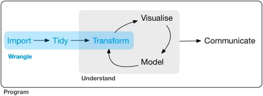
``` 

La **organización de nuestros datos** es fundamental para que su preparación y explotación sea lo más eficiente posible: la **limpieza y preprocesamiento** puede llevarnos hasta el 80% del tiempo en nuestro análisis si no se hace forma correcta (Dasu and Johnson 2003).

--

El concepto **tidy data** fue introducido por **Hadley Wickham** como el primer paso a realizar del entorno de paquetes que posteriormente se fueron desarrollando bajo el nombre de `{tidyverse}`, desarrollando un flujo de trabajo desde la carga hasta la visualización


---

# Tidy data

Los **conjuntos tidy o datos ordenados** tienen tres objetivos principales:

1. **Estandarización** en su estructura.
2. **Sencillez** en su manipulación.
3. Listos para ser **modelizados y visualizados**.

--

Para ello, los **datos ordenados o tidy data** deben cumplir:

* Cada **variable en una columna**.
* Cada **observación/registro/individuo en una fila** diferente.
* Cada **celda con un único valor**.
* Cada **conjunto** o unidad observacional conforma una **tabla**.

```{r tidy-data, echo = FALSE,  out.width = "67%", fig.align = "center", fig.cap = "Infografía con datos ordenados (tidy data) extraída de https://r4ds.had.co.nz/tidy-data.html"}
knitr::include_graphics("./img/tidy_data.png")
``` 

Lo contrario lo llamaremos **datos desordenados** o _messy data_. 

---

# Pipeline %>%

En este entorno de trabajo tendremos un **operador clave**: el **operador pipeline (%>%)**, el cual lo debemos interpretar como una **flecha que une nodos**, y nos servirá para **concatenar operaciones sobre un conjunto de datos de forma legible**. Por ejemplo, si tuviésemos tres funciones `first()`, `second()` y `third()`, la opción más inmediata sería anidar las tres funciones.

```{r eval = FALSE}
third(second(first(x)))
```

Con el **pipeline %>%** podremos escribir (y leer) la concetanción de izquierda a derecha

```{r eval = FALSE}
first(x) %>% second(x) %>% third(x)
```

&nbsp;

Dicho operador depende del paquete `{magrittr}`: para evitar esta dependencia (cuantos menos paquetes tengamos que cargar, mejor), desde la **versión 4.1.0 de R** disponemos de un operador pipeline nativo de R, el **operador |>** (disponible además fuera del entorno tidyverse).

Usaremos el **paquete `{tidyr}`** para pasar de _messy_ a _tidy data_

---

# Messy data: valores en el nombre

Veamos un primer ejemplo con el conjunto `table4a` del paquete `{tidyr}`.

```{r}
library(tidyr)
table4a
```

En este ejemplo de 3 filas y 3 columnas, tenemos dos columnas `1999` y `2000` que **no están representando cada una a una sola variable**: ambas son la misma variable, solo que medida en años distintos, **cada fila está representando dos observaciones (1999, 2000) en lugar de un solo registro**.

Lo que haremos será **incluir una nueva columna llamada `year`** que nos marque el año y otra `values` que nos diga el valor de la variable de interés en cada uno de esos años.

---

# pivot_longer: pivotando tablas


Con la función `pivot_longer` del mencionado paquete le indicaremos lo siguiente:

* `cols`: el **nombre de las columnas a pivotar** (con comillas porque son números, no texto como nombre).
* `names_to`: el nombre de la columna a la que vamos a mandar los valores que figuran ahora en los nombres de las columnas.
* `values_to`: el nombre de la columna a la que vamos a mandar los valores.

```{r}
table4a %>% pivot_longer(cols = c("1999", "2000"), names_to = "year",
                         values_to = "values") #<<
```

Ahora tenemos **un registro por fila, una variable por columna y cada celda representa un único valor**. Lo que hacemos con `pivot_longer()` es **«ampliar» la tabla haciéndola más larga (más filas)** pero con menos columnas.

---

# Segundo ejemplo: relig_income

```{r}
relig_income[1:3, ]
```

Salvo la primera, el **resto de columnas tienen como nombre los valores de una variable en sí misma (ingresos)**. Ahora en lugar de indicarle el nombre de todas vamos a indicarle **la columna que NO queremos pivotar**.

```{r}
# No necesitamos comillas en el nombre salvo que tengan caracteres que no sean letras
relig_income %>% pivot_longer(-religion, names_to = "ingresos", values_to = "frec") #<<
```

---

# Messy data: un registro en varias filas

Otro caso puede ser tener un mismo registro (datos de un mismo individuo) pero dividido en varias filas.

```{r}
table2[1:3, ]
```

Los registros con el mismo año deberían ser el mismo, es la misma información, pero están divididos en dos filas. Lo que haremos será lo opuesto a antes: con `pivot_wider()` **«ampliaremos» la tabla a lo ancho**

```{r}
table2 %>% pivot_wider(names_from = type, values_from = count) #<<
```

---

# Messy data: múltiples valores en celda

```{r}
table3
```

En la columna `rate` hay **guardados dos valores, separados por /**, lo que hace que en **una celda no tenga un único valor**. La función `separate()` nos permitirá **separar los múltiples valores de la columna** (por defecto **localiza como separador cualquier caracter que no sea alfa-numérico**)

```{r}
table3 %>% separate(rate, into = c("cases", "population")) #<<
```

---

# Messy data: múltiples valores en celda

Si **queremos un caracter concreto para dividir** podemos indicárselo explícitamente

```{r}
table3 %>% separate(rate, into = c("cases", "population"), sep = "/")
```

De la misma manera que **podemos separar columnas también podemos unirlas**. Para ello vamos a usar la tabla `table5`: con la función `unite()` vamos a **unir el siglo (en century) y el año (en year)**.

```{r}
table5 %>% unite(date, century, year) #<<
```

---

# Convertir al tipo adecuado

Una opción muy útil que podemos usar al **aplicar la separación de los múltiples valores** es **convertir los datos al tipo adecuado**. Los datos unidos en `rate` eran **caracteres** (no podían ser numéricos). Al separarlos, por defecto, aunque ahora ya son solo números, **los separa como si fueran textos**. Con `convert = TRUE` podemos indicarle que identifique el tipo de dato y lo convierta.

```{r}
table3 %>%
  separate(rate, into = c("cases", "population"), convert = TRUE)
```

---

# Ejercicios

.panelset[
.panel[.panel-name[Ejercicios]

* 📝 **Ejercicio 1**: convierte en _tidy data_ el siguiente _data.frame_.

```{r}
tabla_tb <- tibble("trimestre" = c("T1", "T2", "T3"),
                   "2020" = c(10, 12, 7.5),
                   "2021" = c(8, 0, 9))
```

* 📝 **Ejercicio 2**: convierte en _tidy data_ el siguiente _data.frame_.
 
```{r}
tabla_tb <- tibble("año" = c(2019, 2019, 2020, 2020, 2021, 2021),
                   "variable" = c("A", "B", "A", "B", "A", "B"),
                   "valor" = c(10, 9383, 7.58, 10839, 9, 32949))
```

* 📝 **Ejercicio 3**: convierte en _tidydata_ la tabla `table5` del paquete `{tidyr}`.

]

.panel[.panel-name[Solución Ej. 1]

El problema es que las dos columnas con nombres de año son en realidad valores que deberían pasar a ser variables, así que deberíamos disminuir aplicar `pivot_longer()`.

```{r}
library(tidyr)
tabla_tb <- tibble("trimestre" = c("T1", "T2", "T3"),
                   "2020" = c(10, 12, 7.5),
                   "2021" = c(8, 0, 9))

# Aplicamos pivot_longer
tabla_tb %>% pivot_longer(cols = c("2020", "2021"),
                          names_to = "año", values_to = "valores")
```


]


.panel[.panel-name[Solución Ej. 2]

El problema es que las filas que comparten año son el mismo registro (pero con dos características que tenemos divididas en dos filas), así que deberíamos disminuir aplicar `pivot_wider()`.

```{r}
tabla_tb <- tibble("año" = c(2019, 2019, 2020, 2020, 2021, 2021),
                   "variable" = c("A", "B", "A", "B", "A", "B"),
                   "valor" = c(10, 9383, 7.58, 10839, 9, 32949))

# Aplicamos pivot_wider
tabla_tb %>% pivot_wider(names_from = "variable",
                         values_from = "valor")
```

]

.panel[.panel-name[Solución Ej. 3]

Primero uniremos el siglo y las dos últimas cifras del año para obtener el año completo (guardado en año). Tras ello deberemos separar el valor del ratio en denominador y numerador (ya que ahora hay dos valores en una celda), y convertiremos el tipo de dato en la salida para que sea número.

```{r}
table5 %>%
  unite(año, century, year, sep = "") %>%
  separate(rate, c("numerador", "denominador"), convert = TRUE)
```

]

]


---

name: tidyverse
class: center, middle

# Introducción a tidyverse

## **Manipulando (para bien) los datos**

&nbsp;

El conjunto de paquetes de `{tidyverse}` supuso un antes y un después en el preprocesamiento de los datos en `R`

---

# Entorno tidyverse

Aunque conocemos ya un formato amable de almacenar los datos, muchas veces los **datos no los tenemos en el formato deseado**, o directamente queremos realizar algunas **transformaciones en los mismos**. Para trabajar con los datos vamos a cargar `{tidyverse}`, un **entorno de paquetes para el manejo de datos**.

```{r eval = FALSE}
install.packages("tidyverse") # SOLO la primera vez
library(tidyverse)
```

```{r include = FALSE}
library(tidyverse)
```

```{r flujo-tidyverse, echo = FALSE,  out.width = "60%", fig.align = "center", fig.cap = "Imagen extraída de https://sporella.github.io/datos_espaciales_presentacion/#30"}
knitr::include_graphics("https://dadosdelaplace.github.io/courses-ECI-2022/img/flujo_tidyverse.png")
``` 

---

# Entorno tidyverse

El **entorno tidyverse** es una de las **herramientas más importantes en el manejo de datos en R**, una c**olección de paquetes** pensada para el manejo, la exploración, el análisis y la visualización de datos, **compartiendo una misma filosofía y gramática**.

```{r flujo-tidyverse-2, echo = FALSE,  out.width = "90%", fig.align = "center", fig.cap = "Imagen extraída de https://www.storybench.org/getting-started-with-tidyverse-in-r/"}
knitr::include_graphics("https://dadosdelaplace.github.io/courses-ECI-2022/img/flujo_tidyverse_1.png")
``` 

---

# Paquetes de tidyverse

* `{tidyr}`: para **adecuar los datos a tidy data**

* `{tibble}`: **mejorando los data.frame** para un manejo más eficiente.

* Paquetes `{readr}` para una **carga rápida y eficaz de datos rectangulares** (formatos .csv, .tsv, etc). Paquete `{readxl}` para **importar archivos .xls y .xlsx**. Paquete `{haven}` para importar archivos desde **SPSS, Stata y SAS**. Paquete `{httr}` para **importar desde web**. Paquete `{rvest}` para **web scraping**.

* `{dplyr}`: una **gramática de manipulación de datos** para facilitar su procesamiento.

* `{ggplot2}`: una **gramática para la visualización** de datos.

* Paquete `{stringr}` para un manejo sencillo de **cadenas de texto**. Paquete `{forcast}` para un manejo de **variables cualitativas** (en R conocidas como factores).

* `{purrr}`: manejo de **listas**.

* `{lubridate}` para el **manejo de fechas**.

&nbsp;

Puedes ver su **documentación completa** en <https://www.tidyverse.org/>.

---

# Intro a tidyverse: conjunto starwars

Para nuestra **introducción de tidyverse** vamos a trastear con el conjunto de datos `starwars` del paquete `{dplyr}` (incluido en `{tidyverse}`).


.pull-left[

```{r luke-starwars, echo = FALSE,  out.width = "90%", fig.align = "left", fig.cap = "Imagen extraída de https://rstudio-education.github.io/"}
knitr::include_graphics("https://rstudio-education.github.io/bootcamper/slides/02-visualize-data/img/luke-skywalker.png")
``` 
]

.pull-right[

```{r}
starwars
```

]

---

# Intro a tidyverse: conjunto starwars


```{r}
glimpse(starwars) #<<
```

Dicho conjunto de datos, extraído de la [Star Wars API](https://swapi.dev/), recopila **14 variables para 87 personajes de Star Wars**. 

```{r}
dim(starwars)
```

---

# Intro a tidyverse: conjunto starwars

```{r}
print(starwars, n = 3, width = Inf)
```

* `int`: números enteros (`height`).
* `dbl`: números reales (`mass`, `birth_year`).
* `chr`: cadenas de texto (`name`, `hair_color`, `skin_color`, `eye_color`, `sex`, `gender`, `homeworld`, `species`).
* `list`: listas (`films`, `vehicles`, `starships`).

---

# Intro a tidyverse: conjunto starwars

Para los **datos de tipo lista** tenemos guardados las películas de cada personaje, los vehículos de cada uno y las naves de cada personaje. Por ejemplo, con `starwars$films` podemos extraer las películas en las que aparecen los tres primeros personajes, basta con ejecutar (del conjunto starwars –> accedemos a la variable films con `$`)

```{r}
starwars$films[1:3]
```

---

# dplyr: manipulando datos

```{r dplyr, echo = FALSE,  out.width = "63%", fig.align = "center", fig.cap = "Cheet sheet de las opciones del paquete dplyr para la manipulación de datos extraída de https://github.com/rstudio/cheatsheets/blob/master/data-transformation.pdf"}
knitr::include_graphics("https://dadosdelaplace.github.io/courses-ECI-2022/img/dplyr.png")
``` 

---

# Operaciones con filas: seleccionar

Una de las **operaciones más comunes** es **filtrar registros**: de todos los individuos de nuestro conjunto de datos, seleccionaremos parte de ellos. Para hacerlo tenemos principalmente **tres opciones**:

* **Seleccionar en base a algún filtro lógico**: con `filter()`, se seleccionarán solo individuos que cumplan ciertas condiciones (por ejemplo, solo los mayores de tal edad). Dentro de `filter()` se incluirán las condiciones lógicas a cumplir.


Por ejemplo, vamos a **filtrar solo aquellos personajes con ojos marrones**, es decir, con la condición `eye_color == "brown"`.

```{r}
starwars %>% filter(eye_color == "brown") #<<
```

---

# Operaciones con filas: filter()

Con `%>% filter()`, en **tan solo una línea**, hemos hecho más de lo que parece: `R` ha «recorrido» (algo similar a un bucle) cada una de las filas y ha ido comprobando que filas cumplen la condición y cuales no.

El operador de comparación `==` puede ser **cambiado por `!=`** (seleccionamos los que **NO TIENEN ojos marrones**).

```{r}
starwars %>% filter(eye_color != "brown")
```


---

# Operaciones con filas: filter()

También se pueden **seleccionar los personajes** que tienen los **ojos de una serie de colores** permitidos: con `%in%` le indicaremos que seleccione solo aquellas filas cuyo valor de la variable `eye_color` esté **dentro de un conjunto de candidatos**.

```{r}
starwars %>% # con ojos marrones, azules o rojos
  filter(eye_color %in% c("brown", "blue", "red"))
```
  
---

# Operaciones con filas: filter()

Si es una variable numérica también podemos **seleccionar por rango** con `between()`, por ejemplo, los personajes cuya altura está **entre** 120 y 160 cm.

```{r}
# Con between filtramos por rango
starwars %>% filter(between(height, 120, 160))
```

---

# Operaciones con filas: filter()

Las condiciones se pueden **concatenar** todo lo que queramos, pudiendo en pocas líneas realizar un filtro complejo, por ejemplo, seleccionando los **personajes con ojos marrones Y ADEMÁS NO humanos**.

```{r}
starwars %>% filter(eye_color == "brown" & species != "Human")
```

Otro ejemplo: ojos azules o rojos, que no sean humanos, y con menos de 50 años.

```{r}
starwars %>%  filter(eye_color %in% c("blue", "red") & species != "Human" & birth_year < 50)
```

---

# Operaciones con filas: seleccionar

Una de las **operaciones más comunes** es **filtrar registros**: de todos los individuos de nuestro conjunto de datos, seleccionaremos parte de ellos. Para hacerlo tenemos principalmente **tres opciones**:


* **Seleccionar por su índice de fila**: con `[]` o `slice()`, se seleccionarán los individuos que ocupen cierta posición en la tabla (la fila que ocupa tal personaje).


```{r}
# slice: extramos filas por índice de fila.
starwars %>% slice(1) #<<
starwars[1, ]
```

---

# Operaciones con filas: slice()


Podemos **extraer varias a la vez**, por ejemplo, filtrando las filas quinta, séptima y novena.

```{r}
# slice: extramos filas por índice de fila.
starwars %>% slice(c(5, 7, 9))
```

También podemos **usar una secuencia de índices a extraer**, por ejemplo solo las filas pares.

```{r}
starwars %>% slice(seq(2, 8, by = 2)) # filas pares hasta la octava
```

---

# Operaciones con filas: slice()

Disponemos además de opciones por defecto para directamente **extraer las m primeras o últimas filas** con `slice_head()` y `slice_tail()`.

```{r}
# Podemos extraer directamente las primeras o últimas filas
starwars %>% slice_head(n = 3) # 3 primeras filas 
```

```{r}
starwars %>% slice_tail(n = 2) # 2 últimas filas 
```

---

# Operaciones con filas: seleccionar

Una de las **operaciones más comunes** es **filtrar registros**: de todos los individuos de nuestro conjunto de datos, seleccionaremos parte de ellos. Para hacerlo tenemos principalmente **tres opciones**:

* **Seleccionar aleatoriamente**: con `slice()`, se seleccionarán los individuos aleatoriamente.
 
```{r}
# También podemos hacer una extracción al azar de filas
starwars %>% slice_sample(n = 3) # 3 al azar
starwars %>% slice_sample(n = 3) # 3 al azar nuevas
```

---

# Operaciones con filas: slice_min()

También tenemos `slice_min()` y `slice_max()` que nos permite **extraer filas en función del mínimo y máximo de una variable** (si hay empate, mostrará todas las filas aunque supere el número indicado, salvo que `with_ties = FALSE`). Por ejemplo, vamos a filtrar con `slice_min(height, n = 2)` los 2 personasjes más bajitos, y con `slice_max(mass, n = 3)` los 2 personajes más pesados.

```{r}
# Podemos extraer filas en función del mín/máx de una variable
starwars %>% slice_min(height, n = 2) # los 2 más bajitos
starwars %>% slice_max(mass, n = 2) # los 3 más pesados
```

---

# Operaciones con filas: reordenar

Otra operación habitual en las filas es **ordenarlas en función del valor de alguna de las variables** con `arrange()`,  pasándole como argumento el nombre de la variable que usaremos para la ordenación. Por ejemplo, vamos a ordenar nuestra **tabla de personajes por altura, de bajitos a altos**.

```{r}
# Con arrange ordenamos en base al orden de la variable que introduzcamos
starwars %>% arrange(height) #<<
```

---

# Operaciones con filas: reordenar

Por defecto la ordenación es de menor a mayor pero podemos invertirlo usando `desc()`.

```{r}
# Por defecto lo hace ascendente pero podemos cambiarlo
starwars %>% arrange(desc(height))
```

---

# Operaciones con filas: reordenar

La ordenación también puede **realizarse en base al valor de dos o más variables**: ordenará las filas en base a la primera, en caso de empate usará la segunda, en caso de empate la tercera, y así sucesivamente. Vamos a ordenar los personajes por altura y, luego, por peso.

```{r}
# Un dato NA va siempre al final
starwars %>% arrange(height, desc(mass))
```

---

# Ejercicio

Como estarás imaginando podemos combinar varias acciones en pocas líneas, filtrando a la vez que ordenamos el filtro resultante. 

.panelset[
.panel[.panel-name[Ejercicio]


* 📝 Selecciona solo los personajes que sean humanos, hombres y de ojos marrones, para después ordernarlos en altura descendente y peso ascendente.

]

.panel[.panel-name[Solución]

```{r}
# Podemos combinar varias acciones en pocas líneas
starwars %>%
  filter(eye_color == "brown",
         species == "Human", sex == "male") %>%
  arrange(height, desc(mass))
```

]
]

---

# Operaciones con filas: eliminar

La misma lógica que hemos usado para seleccionar filas podemos usarla para **eliminar filas** con `slice()`, simplemente **negando** la condición de filtrado. Por ejemplo, vamos a eliminar las 5 primeras filas.

```{r}
# Eliminamos por índices
starwars %>% slice(-(1:5)) # eliminamos las 5 primeras filas
```

---

# Operaciones con filas: duplicados

Otra opción es **eliminar filas duplicadas** con `distinct()`, pasándole como argumentos el nombre de las variables que usaremos para quitar duplicados, por ejemplo, aquellos personajes con igual par de color de pelo y ojos.

```{r}
# Eliminamos registros con igual par (color_pelo, color_ojos)
starwars %>%
  distinct(hair_color, eye_color)
```
  
---

# Operaciones con filas: duplicados

Por defecto, solo ha extraído las dos columnas en base a las cuales hemos eliminado duplicados. Si queremos que nos mantenga todas deberemos explicitarlo con `.keep_all = TRUE`.

```{r}
# Eliminamos duplicados
starwars %>% # Eliminamos registros con igual par (color_pelo, color_ojos)
  distinct(hair_color, eye_color, .keep_all = TRUE)
```

---

# Operaciones con filas: añadir

No suele ser habitual pero si quisiéramos añadir un nuevo registro manualmente, podremos hacerlo con `bind_rows()`, asegurándonos que las **variables en el nuevo registro son las mismas que en el original**. Por ejemplo, vamos a añadir al fichero original los 3 primeros registros (al final).

```{r}
starwars_nuevo <- bind_rows(starwars, starwars[1:3, ]) #<<
dim(starwars)
dim(starwars_nuevo)
```

---

# Operaciones con columnas: seleccionar

La opción más sencilla para **seleccionar variables/columnas** es usar `select()`, pasándole como argumentos los nombres de columnas (¡SIN COMILLAS!) que queremos seleccionar, por ejemplo, color de pelo.

```{r}
# seleccionamos solo 1 columna: color de pelo
starwars %>% select(hair_color) #<<
```

---

# Operaciones con columnas: seleccionar

Podemos **seleccionar varias a la vez concatenando sus nombres**, por ejemplo, seleccionando las variables de color de pelo, piel y ojos.

```{r}
# seleccionamos solo 3 columnas: pelo, piel y ojos
starwars %>% select(c(hair_color, skin_color, eye_color))
```

---

# Operaciones con columnas: seleccionar

La misma lógica podemos aplicar para **deseleccionar**, excluyendo columnas

```{r}
# sin 3 columnas: pelo, piel y ojos
starwars %>% select(-c(hair_color, skin_color, eye_color))
```

---

# Operaciones con columnas: seleccionar

Las columnas también las podemos **seleccionar a través de expresiones regulares**, por ejemplo, seleccionando solo aquellas columnas que compartan un **sufijo común** en el nombre, con `ends_with()` dentro de órdenes como `select()`

```{r}
# Podemos seleccionar columnas por sufijo y prefijo
starwars %>% select(ends_with("color")) # acaban en "color"
```


---

# Operaciones con columnas: seleccionar

De una manera similar podemos seleccionar columnas cuyo **nombre empiecen o contengan alguna cadena de texto concreta**, con `starts_with()` o `contains()`.

```{r}
starwars %>% select(starts_with("h")) # empiezan por h
```

---

# Operaciones con columnas: seleccionar

Incluso nos permite **seleccionar aquellas columnas que son del mismo tipo** (imagina que necesitamos solo las columnas numéricas para calcular ciertas estadísticas) con `where()`.

```{r}
# Seleccionamos solo la columnas numéricas
starwars %>% select(where(is.numeric))
```

---

# Visualizar el flujo de datos

Existe una **reciente herramienta** que nos va a permitir **entender mejor y visualizar el flujo de trabajo** en `{tidyverse}`: <https://tidydatatutor.com/>. 
Basta con poner el código que queremos ejecutar, y nos **muestra visualmente las operaciones en los datos**.


---

# Operaciones con columnas: renombrar

A veces también podemos querer **modificar la «metainformación» renombrando el orden** de las columnas. Para ello debremos usar la función `rename()` poniendo **primero el nombre nuevo y luego el antiguo**. Como ejemplo, vamos a traducir el nombre de las columnas `name, height, mass` a castellano.

```{r}
# rename: renombrar columnas, primero el nuevo y luego el antiguo
starwars %>% rename(nombre = name, altura = height, peso = mass)
```

---

# Operaciones con columnas: renombrar

Muchas de las funciones pueden ir acompañadas de `at` o `if`, como `rename_if`, que nos permite hacer operaciones más personalizadas. Por ejemplo, vamos a renombrar las columnas, pasándolas a mayúscula con toupper, pero solo aquellas que sean de tipo numérico.

```{r}
starwars %>% rename_if(is.numeric, toupper)
```

---

# Operaciones con columnas: reordenar

De la misma manera podemos **reordenar las columnas**, indicando el nombre de columnas que queremos mover, y con `.after` o `.before` para indicar antes o después de que columnas queremos moverlas.

```{r}
starwars %>% # altura y masa detrás de color de piel
  relocate(height, mass, .after = skin_color) 
```

  
---

# Crear nuevas variables (mutate)

A veces no queremos modificar variables ya existentes sino **crear nuevas variables** en base a las ya existentes. Para ello tenemos `mutate()`. Para empezar, vamos a crear una **nueva variable** `height_m` con la altura en centímetros.

```{r}
# altura en metros
starwars %>% mutate(height_m = height / 100) %>%
  relocate(height_m, .after = height)
```

---

# Crear nuevas variables (mutate)

Otra opción es **quedarnos solo con las columnas nuevas** creadas con `transmute()`

```{r}
starwars %>% transmute(height_m = height / 100)
```

---

# Crear nuevas variables (mutate)

También se pueden aplicar **funciones más complejas** como `map()` del paquete `{purrr}` para el manejo de **listas** (no se pueden vectorizar, esta función nos permite aplicar operaciones a listas elemento a elemento). Imagina que queremos **calcular el número de películas** en las que sale cada personaje.

&nbsp;

Las películas de cada personaje están en una lista: para saber la **cantidad de películas** en las que ha participado el primer personaje basta con usar el comando `length()` (nos dará el número de elementos de cada lista).

```{r}
length(starwars$films[1])
length(starwars$films[2])
```

---

# Crear nuevas variables (mutate)

**¿Cómo aplicar dicha a función a cada personaje?** Con `map_int()` (para que nos devuelva un vector de `int`) y la función a aplicar en cada elemento.

```{r}
# Mapeamos la lista con length pero devolvemos un vector de números enteros
starwars$films %>% map_int(length)
```


&nbsp;

Tenemos también otras funciones como `map_chr()`, `map_dfr()`, etc, que nos definen como será la salida (con `map` a secas lo devuelve en una lista).

```{r}
starwars$films %>% map_chr(length)
```

---

# Crear nuevas variables (mutate)

Una vez que tenemos una forma de calcular la variable que queremos, lo añadimos con `mutate()`

```{r}
starwars %>%
  mutate("n_peliculas" = map_int(films, length)) %>%
  select(c(name, homeworld, n_peliculas))
```

  
---

# Recategorizar variables

Una operación también muy habitual es querer **recategorizar nuestras variables**: tenemos categorías ya existentes o variables numéricas que queremos convertir a **categorías (factores en R)**. Supongamos por ejemplo que queremos crear una **categoría en función de su altura**: menos de 120, entre 120 y 180, y más de 180. Para ello podemos podemos usar `cut()`, y en el argumento `breaks` le debemos indicar los **«cortes» o saltos de la variable**.

```{r}
starwars %>%
  mutate("estat_cat" = cut(height, breaks = c(-Inf, 120, 180, Inf))) %>%
  relocate(estat_cat, .after = height)
```

---

# Recategorizar variables

Si queremos que **las categorías tenga nun nombre explícito** (y no el intervalo en sí), podemos indicárselo en `labels =` el vector de nombres de las categorías.

```{r}
starwars %>%
  mutate("estat_cat" = cut(height, breaks = c(-Inf, 120, 180, Inf),
                           labels = c("bajos", "medios", "altos"))) %>%
  relocate(estat_cat, .after = height)
```

---

# Recategorizar variables

Otra opción para no anidar es `case_when`, en el que le podemos indicar que valores asignamos en función de condiciones. Vamos a crear una variable nueva altura

* Si `height > 180` –> serán `"altos"`.
* Si `height <= 180` y `height > 120` –> serán `"bajos"`
* Si `height <= 120` y `height > 0` –> serán `"enanos"`
* Si no se cumple lo anterior –> serán `"ausentes"`

```{r}
starwars %>%
  transmute(altura = case_when(height > 180 ~ "altos",
                               height > 120 ~ "bajos",
                               height > 0 ~ "enanos",
                               TRUE ~ "ausentes"))
```
  
                        
---

# Datos ausentes

Por último, podemos **eliminar los registros ausentes** en alguna de sus variables con `drop_na()`.

```{r}
starwars %>% drop_na()
```

Podemos indicarle que nos elimine con datos ausentes solo en algunos campos en concreto.

```{r}
starwars %>% drop_na(mass, height, sex, gender, birth_year)
```


---

# Ejercicios


.panelset[
.panel[.panel-name[Ejercicios]


* 📝 **Ejercicio 1**: del conjunto `starwars` encuentra todos los personajes cuyo peso esté entre 60kg y 90kg y que además tengan los ojos que no sean azules.
 
* 📝 **Ejercicio 2**: añadido al anterior, encuentra todos los personajes que además tengan menos de 100 años.
 
* 📝 **Ejercicio 3**: selecciona además solo  `name, mass, height, eye_color, birth_year`.
 
* 📝 **Ejercicio 4**: añadido al filtro anterior, ordena los registros de más pesados a más ligeros, y al revés.
 
* 📝 **Ejercicio 5**: añadido al filtro anterior, ordena los registros (en orden ascendente) por altura y peso.
 
* 📝 **Ejercicio 6**: selecciona solo las columnas que contengan variables numéricas, coloca los años de nacimiento como primera columna y cambia los nombres a castellano.
 
* 📝 **Ejercicio 7**: calcula una nueva columna que indique el IMC de cada personaje (define antes una función).

* 📝 **Ejercicio 8**: selecciona los 3 personajes que en más películas han salido y los 3 que menos.
 
* 📝 **Ejercicio 9**: selecciona solo las columnas que se refieren a variables de color (ojos, piel, pelo) (con sufijo "color")

]

.panel[.panel-name[Sol. 1]

```{r}
# todas columnas
filtro <-
  starwars %>% filter(between(mass, 60, 90) & eye_color != "blue")
print(filtro, width = Inf)
```

]

.panel[.panel-name[Sol. 2]

```{r}
filtro <-
  starwars %>%
  filter(between(mass, 60, 90) & eye_color != "blue" &
           birth_year < 100)
print(filtro, width = Inf)
```

]

.panel[.panel-name[Sol. 3]

```{r}
# Solo name, mass, height, eye_color, birth_year
filtro %>% select(c(name, mass, height, eye_color, birth_year))
```

]

.panel[.panel-name[Sol. 4]

```{r}
filtro %>% select(c(name, mass, height, eye_color, birth_year)) %>%
  arrange(mass)
```

```{r}
filtro %>% select(c(name, mass, height, eye_color, birth_year)) %>%
  arrange(desc(mass))
```

]

.panel[.panel-name[Sol. 5]

```{r}
filtro %>% select(c(name, mass, height, eye_color, birth_year)) %>%
  arrange(height, mass)
```

]

.panel[.panel-name[Sol. 6]

```{r}
starwars %>%
  select(where(is.numeric)) %>%
  relocate(height, mass, .after = birth_year) %>%
  rename(edad = birth_year, altura = height, peso = mass)
```

]

.panel[.panel-name[Sol. 7]

Primero definimos la función `IMC_fun` (calcula el IMC dada estatura y peso).

```{r}
IMC_fun <- function(m, h) {
  
  return(m / h^2)
}
IMC_fun(90, 1.6)
```

La función definida como `IMC_fun()` podemos ahora aplicarla dentro del `mutate()`.

```{r}
starwars %>%
  mutate(height_m = height / 100,
         IMC = IMC_fun(mass, height_m)) %>%
  # Las movemos al inicio (por defecto las mete al final)
  relocate(height_m, IMC, .after = name)
```

]

.panel[.panel-name[Sol. 8]

 
```{r}
starwars  %>%
  mutate(n_films = map_int(films, length)) %>%
  slice_max(n_films, n = 3)
```

```{r}
starwars  %>%
  mutate(n_films = map_int(films, length)) %>%
  slice_min(n_films, n = 3)
```

]

.panel[.panel-name[Sol. 9]

```{r}
# Contiene "color" independientemente de que sea sufijo o prefijo
starwars %>% select(contains("color"))
```

]
]

---

name: dataviz
class: center, middle

# Dataviz e introducción a ggplot2

## **La gramática de los gráficos**

&nbsp;

El paquete `{ggplot2}` se basa en la idea propuesta en «Grammar of graphics» del recién fallecido Wilkinson.

---

# Breve historia del dataviz


## Punto de partida: los mapas


Podríamos considerar a los **mapas** como las primeras **visualización de datos**, con la representación de nuestra realidad en **superficies bidimensionales** <sup>1</sup>, usando sistemas de coordenadas para resumir o proyectar la realidad.

&nbsp;

Las propias palabras _chart_ y _cartography_ derivan del mismo origen latino, _charta_, así como otros términos matemáticos relacionados como contornos, niveles, curvas, escalas o dominios <sup>2</sup>, aunque el primer uso datado de coordenadas parece venir de los egipcios. <sup>3</sup>

.footnote[[1] [«Gramática de las gráficas: pistas para mejorar las representaciones de datos» de Joaquín Sevilla](http://academica-e.unavarra.es/bitstream/handle/2454/15785/Gram%C3%A1tica.pdf)

[2] [«Presentation Graphics» de Leland Wilkinson. International Encyclopedia of the Social & Behavioral Sciences](https://www.cs.uic.edu/~wilkinson/Publications/iesbs.pdf)

[3] [«Quantitative Graphics in Statistics: A Brief History» de James R. Beniger y Dorothy L. Robyn. The American Statistician (1978)](https://www.jstor.org/stable/2683467)]


---

# Breve historia del dataviz

La **visualización de datos** o _dataviz_ está muy ligada a la evolución de ramas que han acabado convergiendo en paralelo:

* La **producción de los datos**: hasta no hace mucho, el dato no era usado ni generado para explicar a la población sino para «uso interno».

* La **estadística** (convertir el dato en información).

* La **tecnología**: cómo cualquier acto de comunicación visual, está tremendamente condicionado a los medios técnicos.

* La **comunicación**: no es lo mismo producir una visualización para un periódico en papel (no editable) que para un formato digital.

&nbsp;

Parte de esta introducción está basada en

[«Gramática de las gráficas: pistas para mejorar las representaciones de datos» de Joaquín Sevilla](https://academica-e.unavarra.es/bitstream/handle/2454/15785/Gram%C3%A1tica.pdf)

«The Functional Art: an introduction to information graphics and visualization» de Alberto Cairo.

[«Quantitative Graphics in Statistics: A Brief History» de James R. Beniger y Dorothy L. Robyn. The American Statistician (1978)](https://www.jstor.org/stable/2683467)]


---

# Breve historia de la estadística

.pull-left[
* Del (neo)latín «statisticum collegium»: consejo de **Estado**.
* Del alemán «statistik» (ciencia del **Estado**, intoducido por G. Achenwall).

&nbsp;

**Origen**: una herramienta para la **administración** eficiente del Estado

&nbsp;

Hasta no hace tanto, la mayoría de usos de la Estadística eran para una gestión de los recursos públicos, pero **sin intención de comunicar ni de convertir el dato en información**.

]


.pull-right[
```{r echo = FALSE, out.width = "90%", fig.align = "center"}
knitr::include_graphics("./img/biblia.jpg")
```
]

---

# Breve historia de la estadística

## Primeros usos: elaboración de censos

Los **primeros usos** documentados de la estadística fueron la elaboración de **censos** por parte de **mesopotámicos, chinos y egipcios**, con tres fines:

* Cobrar **impuestos** (un saludo, Willyrex).
* Reparto de **tierras** y optimización de su uso.
* **Reclutamiento de soldados**.

## Estadística en la guerra

.pull-left[Según Tucídides, conceptos estadísticos como la **moda** datan del **siglo V a.C.**: para asaltar la muralla de la ciudad de Platea, ponían a contar a varios soldados el número de ladrillos vistos en la muralla, quedándose con el **conteo más repetido (la moda, el más frecuente)**, permitiendo el cálculo de la altura de la muralla.]

.pull-right[
```{r echo = FALSE, out.width = "70%", fig.align = "center"}

```
]

---

# ¿Qué han hecho los romanos por nosotros?


.pull-left[

Precisamente por el tamaño de su Imperio, fueron los **romanos** quienes hicieron un uso más intenso de la estadística:

* **Censos** (elaborados por la censura, que elaboraba no solo el censo sino la supervisión de la moralidad pública).
* Primeras **tablas de natalidad/mortalidad**
* Primeros **catastros** (registros oficiales de propiedades, primeros impuestos)

```{r echo = FALSE, out.width = "60%", fig.align = "center"}
knitr::include_graphics("./img/catastro.jpg")
```

]

.pull-right[

```{r echo = FALSE, out.width = "95%", fig.align = "left"}
knitr::include_graphics("https://www.publico.es/tremending/wp-content/uploads/2019/02/lifeofbrian3.jpg")
```

]

---

# Breve historia de la estadística

.pull-left[

## **ÁRABES**

Autores de los **primeros tratados de estadística**, como el manuscrito de **Al-Kindi (801-873)**, que usó la distribución de **frecuencias de palabras** para el desarrollo de métodos de cifrado y descifrado de **mensajes encriptados**.

]

.pull-right[

## **MÉXICO**

Ya en el **año 1116, el rey Xólotl** implementó un **censo** que consistía en la **estimación de piedras**, tirando cada súbdito una a un montón (Nepohualco).
]


&nbsp;

.pull-left[

## **INGLATERRA**

Desde el siglo XII se realiza la **Prueba del Pyx**, considerado uno de los **primeros controles de calidad**: se extre una de las monedas acuñadas y se deposita en una caja, para un año después comprobar su calidad y pureza.

]

.pull-right[

## **ITALIA**

En paralelo al **auge de los primeros «sistemas financieros» en Italia**, «La Nuova Crónica» de G. Villani fue considerado durante mucho tiempo el primer tratado de estadística (hasta el descubrimiento de los trabajos de Al-Kindi).

]

---

# Navegación y astronomía

Y es de aquella época medieval, en la que la navegación y la astronomía empezaban a tomar relevancia científica, cuando aparece la que se considera la primera gráfica (aunque no propiamente estadística) <sup>3</sup>, representando el **movimiento cíclico de los planetas** (entre los siglos X y XI)

```{r echo = FALSE,  out.width = "60%", fig.align = "center", fig.cap = "Gráfica extraída de Beniger y Robyn (1978)"}
knitr::include_graphics("./img/dataviz_historico_1.png")
``` 

[3] [«Quantitative Graphics in Statistics: A Brief History» de James R. Beniger y Dorothy L. Robyn. The American Statistician (1978)](https://www.jstor.org/stable/2683467)

 
---

# Navegación y astronomía

Con una motivación similar, en torno a 1360 el matemático **Nicole Oresme** diseñó el **primer gráfico de barras** (no estadístico), con la idea de **visualizar a la vez dos magnitudes físicas teóricas**.


```{r echo = FALSE,  out.width = "30%", fig.align = "center", fig.cap = "Gráfica extraída de Friendly y Valero-Mora (2010), de «Tractatus De Latitudinibus Formarum»"}
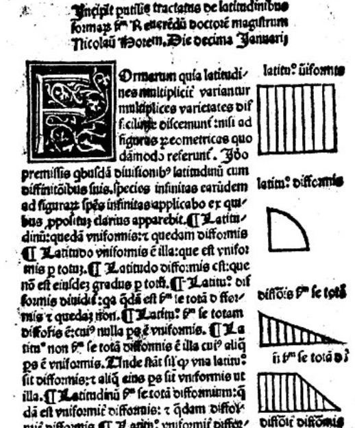
``` 

[5] [«The First (Known) Statistical Graph: Michael Florent van Langren and the 'Secret' of Longitude» de M. Friendly y P. M. Valero-Mora. The American Statistician (2010)](https://www.researchgate.net/publication/227369016_The_First_Known_Statistical_Graph_Michael_Florent_van_Langren_and_the_Secret_of_Longitude)

 
---

# Primer gráfico estadístico

La mayoría de expertos, como Tufte <sup>6,7</sup>, consideran **este gráfico** casi longitudinal como la **primera visualización de datos** de la historia, hecha por **van Langren** en 1644, representando la **distancia (en longitud) entre Toledo y Roma** (un poco mal medida ya que la distancia real es de 16.5º).

```{r echo = FALSE,  out.width = "45%", fig.align = "center", fig.cap = "Gráfica original extraída de Friendly y Valero-Mora (2010)"}
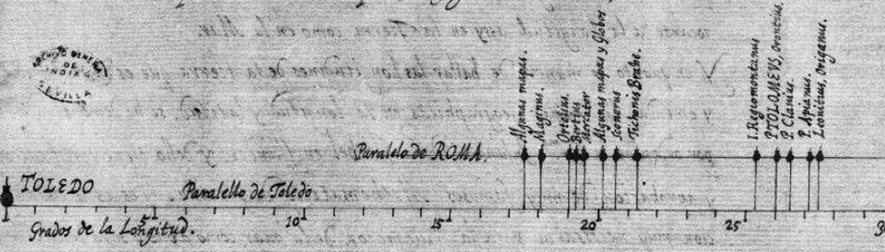
``` 

```{r echo = FALSE,  out.width = "45%", fig.align = "center", fig.cap = "Adaptación extraída de Friendly y Valero-Mora (2010)"}
knitr::include_graphics("./img/dataviz_historico_3.jpeg")
``` 

[6] [«Visual explanations: images and quantities, evidence and narrative» de E. Tufte](https://archive.org/details/visualexplanatio00tuft)

[7] [«PowerPoint is evil» de E. Tufte](https://www.wired.com/2003/09/ppt2/)

---

# ¿Qué es una gráfica estadística?

¿Por qué ese gráfico se considera la primera visualización estadística de la historia? ¿Qué es lo que hace que una visualización sea una gráfica estadística? **¿Cuál es la frontera entre una ilustración y una gráfica (de datos)?**

&nbsp;

Esas mismas preguntas se hizo **Joaquín Sevilla** en su manual <sup>1</sup>, argumentando que deben cumplir **3 requisitos**:

1. Que se base en el esquema de composición de **eje métrico** (proceso de medida): **no cualquier dibujo que incluya números** lo podemos denominar «gráfica estadística». 

.pull-left[

```{r echo = FALSE,  out.width = "55%", fig.align = "center", fig.cap = "INFOGRAFÍA extraída del manual de Joaquín Sevilla"}
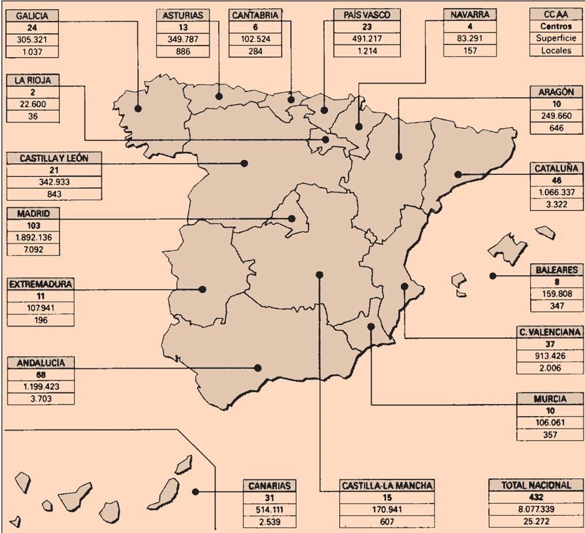
``` 

]

.pull-right[

```{r echo = FALSE,  out.width = "53%", fig.align = "center", fig.cap = "GRÁFICA extraída del manual de Joaquín Sevilla"}
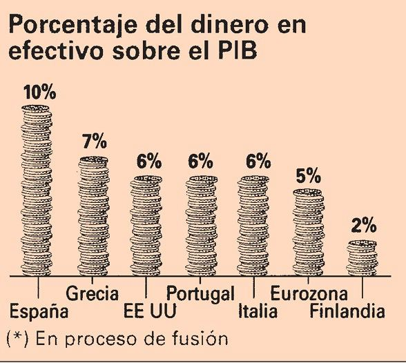
``` 

]

[1] [«Gramática de las gráficas: pistas para mejorar las representaciones de datos» de Joaquín Sevilla](http://academica-e.unavarra.es/bitstream/handle/2454/15785/Gram%C3%A1tica.pdf)


---

# Vizfail

.pull-left[

```{r echo = FALSE,  out.width = "99%", fig.align = "center", fig.cap = "Ejemplo de metáfora visual mal ejecutada"}
knitr::include_graphics("./img/persona_dataviz.jpg")
``` 

]

.pull-right[

* La figura elegida (una persona caminando) no guarda relación alguna con lo que se pretende representar.

* Los sectores señalados no tienen relación con el ítem a representar, lo que dificulta su interpretación

* Los colores no dan información de ningún tipo.

* La forma hace imposible la comparación entre áreas (salvo que leas el % adjunto).

* La suma total supera el 100% ¿?

* **Sin la fuente de los datos**.

]

---

# ¿Qué es una gráfica estadística?

Ese **proceso de medida** en el que una gráfica se debe apoyar lo ilustra muy bien Alberto Cairo <sup>8</sup> con esta **infografía**.


* ¿Sabrías decir en 5 segundos en que región el empleo ha crecido más? ¿Y menos?
* ¿Sabrías decir en 5 segundos si la variación ha sido mayor en Madrid, La Rioja o Canarias?

```{r echo = FALSE,  out.width = "65%", fig.align = "center", fig.cap = "INFOGRAFÍA extraída de Alberto Cairo"}
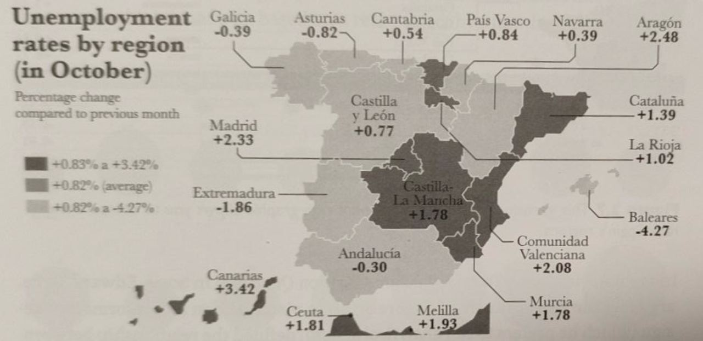
``` 

[8] «The Functional Art: an introduction to information graphics and visualization» de Alberto Cairo.

---

# ¿Qué es una gráfica estadística?


```{r echo = FALSE,  out.width = "90%", fig.align = "center", fig.cap = "GRÁFICA extraída de Alberto Cairo"}
knitr::include_graphics("./img/mapa_cairo_2.jpg")
``` 

La principal diferencia entre otro tipo de comunicación visual y una **gráfica estadística** radica en proporcionar **herramientas de medida**.

---

# ¿Qué es una gráfica estadística?

1. Que se base en el esquema de composición de **eje métrico**

2. Debe incluir **información cuantitativa** (debe visualizar datos)

3. La relación de representatividad debería **ser reversible**: los **datos deberían poder «recuperarse»** a partir de la gráfica (una gráfica estadística es un tipo particular de **aplicación** matemática).


```{r echo = FALSE,  out.width = "50%", fig.align = "center", fig.cap = "Gráfica extraída del manual de Joaquín Sevilla"}
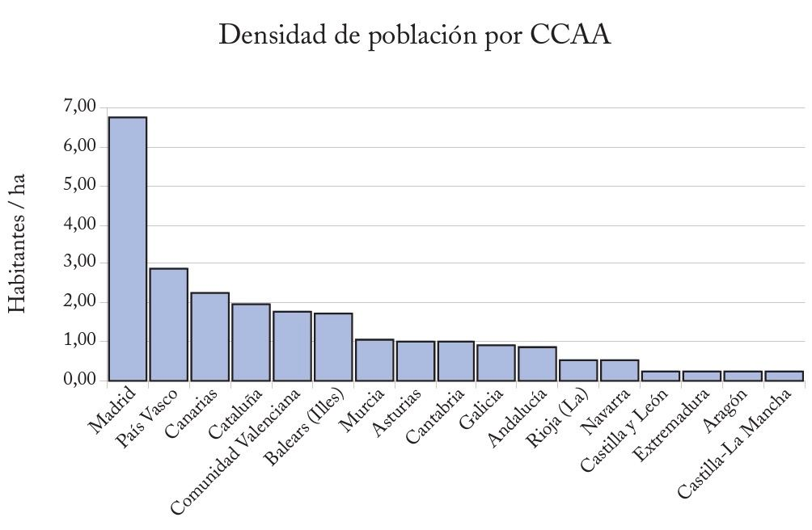
``` 

[1] [«Gramática de las gráficas: pistas para mejorar las representaciones de datos» de Joaquín Sevilla](http://academica-e.unavarra.es/bitstream/handle/2454/15785/Gram%C3%A1tica.pdf)


---

# ¿Qué es una gráfica estadística?

Hay muchas formas de hacer una gráfica estadística, y **no suele pasar** por hacer un gráfico de tartas. Los **diagramas de tartas o sectores** tiene un problema de reversibilidad:

* Si hay **muchas variables**: salvo que conozcas el montante total y tengas un transportador de ángulos a mano, es muy complicado que obtengas información.

* Si hay **pocas variables**: ¿aporta algo distinto (y/o mejor) que una tabla?


```{r echo = FALSE,  out.width = "40%", fig.align = "center", fig.cap = "Gráfica extraída del manual de Joaquín Sevilla"}
knitr::include_graphics("./img/sectores_sevilla.jpg")
``` 

---

# ¿Qué es una gráfica estadística?

El principal problema de un **diagrama de sectores** es que la posible información está contenido en los **ángulos**, pero nuestra interpretación la realizamos a través de la **comparación de áreas** (nuestros ojos no miden bien ángulos), las cuales dependen no solo del ángulo sino del radio.

Algo similar sucede con los mal llamados **gráficos tridimensionales** (son bidimensionales con perspectiva en realidad): los valores más cercanos aparecen sobredimensionados, siendo prácticamente imposible la reversibilidad.


```{r echo = FALSE,  out.width = "70%", fig.align = "center", fig.cap = "Gráfica extraída del manual de Joaquín Sevilla"}
knitr::include_graphics("./img/sectores_3D_sevilla.jpg")
``` 

---

# Vizfail

Además, dado que un diagrama de sectores solo permite una **visualización relativa** de los datos, no son comparables con otros diagramas de tartas.

```{r echo = FALSE,  out.width = "78%", fig.align = "center"}
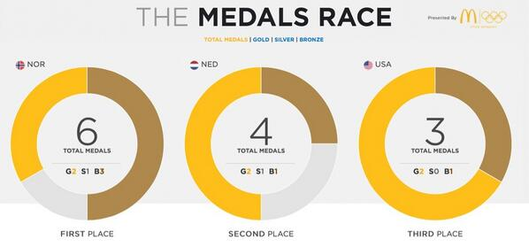
``` 

Gráfica extraída de <https://twitter.com/Dave_Andrade/status/432576336872624129?t=FGjLtxE8V1BJR_QdXdtZgQ&s=19>

---

# Vizfail

```{r echo = FALSE,  out.width = "50%", fig.align = "center", fig.cap = "Ejemplo de un desastre"}
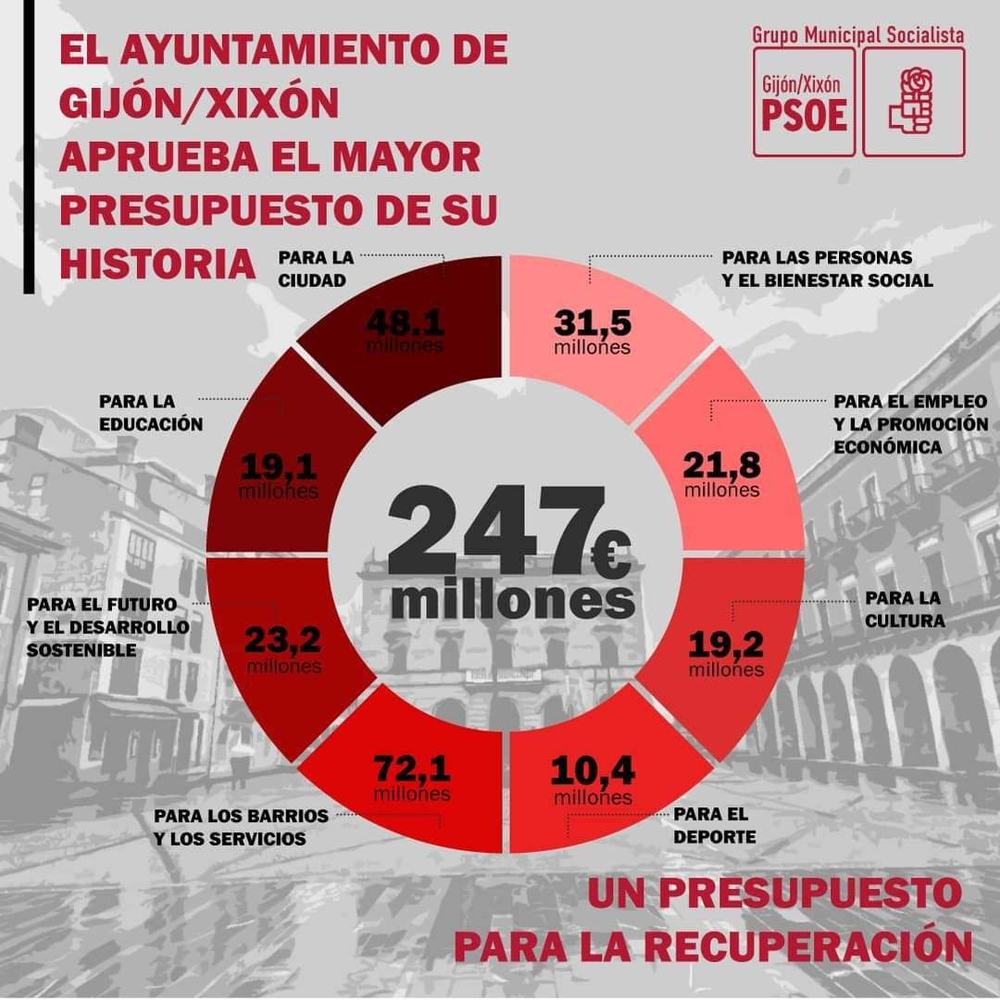
``` 

---

# Historia de la estadística: navegación y astronomía

.pull-left[

### T. Brahe

Uno de los primeros usos «modernos» de la estadística fue en la **navegación y la astronomía**, siendo Tycho Brahe de los primeros en utilizar la estadística para **reducir los errores** observacionales.
]

.pull-right[

### E. Wright

Fue el primero en usar en 1599 lo que hoy llamamos **mediana** en su libro «Certaine errors in navigation», aplicada a la navegación.

]

.pull-left[

### G. Galileo

Aunque la fama se la llevó **Gauss**, fue el primero en plantear una idea similar a la que hoy llamamos **método de mínimos cuadrados**: los valores más probables serían aquellos que minimizaran los errores.

]

.pull-right[
### C. F. Gauss y A. M. Legendre

El **método de los mínimos cuadrados**, en el que basan modelos actuales como la regresión, fue desarrollado por **Legendre y Gauss** (el último lo aplicó a la detección más probable del planeta enano Ceres).

]

---

# Historia de la estadística: demografía, epidemiología y fisiología

.pull-left[

#### J. Graunt

Autor de «Natural and Political Observations Made upon the Bills of Mortality» (1662), uno de los primeros trabajos en los que ya se hablaba de **exceso de mortalidad** a partir de las primeras tablas de natalidad y mortalidad, **estimando la población de Londres**.
]

.pull-right[

#### G. Neumann

Las **fakes news** ya existían en el siglo XVII: Gaspar Neumann también un precursor en el **análisis estadístico de tablas de mortalidad**, para desmentir bulos (ejemplo: desmontó la creencia de que en los años acabados en siete morían más personas).
]


Son precisamente las tablas de Graunt las que usó **Christiaan Huygens** (pionero en teoría de probabilidad con su «De ratiociniis in ludo aleae» en 1656) para generar la **primera gráfica de densidad** de una distribución continua, visualizando la **esperanza de vida** (en función de la edad).


---

# Primer gráfico de densidad

Son precisamente las tablas de Graunt las que usó **Christiaan Huygens** (pionero en teoría de probabilidad con su «De ratiociniis in ludo aleae» en 1656) para generar la **primera gráfica de densidad** de una distribución continua, visualizando la **esperanza de vida** (en función de la edad).


```{r echo = FALSE,  out.width = "50%", fig.align = "center", fig.cap = "Primera función de densidad, extraída de https://omeka.lehigh.edu/exhibits/show/data_visualization/vital_statistics/huygen"}
knitr::include_graphics("https://omeka.lehigh.edu/files/fullsize/65fc32c11a768f1d3263a99caca28dff.jpg")
``` 

---

# Edmond Halley

El astrónomo **Edmond Halley** fue uno de los primeros científicos en usar la visualización de datos para sus trabajos, publicando en 1686 un gráfico relacionando la presión barométrica en función de la altitud, y se le atribuye el primer mapa no geográfico: un mapa representando datos meteorológicos (direcciones de viento)


.pull-left[

```{r echo = FALSE,  out.width = "80%", fig.align = "center", fig.cap = "Gráfico bivariante de Halley, extraída de https://friendly.github.io/HistDataVis"}
knitr::include_graphics("https://friendly.github.io/HistDataVis/figs-web/06_2-halleygraph2.png")
``` 

]

.pull-right[

```{r echo = FALSE, out.width = "80%", fig.align = "center", fig.cap = "Mapa meteorológico, extraído de Thrower (1969)"}
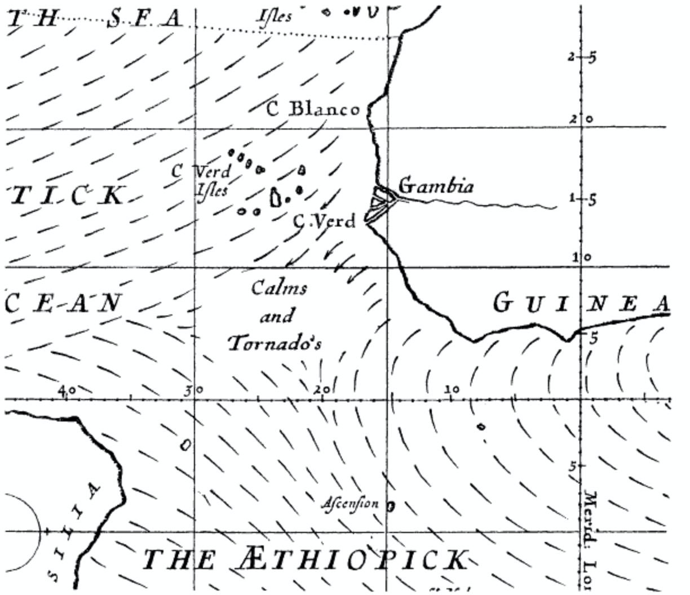
``` 

]

[9] [«Edmond Halley as a Thematic Geo-Cartographer» de Norman J. W. Thrower (1969)](https://www.jstor.org/stable/2561832)


---

# El gran boom: los gráficos de Playfair

La figura que cambió el dataviz fue, sin lugar a dudas, el economista y político **William Playfair (1759-1823)**. En 1786 publicó el **«Atlas político y comercial»** con 44 gráficas (43 series temporales y el **diagrama de barras más famoso**, aunque no el primero).

.pull-left[

```{r echo = FALSE, out.width = "85%", fig.align = "center", fig.cap = "Gráficas de Playfair, extraídas de Funkhouser y Walker (1935)"}
knitr::include_graphics("./img/playfair_1.jpg")
``` 

]

.pull-right[

```{r echo = FALSE, out.width = "35%", fig.align = "center", fig.cap = "Gráficas de Playfair, extraídas de Funkhouser y Walker (1935)"}
knitr::include_graphics("./img/playfair_2.jpg")
``` 

]

[10] [«Atlas político y comercial» de William Playfair (1786)](https://www.amazon.es/Playfairs-Commercial-Political-Statistical-Breviary/dp/0521855543)

[11] [«Playfair and his charts» de H. Gray Funkhouser and  Helen M. Walker (1935)](https://www.jstor.org/stable/45366440)

---

# El gran boom: los gráficos de Playfair

Playfair no solo fue el primero en usar el dataviz para entender (y no solo describir) la realidad: fue el primero en usar **conceptos modernos** como el _grid_ o el color como un elemento no solo estético.

.pull-left[

```{r echo = FALSE, out.width = "99%", fig.align = "center", fig.cap = "Gráficas de Playfair, extraídas de https://friendly.github.io/HistDataVis"}
knitr::include_graphics("./img/playfair_3.jpg")
``` 

]

.pull-right[

```{r echo = FALSE, out.width = "99%", fig.align = "center", fig.cap = "Gráficas de Playfair, extraídas de la wikipedia."}
knitr::include_graphics("./img/playfair_4.png")
``` 

]

[10] [«Atlas político y comercial» de William Playfair (1786)](https://www.amazon.es/Playfairs-Commercial-Political-Statistical-Breviary/dp/0521855543)

---

# Primer gráfico de barras

Playfair es además el **autor del gráfico de barras más famoso** (aunque no fue el primero, pero sí el que sentó un precedente, quien lo hizo _mainstream_).

.pull-left[

```{r echo = FALSE, out.width = "95%", fig.align = "center", fig.cap = "Gráficas de Playfair de importaciones (barras grises) y exportaciones (negras) de Escocia en 1781, extraídas de la wikipedia."}
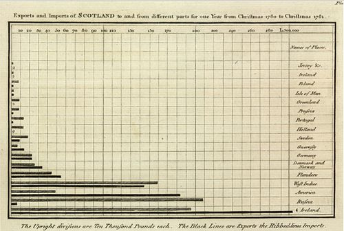
``` 

]

.pull-right[

```{r echo = FALSE, out.width = "95%", fig.align = "center", fig.cap = "Primer diagrama de barras (Philippe Buache y Guillaume de L’Isle), visualizando los niveles del Sena desde 1732 hasta 1766, extraída de https://friendly.github.io/HistDataVis"}
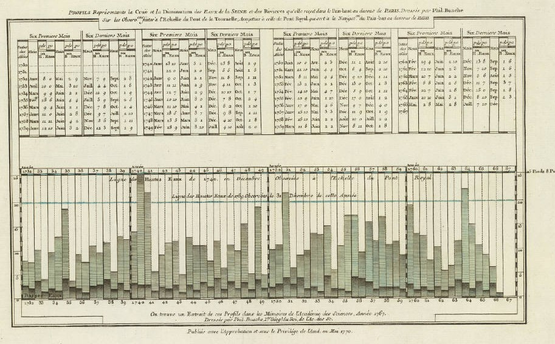
``` 

]

[10] [«Atlas político y comercial» de William Playfair (1786)](https://www.amazon.es/Playfairs-Commercial-Political-Statistical-Breviary/dp/0521855543)

---

# El gran boom: los gráficos de Playfair


Playfair además fue el primero en **combinar gráficos en la misma visualización**

.pull-left[

```{r echo = FALSE, out.width = "92%", fig.align = "center", fig.cap = "Gráfica de Playfair, visualizando 3 series temporales: precios (barras)f a quarter of wheat (the histogram bars), salarios (línea) y time-line con reinados, extraída de https://friendly.github.io/HistDataVis."}
knitr::include_graphics("./img/playfair_7.jpg")
``` 

]

.pull-right[

```{r echo = FALSE, out.width = "92%", fig.align = "center", fig.cap = "Gráfica de Playfair, visualizando un time-line histórico, extraída de https://friendly.github.io/HistDataVis."}
knitr::include_graphics("./img/playfair_8.jpg")
``` 
]

[12] [«A Letter on Our Agricultural Distresses, Their Causes and Remedies» de William Playfair (1821)](http://onlinebooks.library.upenn.edu/webbin/book/lookupid?key=ha009726110)

[13] [«An Inquiry Into the Permanent Causes of the Decline and Fall of Powerful and Wealthy Nations» de William Playfair (1821)](https://www.amazon.com/Permanent-Powerful-Nations-Prosperity-Prolonged/dp/140691830X)


---

# Primeros gráficos de tarta

Junto a **J.H. Lambert** (sí, el de la proyección cartográfica), Playfair inventó las gráficas circulares y los **diagramas de tartas**.

.pull-left[

```{r echo = FALSE, out.width = "85%", fig.align = "center", fig.cap = "Gráfica de Lambert visualizando la temperatura de la tierra (eje horizontal: tiempo; eje vertical: latitud)."}
knitr::include_graphics("https://www.researchgate.net/profile/Ian-Spence-7/publication/228091928/figure/fig18/AS:668617855234069@1536422327601/Lamberts-chart-of-soil-temperatures-1779.ppm")
``` 

]

.pull-right[

```{r echo = FALSE, out.width = "100%", fig.align = "center", fig.cap = "Gráfica de Playfair, considerada el primer diagrama de tartas, visualizando el tamaño, localización y población de 5 países, extraída de https://friendly.github.io/HistDataVis."}
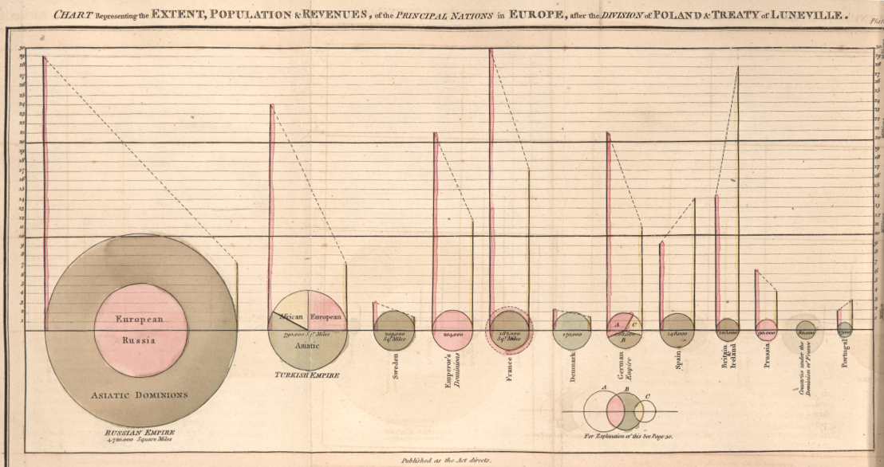
``` 

]

[14] [«The Statistical Breviary» de William Playfair (1801)](https://www.amazon.es/Statistical-Breviary-Shewing-Resources-Kingdom/dp/1293282693)

---

# Gráficos combinados en mapas

**Minard** fue además el primero en 1858 que se atrevió a **incorporar gráficas en mapas**, mostrando la proporción de consumo de carne (ternera, cerdo, cordero) proporcionado por el mercado central de París.

```{r echo = FALSE, out.width = "43%", fig.align = "center", fig.cap = "Mapa con diagramas de sectores de Minard, extraída de https://friendly.github.io/HistDataVis."}
knitr::include_graphics("./img/minard.png")
``` 


---

# Mapas figurativos de Minard

Minard fue el autor del famoso «Carte figurative des pertes successives en hommes de l'Armée Française dans la campagne de Russie 1812-1813», según Tufte «el mejor gráfico estadístico jamás dibujado», publicado en 1869 sobre la **desastrosa campaña rusa de las tropas de Napoleón en 1812**, mostrando 3 variables en un gráfico bidimensional

```{r echo = FALSE, out.width = "73%", fig.align = "center", fig.cap = "Gráfico de Minard sobre el avance de las tropas de Napoleón hacia Rusia, extraída de https://friendly.github.io/HistDataVis."}
knitr::include_graphics("./img/minard_2.png")
``` 


---

# Primera función de distribución

Años antes, en  1821, el **matemático J. B. J. Fourier** publicó  el primer **gráfico de una distribución acumulada** (la población de Paris en 1817 por grupos de edad), aunque nacieron para ser leídas al revés de lo usual actualmente (de derecha a izquierda).

```{r echo = FALSE, out.width = "57%", fig.align = "center", fig.cap = "Primera función de distribución acumulada, extraída de Beniger y Robyn (1978)."}
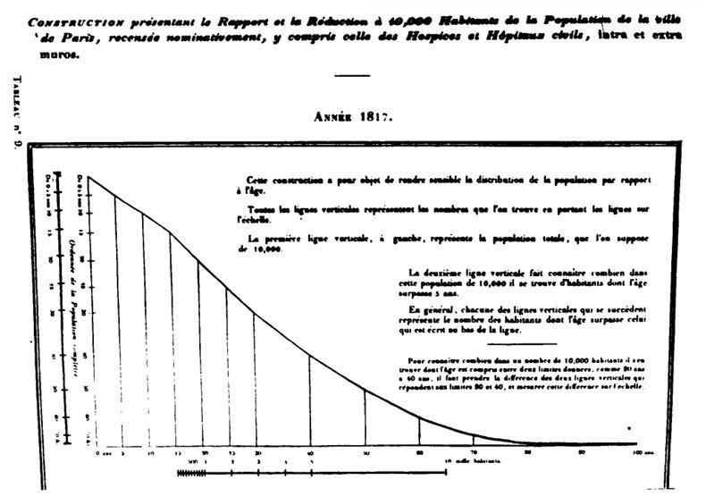
``` 

---

# Primer diagrama de dispersión

Según Sevilla <sup>1</sup>, se considera al astrónomo británico **John Frederick William Herschel** el primero que publicó un **diagrama de dispersión o scatterplot** en 1833, visualizando el movimiento de la estrella doble Virginis (tiempo en el eje horizontal, posición angular en el eje vertical)


```{r echo = FALSE, out.width = "36%", fig.align = "center", fig.cap = "Primer scatterplot, extraído de https://friendly.github.io/HistDataVis."}
knitr::include_graphics("./img/herschel.jpg")
``` 

[15] [«On the investigation of the orbits of revolving double stars: being a supplement to a paper entitled micrometrical measures of 364 double stars», de John F. W. Herschel (1833)](https://adsabs.harvard.edu/full/1833MmRAS...5..171H)

---

# Primera pirámide poblacional

La **primera pirámide de población** (en realidad es un doble histograma de población, en función de dos variables, edad y sexo), fue publicada por **Francis Amasa Walker**, superintendente del censo de EE.UU., en 1874.

```{r echo = FALSE, out.width = "55%", fig.align = "center", fig.cap = "Primera pirámide de población, extraída de https://www.depauw.edu/learn/dew/wpaper/workingpapers/DePauw2016-02-Barreto-DemographyEconomics.pdf"}
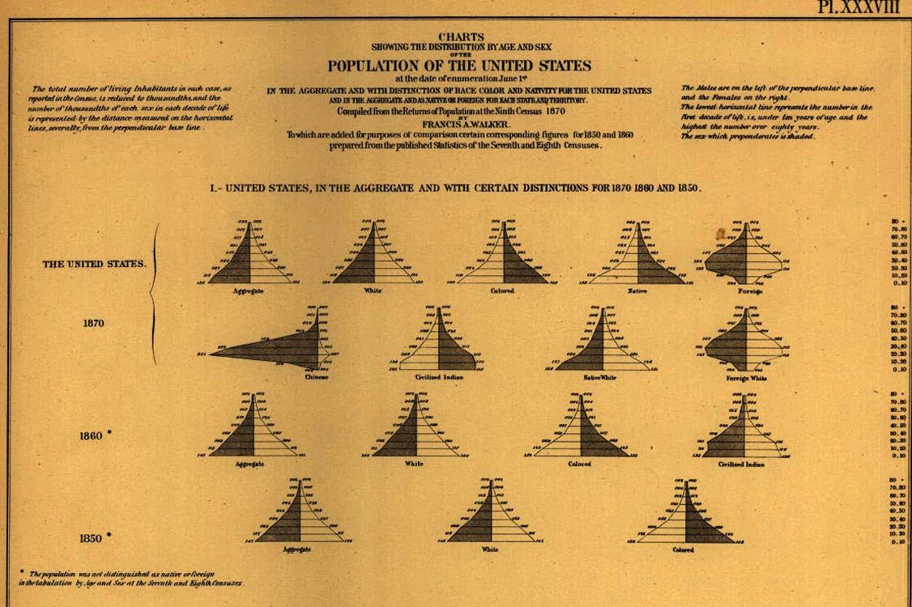
``` 


---

# Primer gráfico de mosaico

Walker también fue el autor del **primera gráfico de mosaico** en 1874, visualizando la población de Missouri por origen racial, según el censo de 1870

```{r echo = FALSE, out.width = "75%", fig.align = "center", fig.cap = "Primer gráfico de mosaico, extraído de https://friendly.github.io/HistDataVis."}
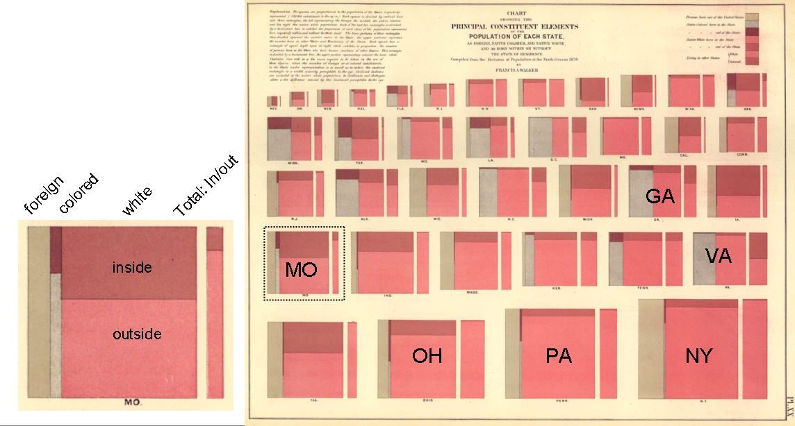
``` 

---

# El boom de la estadística: epidemiología y bioestadística

.pull-left[

#### F. Galton

Primo de Charles Darwin, inventor de los **silbatos para perretes**, de los mapas de predicción meteorológica y la persona que acuñó el concepto de **regresión** (y el de eugenesia :/).

```{r echo = FALSE, out.width = "93%", fig.align = "center"}
knitr::include_graphics("https://www.bogleheads.org/w/images/thumb/9/95/Screen_Shot_2012-01-03_at_7.36.29_AM.png/600px-Screen_Shot_2012-01-03_at_7.36.29_AM.png")
``` 


]

.pull-right[

```{r echo = FALSE, out.width = "58%", fig.align = "center"}
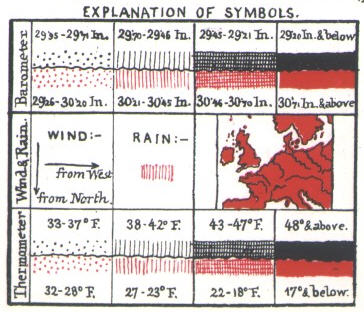
``` 

```{r echo = FALSE, out.width = "58%", fig.align = "center"}
knitr::include_graphics("./img/galton_2.png")
``` 

]


---

# El boom de la estadística: epidemiología y bioestadística

.pull-left[

#### John Snow

Se le considera uno de los pioneros de la **epidemiología moderna** y la **estadística espacial**: aunque los **diagramas de Voronoi** tardarían años en ser formalizados, John Snow aplicó el mismo concepto para mitigar la **epidemia de cólera en Londres**, con su **mapa con diagrama de barras**, localizando el foco en la conocida fuente de Broad Street.

]

--

.pull-right[

```{r echo = FALSE, out.width = "100%", fig.align = "center"}
knitr::include_graphics("https://media.revistagq.com/photos/5cc84a91c46d3a2b7435d7cf/2:3/w_1799,h_2699,c_limit/pelo%20jon%20snow.jpg")
``` 

]

---


# El boom de la estadística: epidemiología y bioestadística


.pull-left[

#### John Snow

Se le considera uno de los pioneros de la **epidemiología moderna** y la **estadística espacial**: aunque los **diagramas de Voronoi** tardarían años en ser formalizados, John Snow aplicó el mismo concepto para mitigar la **epidemia de cólera en Londres**, con su **mapa con diagrama de barras**, localizando el foco en la conocida fuente de Broad Street.


[📚 «El mapa fantasma», Steven Johnson, sobre la historia de John Snow](https://capitanswing.com/libros/el-mapa-fantasma/)


]

.pull-right[

```{r echo = FALSE, out.width = "100%", fig.align = "center", fig.cap = "John Snow, el epidemiólogo"}
knitr::include_graphics("https://s1.eestatic.com/2016/04/22/reportajes/reportajes_119248513_3987143_854x640.jpg")
``` 

]

---

# Nacimiento de la estadística espacial

```{r echo = FALSE, out.width = "77%", fig.align = "center", fig.cap = "Mapa de Londres, mostrando los casos de cólera del 19 de agosto al 30 de septiembre de 1854, extraído de https://friendly.github.io/HistDataVis."}
knitr::include_graphics("./img/snow_mapa.jpg")
``` 

---

# Cólera en Londres

Esa **epidemia de cólera** en Londres fue una catástrofe en términos humanos pero supuso un verdadero auge de la **bioestadística y visualización de datos**. Unos años antes que Snow, **William Farr** ya usaba el dataviz para **monitorizar las muertes diarias** de cólera (abajo, cólera en azul, diarre en amarillo), en función del tiempo meteorológico (arriba)


```{r echo = FALSE, out.width = "48%", fig.align = "center"}
knitr::include_graphics("./img/farr_colera.png")
``` 

[16] [«General Register Office, Report on the Mortality of Cholera in England, 1848–49» publicado en 1852](https://wellcomecollection.org/works/pajtrpez/items?canvas=9)


---

# Primer diagrama de área polar

Fue también Farr al que se le atribuye el primer **diagrama de área polar o radial**, cambiando por completo el **paradigma cartesiano** de la época: para visualizar la estacionalidad de la mortalidad en función de la temperatura, Farr decidió visualizarlo con coordenadas polares o esféricas.

```{r echo = FALSE, out.width = "48%", fig.align = "center"}
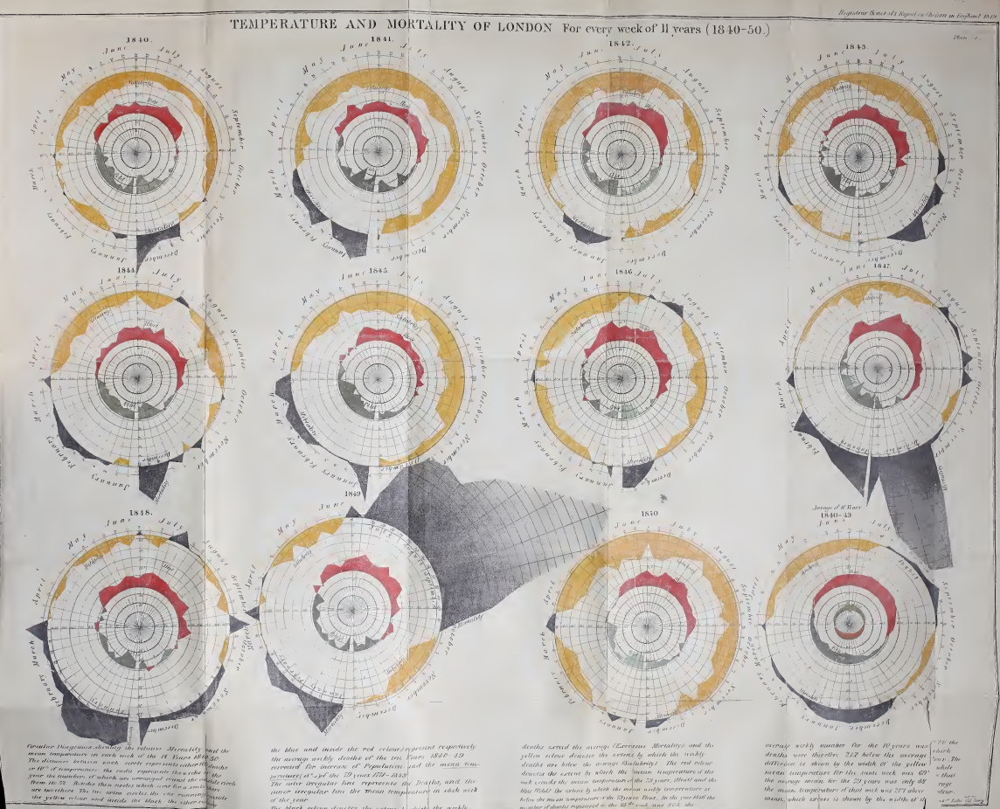
``` 

[16] [«General Register Office, Report on the Mortality of Cholera in England, 1848–49» publicado en 1852](https://wellcomecollection.org/works/pajtrpez/items?canvas=9)


---

# Florence Nigthingale: una revolución

.pull-left[


* El 21 de octubre de 1854 **Florence Nigthingale** fue enviada para mejorar las **condiciones sanitarias** de los **soldados británicos en la guerra de Crimea**. 

* A su regreso se dedicó a demostrar que los **soldados fallecían por las condiciones sanitarias**: eran **muertes evitables**. Nigthingale es la creadora del famoso **diagrama de rosa**, permitiendo pintar tres variables a la vez y su estacionalidad.

* El 8 de febrero de 1955, The Times la describió como la **«ángel guardián» de los hospitales**, y al finalizar la contienda, fue recibida como una heroína, conocida como **«The Lady with the Lamp»** tras un poema de H. W. Longfellow publicado en 1857.

* Años después se convirtió en la **primera mujer en la Royal Statistical Society** y renunció a su puesto para crear las primeras escuelas de enfermería

]

.pull-right[

```{r echo = FALSE, out.width = "90%", fig.align = "center"}
knitr::include_graphics("https://www.researchgate.net/profile/Miguel-Guevara-4/publication/325622727/figure/fig1/AS:635977265582080@1528640204506/FIGURA-2-La-dama-con-la-lampara-1891-en-ingles-The-lady-with-the-lamp.png")
``` 

]

---

# Los gráficos en espiral no son novedosos

**Florence Nigthingale** es la creadora del famoso **diagrama de rosa**, permitiendo pintar tres variables a la vez y su estacionalidad: **tiempo** (cada **gajo** es un mes), **nº de muertes** (**área** del gajo) y **causa** de la muerte (**color** del gajo: azules enfermedades infecciosas, rojas por heridas, negras otras causas).


```{r echo = FALSE, out.width = "75%", fig.align = "center"}
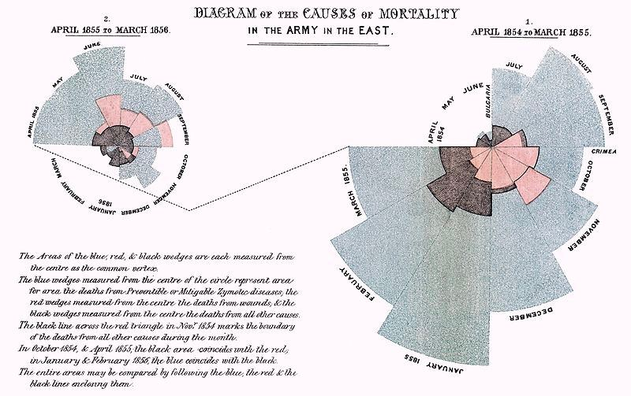
``` 

---

# La espiral de la polémica

.pull-left[

```{r echo = FALSE, out.width = "100%", fig.align = "center", fig.cap = "Gráfica en espiral del New York Times"}
knitr::include_graphics("https://www.memo.com.ar/files/image/30/30306/61e162fc784b3_715_896!.jpg?s=8418d87978ab79e1a76da127f6b37bb2&d=1642160894")
``` 

]


.pull-right[

**¿A favor? ¿En contra?**

✖️ No es novedosa (la novedad tampoco debería ser un argumento a favor per se)

✔️ Las **coordenadas polares** son un **acierto**: los datos estacionales como los datos epidemiológicos o las temperaturas son precisamente los casos en los que está más justificado representar los datos en coordenadas polares o en espiral.

✖️ **No respeta la reversibilidad**: es más una ilustración que una gráfica estadística. La forma de llevarlo a cabo **infraestima los datos** actuales y, por su **distorsión de la realidad**, no permite **medir** precisamente el patrón estacional que se propone visualizar.

✔️ **Metáfora visual** de la pandemia.

✖️ Opinión personal: buena idea, buena como ilustración, error como gráfica estadística en su ejecución.
]

---

# La espiral de la polémica

.pull-left[

```{r echo = FALSE, out.width = "60%", fig.align = "center", fig.cap = "Gráfica en espiral del New York Times"}
knitr::include_graphics("https://www.memo.com.ar/files/image/30/30306/61e162fc784b3_715_896!.jpg?s=8418d87978ab79e1a76da127f6b37bb2&d=1642160894")
``` 

]

.pull-right[

```{r echo = FALSE, out.width = "100%", fig.align = "center", fig.cap = "Mejora de la espiral realizada por Paula Casado https://elartedeldato.com/blog/the-new-york-times-spiral-graph-en-r/"}
knitr::include_graphics("https://elartedeldato.com/blog/the-new-york-times-spiral-graph-en-r/featured-the_nyt_spiral_hu8f42fa4590b2c04399b29318317fd771_501398_720x0_resize_lanczos_3.png")
``` 

]

✖️ El **eje que recorre la espiral no aporta**, distrae de los datos a representar, **aumenta la distorsión producida** por la no linealidad de la espiral y duplica información, dificultando la comparación estacional.


---

# La espiral de la polémica


```{r echo = FALSE, out.width = "90%", fig.align = "center", fig.cap = "Misma idea, distinta ejecución, de https://twitter.com/abmakulec/status/1479496579040034822"}
knitr::include_graphics("https://pbs.twimg.com/media/FIgzfW4XMAsWYMs?format=jpg&name=large")
``` 

---

# La espiral de la polémica


.pull-left[

```{r echo = FALSE, out.width = "100%", fig.align = "center", fig.cap = "Mejora de https://twitter.com/abmakulec/status/1479496581439238152"}
knitr::include_graphics("https://pbs.twimg.com/media/FIg4FiIXIAITUq6?format=jpg&name=medium")
``` 

]

.pull-right[

✖️ La **inclusión de colores** codificando los datos hubiese mejorado el gráfico, máxime cuando no se añade ningún tipo de escala al gráfico (aunque mida la estacionalidad, para visualizar algo estacional es fundamental que precisamente los periodos puedan ser comparables para percibir ese patrón periódico)

]


El **uso de colores** no es solo algo estético: es una variable más, y la paleta elegida así como su uso es fundamental (por ejemplo, la inclusión de colores nos permite centrarnos en los oscuros, y comparar entre tonalidades).


---


# La espiral de la polémica

.pull-left[

```{r echo = FALSE, out.width = "100%", fig.align = "center", fig.cap = "Mejora de https://twitter.com/abmakulec/status/1479496581439238152"}
knitr::include_graphics("https://pbs.twimg.com/media/FIg4PXhXoAU7C2P?format=jpg&name=medium")
``` 

]

.pull-right[

✖️ No hay ninguna codificación de ningún tipo, ni en ejes ni en colores: añadir **barras con tamaños** codifica de nuevo los datos (ya estaban con colores), y su solapamiento en algunos periodos nos permiten calibrar mejor la colosal magnitud de ómicron en ese momento. El **tamaño de las barras** no solo nos permite medir, per se, sino facilitar aún más la comparación, sin ejes centrales sin significado en base a los datos.

]


---


# La espiral de la polémica

.pull-left[

```{r echo = FALSE, out.width = "100%", fig.align = "center", fig.cap = "Mejora de https://twitter.com/abmakulec/status/1479496581439238152"}
knitr::include_graphics("https://pbs.twimg.com/media/FIg4bLWX0AgHuBT?format=jpg&name=medium")
``` 

]

.pull-right[

✖️ La forma de llevarlo a cabo, **incluyendo solo algunos meses** (¿por qué esos y no otros?), hace más complicado obtener información sin recorrer la espiral (que quizás sea en parte un acierto, por darte la sensación de mareo). Además el **grid que se incluye no aporta escala ni información** por lo que distrae de la verdadera información.

]

---

# La espiral de la polémica


.pull-left[

```{r echo = FALSE, out.width = "100%", fig.align = "center", fig.cap = "Mejora de https://twitter.com/abmakulec/status/1479496581439238152"}
knitr::include_graphics("https://pbs.twimg.com/media/FIg4FiIXIAITUq6?format=jpg&name=medium")
``` 

]

.pull-right[

✖️ La **espiral es una forma geométrica compleja**: la original, al no estar ni centrada ni ser concéntrica, distorsiona (aún más) el crecimiento de los casos y su estacionalidad.

]

---

# Líneas rojas (opinión personal)

* Entender el contexto y respetar el dato

```{r echo = FALSE, out.width = "60%", fig.align = "center", fig.cap = "Infografía extraída de https://twitter.com/storywithdata"}
knitr::include_graphics("https://pbs.twimg.com/media/FIgZcF4X0AAzLnC?format=jpg&name=medium")
``` 

(en lo de los diagramas de tartas discrepamos :P)

---

# Contexto

Una **buena idea** puede estar mejor o peor ejecutada, y la forma de llevarla a cabo es importante

```{r echo = FALSE, out.width = "30%", fig.align = "center", fig.cap = "Un semáforo no es una mala idea, la forma de instalarlo sí puede serlo. Imagen extraída del manual de Joaquín Sevilla"}
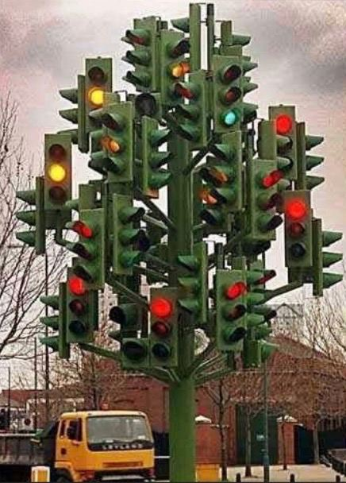
``` 

---

# Fundamentos de la visualización de datos estadísticos

## **Recomendaciones**

[«The Functional Art: an introduction to information graphics and visualization» de Alberto Cairo](https://www.amazon.es/Functional-Art-Voices-That-Matter/dp/0321834739)


[«Gramática de las gráficas: pistas para mejorar las representaciones de datos» de Joaquín Sevilla](https://academica-e.unavarra.es/bitstream/handle/2454/15785/Gram%C3%A1tica.pdf)


[«A Brief History of Visualization» de Friendly et al. (2008)](https://www.researchgate.net/publication/226400313_A_Brief_History_of_Data_Visualization)

[«Quantitative Graphics in Statistics: A Brief History» de James R. Beniger y Dorothy L. Robyn. The American Statistician (1978)](https://www.jstor.org/stable/2683467)]

[«Presentation Graphics» de Leland Wilkinson. International Encyclopedia of the Social & Behavioral Sciences](https://www.cs.uic.edu/~wilkinson/Publications/iesbs.pdf)

[«The Grammar of Graphics» de Leland Wilkinson](https://www.amazon.es/Grammar-Graphics-Statistics-Computing/dp/0387245448)


[«The Minard System: The Graphical Works of Charles-Joseph Minard» de Sandra Rendgen](https://www.amazon.es/gp/product/1616896337/ref=sw_img_1?smid=A1AT7YVPFBWXBL&psc=1)


[«The Visual Display of Quantitative Information» de E. W. Tufte](https://www.amazon.es/Visual-Display-Quantitative-Information/dp/0961392142)

---

## ggplot2: grammar of graphics (gg)

.pull-left[

```{r echo = FALSE,  out.width = "100%", fig.align = "center", fig.cap = "Imagen extraída de Reddit"}
knitr::include_graphics("https://dadosdelaplace.github.io/courses-ECI-2022/img/telling-dataviz")
``` 

]

.pull-right[

Una de las **principales fortalezas** de `R` no solo es el manejo de datos con `{tidyverse}`, también la visualización con uno de sus paquetes: el paquete `{ggplot2}`.

La **visualización de datos** debería ser una parte fundamental de todo análisis de datos. No es solo una cuestión estética. La visualización de datos es fundamental para convertir el dato en información.

]


---

## ggplot2: grammar of graphics (gg)

.pull-left[

La idea de la filosofía detrás de `{ggplot2}` es entender los **gráficos como parte integrada del flujo de datos**, dotándoles de una **gramática**, basándose en la idea de 
[«The Grammar of Graphics» de Leland Wilkinson](https://www.amazon.es/Grammar-Graphics-Statistics-Computing/dp/0387245448).

El objetivo es empezar con un lienzo en blanco e ir **añadiendo capas a tu gráfico**, como harías por ejemplo en Photoshop, con la diferencia de que nuestras capas podemos **ligarlas al conjunto de datos**.

La ventaja de `{ggplot2}` es poder **mapear atributos estéticos** (color, forma, tamaño) de **objetos geométricos** (puntos, barras, líneas) en **función de los datos**, añadiendo transformaciones de los datos, resúmenes estadísticos y transformaciones de las coordenadas.


La **documentación** del paquete puedes consultarla en <https://ggplot2-book.org/introduction.html> 
]

.pull-right[

```{r echo = FALSE,  out.width = "100%", fig.align = "center", fig.cap = "Idea detrás de la «Grammar of graphics» de Wilkinson"}
knitr::include_graphics("https://dadosdelaplace.github.io/courses-ECI-2022/img/grammar.jpg")
``` 
]


---

## ggplot2: grammar of graphics (gg)

.pull-left[


```{r echo = FALSE,  out.width = "100%", fig.align = "center", fig.cap = "Idea detrás de la «Grammar of graphics» de Wilkinson"}
knitr::include_graphics("https://dadosdelaplace.github.io/courses-ECI-2022/img/grammar.jpg")
``` 

]

.pull-right[

Un gráfico se podrá componer de las siguientes **capas**

* **Datos**
* **Mapeado de elementos estéticos (aesthetics)**: ejes, color, forma, tamaño, etc (en función de los datos)
* **Elementos geométricos (geom)**: puntos, líneas, barras, polígonos, etc.
* **Componer gráficas (facet)**: visualizar varias gráficas a la vez.
* **Transformaciones estadísticas (stat)**: ordenar, resumir, agrupar, etc.
* **Sistema de coordenadas (coord)**: coordenadas, grids, etc.
* **Temas (theme)**: fuente, tamaño de letra, subtítulos, captions, leyenda, ejes, etc.

]

---

# Primer intento: scatter plot

Veamos un **primer intento** para entender la filosofía. Imagina que queremos dibujar un **scatter plot** o **diagrama de (dispersión) de puntos**.

&nbsp;

Para ello vamos a usar el **conjunto de datos** `gapminder`, del paquete homónimo: un fichero con **datos de esperanzas de vida, poblaciones y renta per cápita** de distintos países en distintos momentos temporales.

```{r}
library(gapminder)
gapminder
```

---

# Primer intento: scatter plot

El fichero consta de 1704 registros y 6 variables: `country`, `continent`, `year`, `lifeExp` (esperanza de vida), `pop` (población)  y `gdpPercap` (renta per cápita).

```{r}
glimpse(gapminder)
```

Para empezar con algo sencillo **filtraremos solo los datos de 1997**

--

```{r}
gapminder_1997 <- gapminder %>% filter(year == 1997)
gapminder_1997
```

---

# Primer intento: scatter plot

.pull-left[

Vamos a realizar un **diagrama de puntos**:

* **Eje X**: renta per cápita (variable `gdpPercap`)
* **Eje Y**: población (variable `pop`)

**¿Qué necesitamos?**

* **Datos**: el conjunto filtrado `gapminder_1997`.
* **Mapeado**: indicarle dentro de `aes()` (aesthetics) las variables a pintar en cada coordenada. Todo lo que esté **dentro de aes() dependerá de los datos** (en este caso `aes(x = gdpPercap, y = pop)`).


```{r eval = FALSE}
ggplot(gapminder_1997, aes(x = gdpPercap, y = pop)) #<<
```

* **Elegir una geometría**: optaremos por **puntos** con `geom_point()`.

```{r eval = FALSE}
ggplot(gapminder_1997,
       aes(x = gdpPercap, y = pop)) +
  geom_point() #<< Geometría
```

]

.pull-right[

```{r echo = FALSE}
ggplot(gapminder_1997, aes(x = gdpPercap, y = pop)) +
  geom_point()
```
]

---


# Primer intento: scatter plot

.pull-left[

Vamos a profundizar en ese mapeado, cambiando el rol de los ejes:

* **Eje X**: población (variable `pop`)
* **Eje Y**: renta per cápita (variable `gdpPercap`)


```{r eval = FALSE}
ggplot(gapminder_1997,
       aes(y = gdpPercap, x = pop)) + #<<
  geom_point() 
```

]

.pull-right[

```{r echo = FALSE}
ggplot(gapminder_1997, aes(y = gdpPercap, x = pop)) +
  geom_point() 
```
]

---


# Primer intento: scatter plot

.pull-left[

La idea podemos repetirla enfrentando ahora la **esperanza de vida** frente a **la renta per cápita**.

* **Eje X**: esperanza de vida (variable `lifeExp`)
* **Eje Y**: renta per cápita (variable `gdpPercap`)


```{r eval = FALSE}
ggplot(gapminder_1997,
       aes(y = gdpPercap, x = lifeExp)) + #<<
  geom_point()
```

]

.pull-right[

```{r echo = FALSE}
ggplot(gapminder_1997, aes(y = gdpPercap, x = lifeExp)) +
  geom_point()
```
]

---

# Colores, tamaños y formas (constantes)

.pull-left[

Para **cambiar el color de los puntos**, indicaremos dentro de `geom_point()` el color de la geometría con `color = ...` (en este caso, el color del punto). Empezaremos por un **color fijo**, por ejemplo `"red"` (existen otros como `"blue"`, `"black"`, `"yellow"`, etc)

```{r eval = FALSE}
# Color con palabra reservada
ggplot(gapminder_1997,
       aes(y = gdpPercap, x = lifeExp)) +
  geom_point(color = "red") #<<
```
]

.pull-right[

```{r echo = FALSE}
ggplot(gapminder_1997, aes(y = gdpPercap, x = lifeExp)) +
  geom_point(color = "red")
```

]

---

# Colores, tamaños y formas (constantes)

.pull-left[

Los colores también podemos asignárselos por su **código hexadecimal**, consultando en la página <https://htmlcolorcodes.com/es/>, eligiendo el color que queramos. El código hexadecimal siempre comenzará con `#`


```{r eval = FALSE}
# Color en hexadecimal
# https://htmlcolorcodes.com/es/
ggplot(gapminder_1997,
       aes(y = gdpPercap, x = lifeExp)) +
  geom_point(color = "#2EA2D8") #<<
```
]

.pull-right[

```{r echo = FALSE}
ggplot(gapminder_1997, aes(y = gdpPercap, x = lifeExp)) +
  geom_point(color = "#2EA2D8")
```

]


---

# Colores, tamaños y formas (constantes)

.pull-left[
  
De la misma manera podemos **indicarle el tamaño de la geometría** (en este caso el **tamaño de los punto**) con `size = ...` (cuanto mayor sea el número, mayor será el tamaño de la geometría).

```{r eval = FALSE}
# Color y tamaño
ggplot(gapminder_1997,
       aes(y = gdpPercap, x = lifeExp)) +
  geom_point(color = "#A02B85", size = 5) #<<
```
]

.pull-right[

```{r echo = FALSE}
ggplot(gapminder_1997, aes(y = gdpPercap, x = lifeExp)) +
  geom_point(color = "#A02B85", size = 5)
```

]
  
  

---

# Colores, tamaños y formas (constantes)

.pull-left[
  
También podemos jugar con la **transparencia del color** con `alpha = ...`: si `alpha = 1`, el color será totalmente opaco (por defecto); si `alpha = 0` será totalmente transparente.


```{r eval = FALSE}
# Color, tamaño y transparencia
ggplot(gapminder_1997,
       aes(y = gdpPercap, x = lifeExp)) +
  geom_point(color = "#A02B85", size = 9,
             alpha = 0.4) #<<
```
]

.pull-right[

```{r echo = FALSE}
ggplot(gapminder_1997,
       aes(y = gdpPercap, x = lifeExp)) +
  geom_point(color = "#A02B85", size = 9,
             alpha = 0.4)
```

]
  
  
---

# Mapear aesthetics

.pull-left[
  
Hasta ahora los **parámetros estéticos** se los hemos pasado fijos y **constantes**. Pero la verdadera potencia y versatilidad de `ggplot` es entender todos esos parámetros como entendemos el mapeado coordenadas: podemos **mapear los atributos estéticos** en `aes()` para que dependan de variables de los datos

&nbsp;

Por ejemplo, vamos a **asignar un color a cada dato en función de su continente**.

```{r eval = FALSE}
# Tamaño fijo
# Color por continentes
ggplot(gapminder_1997,
       aes(y = gdpPercap, x = lifeExp,
           color = continent)) + #<<
  geom_point(size = 5)
```
]

.pull-right[

```{r echo = FALSE}
ggplot(gapminder_1997,
       aes(y = gdpPercap, x = lifeExp, color = continent)) +
  geom_point(size = 5)
```

]
  
  
---


# Mapear aesthetics

.pull-left[
  
Podemos combinarlo con lo que hemos hecho anteriormente:


* **color** en función del **continente**.
* **tamaño** en función de la **población**
* **transparencia** fija del 70%

```{r eval = FALSE}
ggplot(gapminder_1997,
       aes(y = gdpPercap, x = lifeExp,
           color = continent, size = pop)) + #<<
  geom_point(alpha = 0.7)
```
]

.pull-right[

```{r echo = FALSE}
ggplot(gapminder_1997,
       aes(y = gdpPercap, x = lifeExp,
           color = continent, size = pop)) +
  geom_point(alpha = 0.7)
```

]
  
  
---

# Mapear aesthetics

.pull-left[
  
En lugar de jugar con el color, también podríamos añadir las variables en función de la **forma de la geometría** (en este caso la forma de los «puntos») con `shape = ...`.

```{r eval = FALSE}
ggplot(gapminder_1997,
       aes(y = gdpPercap, x = lifeExp,
           shape = continent, size = pop)) +
  geom_point(alpha = 0.7)
```
]

.pull-right[

```{r echo = FALSE}
ggplot(gapminder_1997,
       aes(y = gdpPercap, x = lifeExp,
           shape = continent, size = pop)) +
  geom_point(alpha = 0.7)
```

]
  

---

# Gráfico multidimensional en 2D

.pull-left[
  
Reflexionemos sobre el gráfico anterior:

* **color** en función del **continente**.
* **tamaño** en función de la **población**
* **transparencia** fija del 70%

Usando los datos hemos conseguido **dibujar en un gráfico bidimensional 4 variables** (`lifeExp` y `gdpPercap` en los ejes $(X, Y)$), `continent` como color y `pop` como tamaño de la geometría) con muy pocas líneas de código.

```{r eval = FALSE}
ggplot(gapminder_1997,
       aes(y = gdpPercap, x = lifeExp,
           color = continent, size = pop)) +
  geom_point(alpha = 0.7)
```
]

.pull-right[

```{r echo = FALSE}
ggplot(gapminder_1997,
       aes(y = gdpPercap, x = lifeExp,
           color = continent, size = pop)) +
  geom_point(alpha = 0.7)
```

]
  
---

# Escala de los ejes

.pull-left[
  
A veces nos puede ser más conveniente **representar alguna de las variables** en otras escalas, por ejemplo en **escala logarítmica** (importante indicarlo en el gráfico), lo que podemos hacer facilmente con `scale_x_log10()` y/o `scale_y_log10()`.


```{r eval = FALSE}
ggplot(gapminder_1997,
       aes(y = gdpPercap, x = lifeExp,
           color = continent, size = pop)) +
  geom_point(alpha = 0.7) +
  # Eje Y con escala logarítmica
  scale_y_log10() #<<
```
]

.pull-right[

```{r echo = FALSE}
ggplot(gapminder_1997,
       aes(y = gdpPercap, x = lifeExp,
           color = continent, size = pop)) +
  geom_point(alpha = 0.7) +
  # Eje Y con escala logarítmica
  scale_y_log10()
```

]

---

# Paletas de colores

.pull-left[

Si no indicamos nada, `R` selecciona automáticamente una **paleta de colores**, pero podemos indicarle alguna paleta concreta de varias maneras.

&nbsp;

La primera y más inmediata es indicarle los **colores manualmente**: con `scale_color_manual` le podemos indicar un **vector de colores**.

```{r eval = FALSE}
pal <- c("#A02B85", "#2DE86B", "#4FB2CA",
         "#E8DA2D", "#E84C2D")
ggplot(gapminder_1997,
       aes(y = gdpPercap, x = lifeExp,
           color = continent, size = pop)) +
  geom_point(alpha = 0.7) +
  scale_y_log10() +
  # Escala manual de colores
  scale_color_manual(values = pal) #<<
```
]

.pull-right[

```{r echo = FALSE}
pal <- c("#A02B85", "#2DE86B", "#4FB2CA",
         "#E8DA2D", "#E84C2D")
ggplot(gapminder_1997,
       aes(y = gdpPercap, x = lifeExp,
           color = continent, size = pop)) +
  geom_point(alpha = 0.7) +
  scale_y_log10() +
  scale_color_manual(values = pal)
```

]

---

# Paletas de colores

.pull-left[

Otra opción es elegir alguna de las **paletas de colores disponibles** en el paquete `{ggthemes}`:

* `scale_color_economist()`: paleta de colores basada en los colores de The Economist.

```{r eval = FALSE}
library(ggthemes)

# scale_color_economist()
ggplot(gapminder_1997,
       aes(y = gdpPercap, x = lifeExp,
           color = continent, size = pop)) +
  geom_point(alpha = 0.8) +
  scale_y_log10() +
  scale_color_economist()
```
  
]

.pull-right[

```{r echo = FALSE}
library(ggthemes)
ggplot(gapminder_1997,
       aes(y = gdpPercap, x = lifeExp,
           color = continent, size = pop)) +
  geom_point(alpha = 0.8) +
  scale_y_log10() +
  scale_color_economist()
```

]

---

# Paletas de colores

.pull-left[

Otra opción es elegir alguna de las **paletas de colores disponibles** en el paquete `{ggthemes}`:

* `scale_color_excel()`: paleta de colores basada en los colores del Excel.

```{r eval = FALSE}
library(ggthemes)
ggplot(gapminder_1997,
       aes(y = gdpPercap, x = lifeExp,
           color = continent, size = pop)) +
  geom_point(alpha = 0.8) +
  scale_y_log10() +
  scale_color_excel()
```

]

.pull-right[

```{r echo = FALSE}
library(ggthemes)
ggplot(gapminder_1997,
       aes(y = gdpPercap, x = lifeExp,
           color = continent, size = pop)) +
  geom_point(alpha = 0.8) +
  scale_y_log10() +
  scale_color_excel()
```

]

---

# Paletas de colores

.pull-left[

Otra opción es elegir alguna de las **paletas de colores disponibles** en el paquete `{ggthemes}`:

* `scale_color_tableau()`: paleta de colores basada en los colores de Tableau.

```{r eval = FALSE}
library(ggthemes)
ggplot(gapminder_1997,
       aes(y = gdpPercap, x = lifeExp,
           color = continent, size = pop)) +
  geom_point(alpha = 0.8) +
  scale_y_log10() +
  scale_color_tableau()
```

]

.pull-right[

```{r echo = FALSE}
library(ggthemes)
ggplot(gapminder_1997,
       aes(y = gdpPercap, x = lifeExp,
           color = continent, size = pop)) +
  geom_point(alpha = 0.8) +
  scale_y_log10() +
  scale_color_tableau()
```

]

---

# Paletas de colores

.pull-left[

También existen **múltiples paquetes** que nos proporcionan **paletas de colores** basados en:

* **películas**: paquete `{harrypotter}` (repositorio de Github `aljrico/harrypotter`) usando `scale_color_hp_d()`.

```{r eval = FALSE}
library(devtools)

install_github(repo = "https://github.com/aljrico/harrypotter")
library(harrypotter)

ggplot(gapminder_1997,
       aes(y = gdpPercap, x = lifeExp,
           color = continent, size = pop)) +
  geom_point(alpha = 0.9) +
  scale_y_log10() +
  scale_color_hp_d(option = "ravenclaw")
```

]

.pull-right[


```{r echo = FALSE,  out.width = "21%", fig.align = "center", fig.cap = "Paleta basada en la casa Ravenclaw"}
knitr::include_graphics("https://raw.githubusercontent.com/aljrico/harrypotter/master/readme_raw_files/palettes/ravenclaw.png")
``` 

```{r echo = FALSE}
library(harrypotter)
ggplot(gapminder_1997,
       aes(y = gdpPercap, x = lifeExp,
           color = continent, size = pop)) +
  geom_point(alpha = 0.9) +
  scale_y_log10() +
  scale_color_hp_d(option = "ravenclaw")
```

]

---

# Paletas de colores

.pull-left[

También existen **múltiples paquetes** que nos proporcionan **paletas de colores** basados en:


* **cuadros**(paquete `{MetBrewer}` descargado desde el repositorio de Github `BlakeRMills/MetBrewer`).

```{r eval = FALSE}
devtools::install_github("BlakeRMills/MetBrewer") 
library(MetBrewer)
MetBrewer::met.brewer("Renoir")
```

```{r echo = FALSE, out.width = "60%"}
library(MetBrewer)
MetBrewer::met.brewer("Renoir")
```


]


.pull-right[

```{r echo = FALSE}
library(MetBrewer)
ggplot(gapminder_1997,
       aes(y = gdpPercap, x = lifeExp,
           color = continent, size = pop)) +
  geom_point(alpha = 0.9) +
  scale_y_log10() +
  scale_colour_manual(values = met.brewer("Renoir"))
```

]

---

# Paletas de colores

.pull-left[

También existen **múltiples paquetes** que nos proporcionan **paletas de colores** basados en:


* **cuadros**(paquete `{MetBrewer}` descargado desde el repositorio de Github `BlakeRMills/MetBrewer`).

```{r eval = FALSE}
devtools::install_github("BlakeRMills/MetBrewer") 
library(MetBrewer)
MetBrewer::met.brewer("Klimt")
```

```{r echo = FALSE, out.width = "60%"}
library(MetBrewer)
MetBrewer::met.brewer("Klimt")
```

]


.pull-right[

```{r echo = FALSE}
library(MetBrewer)
ggplot(gapminder_1997,
       aes(y = gdpPercap, x = lifeExp,
           color = continent, size = pop)) +
  geom_point(alpha = 0.9) +
  scale_y_log10() +
  scale_colour_manual(values = met.brewer("Klimt"))
```

]

---


# Geometrías (geom)

.pull-left[

Hemos jugado un poco con las formas, tamaños y colores, pero siempre ha sido un diagrama de dispersión con puntos. Al igual que hemos usado `geom_point()`, podríamos usar otras geometrías como **líneas** con `geom_line()`.

```{r eval = FALSE }
ggplot(gapminder_1997,
       aes(y = gdpPercap, x = lifeExp)) +
  geom_line(alpha = 0.8) + #<<
  scale_y_log10() +
  scale_color_tableau()
```
  
]

.pull-right[

```{r echo = FALSE }
ggplot(gapminder_1997,
       aes(y = gdpPercap, x = lifeExp)) +
  geom_line(alpha = 0.8) + 
  scale_y_log10() +
  scale_color_tableau()
```
]

---

# Geometrías (geom)

.pull-left[

Asignado los colores a la variable `continent`, automáticamente obtenemos cada curva separada por continente.

```{r eval = FALSE}
# Separando por continente
ggplot(gapminder_1997,
       aes(y = gdpPercap, x = lifeExp,
           color = continent)) +
  geom_line(alpha = 0.8) +
  scale_y_log10() +
  scale_color_tableau()
```
  
]

.pull-right[

```{r echo = FALSE}
ggplot(gapminder_1997,
       aes(y = gdpPercap, x = lifeExp,
           color = continent)) +
  geom_line(alpha = 0.8) +
  scale_y_log10() +
  scale_color_tableau()
```
]

---

# Geometrías (geom)

.pull-left[

La **filosofía es siempre la misma**: dado que cada elemento lo podemos tratar de forma individual, pasar de un gráfico a otro es relativamente sencillo, sin más que cambiar `geom_point()` por `geom_line()`.

De la misma manera podemos dibujar un diagrama de dispersión con **formas hexagonales** con `geom_hex()`. Dado que ahora nuestra geometría **tiene volumen** tendremos dos parámetros: `color` para el contorno y `fill` para el **relleno**  (fíjate que también cambiamos `scale_color_tableau()` por `scale_fill_tableau()`)

```{r eval = FALSE}
ggplot(gapminder_1997,
       aes(y = gdpPercap, x = lifeExp,
           fill = continent, size = pop)) +
  geom_hex(alpha = 0.8) + #<<
  scale_y_log10() +
  scale_fill_tableau() #<<
```
  
]

.pull-right[


```{r echo = FALSE}
ggplot(gapminder_1997,
       aes(y = gdpPercap, x = lifeExp,
           fill = continent, size = pop)) +
  geom_hex(alpha = 0.8) +
  scale_y_log10() +
  scale_fill_tableau()
```

]

---

# Geometrías (geom)

.pull-left[

Tenemos varias funciones de este tipo, como `geom_tile()`, que nos visualiza los datos con «mosaicos» (como baldosas), o `geom_text()`, con la podemos hacer que en lugar de una forma geométrica aparezcan **textos que tengamos en alguna variable**, que la pasaremos en `aes()` por el **parámetro label** (en este caso, la variable de la que tomará los nombres será `country`).


```{r eval = FALSE}
ggplot(gapminder_1997,
       aes(y = gdpPercap, x = lifeExp,
           color = continent, size = pop, label = country)) +
  geom_text(alpha = 0.8) + #<<
  scale_y_log10() +
  scale_color_tableau()
```
  
]

.pull-right[


```{r echo = FALSE}
ggplot(gapminder_1997,
       aes(y = gdpPercap, x = lifeExp,
           color = continent, size = pop, label = country)) +
  geom_text(alpha = 0.8) + #<<
  scale_y_log10() +
  scale_color_tableau()
```

]

---

# Componer (facet)

.pull-left[

Hasta ahora hemos pintado una sola gráfica, **codificando información en colores y formas**. Pero también podemos **dividir/desagregar los gráficos (facetar) por variables**, pintando por ejemplo un **gráfico por continente**, mostrando todos los gráficos a la vez pero por separado, con `facet_wrap()`.

```{r eval = FALSE}
ggplot(gapminder_1997,
       aes(y = gdpPercap, x = lifeExp)) +
  geom_point(alpha = 0.9) +
  scale_y_log10() +
  facet_wrap(~ continent) #<<
``` 

]

.pull-right[

```{r echo = FALSE}
ggplot(gapminder_1997,
       aes(y = gdpPercap, x = lifeExp)) +
  geom_point(alpha = 0.9) +
  scale_y_log10() +
  facet_wrap(~ continent)
``` 

]

---

# Componer (facet)

.pull-left[

También le podemos pasar **argumentos opcionales** para indicarle el **número de columnas o de filas** que queremos.

```{r eval = FALSE}
ggplot(gapminder_1997,
       aes(y = gdpPercap, x = lifeExp)) +
  geom_point(alpha = 0.9) +
  scale_y_log10() +
  facet_wrap(~ continent, nrow = 3) #<<
```

]

.pull-right[

```{r echo = FALSE}
ggplot(gapminder_1997,
       aes(y = gdpPercap, x = lifeExp)) +
  geom_point(alpha = 0.9) +
  scale_y_log10() +
  facet_wrap(~ continent, nrow = 3) #<<
```

]

---

# Componer (facet)

.pull-left[

De esta manera podríamos incluso **visualizar el fichero de datos originales incluye hasta 5 variables** en un gráfico bidimensional:

* las variables `pop` y `lifeExp` en los **ejes**.
* la variable `gdpPercap` en el **tamaño**.
* la variable `continent` en el **color**.
* la variable `year` en la composición de `facet_wrap()`.

```{r eval = FALSE}
library(MetBrewer)
ggplot(gapminder,
       aes(y = lifeExp, x = pop,
           size = gdpPercap, color = continent)) +
  geom_point(alpha = 0.6) +
  scale_x_log10() +
  scale_colour_manual(values =
                        met.brewer("Klimt")) +
  facet_wrap(~ year)
```

]

.pull-right[

```{r echo = FALSE}
library(MetBrewer)
ggplot(gapminder,
       aes(y = lifeExp, x = pop,
           size = gdpPercap, color = continent)) +
  geom_point(alpha = 0.6) +
  scale_x_log10() +
  scale_colour_manual(values =
                        met.brewer("Klimt")) +
  facet_wrap(~ year)
```

]

---

# Componer (facet)

.pull-left[

Con `facet_grid()` podemos incluso **organizar una cuadrícula en base a dos variables**, por ejemplo que haya una **fila por año** (vamos a usar la tabla original en los **años 1952, 1972, 1982 y 2002**) y una **columna por continente**.

```{r eval = FALSE}
ggplot(gapminder %>%
         filter(year %in% c(1952,  1972, 1982,  2002)),
       aes(y = gdpPercap, x = lifeExp)) +
  geom_point(alpha = 0.9) +
  scale_y_log10() +
  facet_grid(year ~ continent)
```

]

.pull-right[

```{r echo = FALSE}
ggplot(gapminder %>%
         filter(year %in% c(1952,  1972, 1982,  2002)),
       aes(y = gdpPercap, x = lifeExp)) +
  geom_point(alpha = 0.9) +
  scale_y_log10() +
  facet_grid(year ~ continent)
```

]

---

# Coordenadas y tema

.pull-left[

Los gráficos pueden además **personalizarse añadiendo**, por ejemplo, *títulos y subtítulos** de la gráfica con `labs()`, asignando textos a `title, subtitle y caption`.

```{r eval = FALSE}
ggplot(gapminder_1997,
       aes(y = gdpPercap, x = lifeExp,
           color = continent, size = pop)) +
  geom_point(alpha = 0.8) +
  scale_y_log10() +
  scale_color_tableau() +
  labs(title = "EJEMPLO DE SCATTERPLOT CON GGPLOT2",
       subtitle =
         "Esperanza vida vs renta per cápita (1997)",
       caption = "J. Álvarez Liébana | Datos: gapminder")
```

]

.pull-right[

```{r echo = FALSE}
ggplot(gapminder_1997,
       aes(y = gdpPercap, x = lifeExp,
           color = continent, size = pop)) +
  geom_point(alpha = 0.8) +
  scale_y_log10() +
  scale_color_tableau() +
  labs(title = "EJEMPLO DE SCATTERPLOT CON GGPLOT2",
       subtitle =
         "Esperanza vida vs renta per cápita (1997)",
       caption = "J. Álvarez Liébana | Datos: gapminder")
```

]

---

# Coordenadas y tema

.pull-left[

También podemos **personalizar algunos aspectos extras**, como el **título que vamos a dar a los ejes** o el **título de las leyendas**.

```{r eval = FALSE}
ggplot(gapminder_1997,
       aes(y = gdpPercap, x = lifeExp,
           color = continent, size = pop)) +
  geom_point(alpha = 0.8) +
  # Eje Y con escala logarítmica
  scale_y_log10() +
  scale_color_tableau() +
  labs(x = "Esperanza de vida", #<<
       y = "Renta per cápita", #<<
       color = "Continente", #<<
       size = "Población", #<<
       title = "EJEMPLO DE SCATTERPLOT CON GGPLOT2",
       subtitle =
         "Esperanza vida vs renta per cápita (1997)",
       caption = "J. Álvarez Liébana | Datos: gapminder")
```

]

.pull-right[

```{r echo = FALSE}
ggplot(gapminder_1997,
       aes(y = gdpPercap, x = lifeExp,
           color = continent, size = pop)) +
  geom_point(alpha = 0.8) +
  # Eje Y con escala logarítmica
  scale_y_log10() +
  scale_color_tableau() +
  labs(x = "Esperanza de vida", #<<
       y = "Renta per cápita", #<<
       color = "Continente", #<<
       size = "Población", #<<
       title = "EJEMPLO DE SCATTERPLOT CON GGPLOT2",
       subtitle =
         "Esperanza vida vs renta per cápita (1997)",
       caption = "J. Álvarez Liébana | Datos: gapminder")
```

]

---

# Coordenadas y tema

.pull-left[

También podemos **ocultar algún nombre de las leyendas** (o ambos) si ya es explícito de lo que se está hablando. Por ejemplo, vamos a indicarle que no queremos el nombre de la leyenda en continentes, haciendo `color = NULL` (la variable que codifica los continentes a `NULL`).

```{r eval = FALSE}
ggplot(gapminder_1997,
       aes(y = gdpPercap, x = lifeExp,
           color = continent, size = pop)) +
  geom_point(alpha = 0.8) +
  scale_y_log10() +
  scale_color_tableau() +
  labs(x = "Esperanza de vida",
       y = "Renta per cápita",
       color = NULL, #<<
       size = "Población",
       title = "EJEMPLO DE SCATTERPLOT CON GGPLOT2",
       subtitle =
         "Esperanza vida vs renta per cápita (1997)",
       caption = "J. Álvarez Liébana | Datos: gapminder")
```

]

.pull-right[

```{r echo = FALSE}
ggplot(gapminder_1997,
       aes(y = gdpPercap, x = lifeExp,
           color = continent, size = pop)) +
  geom_point(alpha = 0.8) +
  scale_y_log10() +
  scale_color_tableau() +
  labs(x = "Esperanza de vida",
       y = "Renta per cápita",
       color = NULL, #<<
       size = "Población",
       title = "EJEMPLO DE SCATTERPLOT CON GGPLOT2",
       subtitle =
         "Esperanza vida vs renta per cápita (1997)",
       caption = "J. Álvarez Liébana | Datos: gapminder")
```

]

---

# Coordenadas y tema

.pull-left[

Incluso podemos **ocultar la leyenda en sí de alguna de alguna de las variables** con `guides(size = "none")` (en este caso, `size = "none"` nos elimina la leyenda que codifica el tamaño de los puntos).

```{r eval = FALSE}
ggplot(gapminder_1997,
       aes(y = gdpPercap, x = lifeExp,
           color = continent, size = pop)) +
  geom_point(alpha = 0.8) +
  scale_y_log10() +
  scale_color_tableau() +
  guides(size = "none") + #<<
  labs(x = "Esperanza de vida",
       y = "Renta per cápita",
       color = NULL, size = "Población",
       title = "EJEMPLO DE SCATTERPLOT CON GGPLOT2",
       subtitle =
         "Esperanza vida vs renta per cápita (1997)",
       caption = "J. Álvarez Liébana | Datos: gapminder")
```

]

.pull-right[

```{r echo = FALSE}
ggplot(gapminder_1997,
       aes(y = gdpPercap, x = lifeExp,
           color = continent, size = pop)) +
  geom_point(alpha = 0.8) +
  scale_y_log10() +
  scale_color_tableau() +
  guides(size = "none") + #<<
  labs(x = "Esperanza de vida",
       y = "Renta per cápita",
       color = NULL, size = "Población",
       title = "EJEMPLO DE SCATTERPLOT CON GGPLOT2",
       subtitle =
         "Esperanza vida vs renta per cápita (1997)",
       caption = "J. Álvarez Liébana | Datos: gapminder")
```
]

---

# Ejercicio

.panelset[
.panel[.panel-name[Ejercicios]

* 📝 **Ejercicio 1**: del conjunto `starwars` filtra solo los registros que no tenga ausente las columnas `mass, height, eye_color`. Dibuja un diagrama de puntos enfrentando `x = height` en el eje X e `y = mass` en el eje Y.
 
* 📝 **Ejercicio 2**: modifica el código del gráfico anterior para asignar el tamaño de los puntos en función de la variable `mass`.

* 📝 **Ejercicio 3**: modifica el código del gráfico anterior para asignar el color en función de su color de ojos guardado en `eye_color`. Antes procesa la variable para quedarte con colores reales: si hay dos colores, quédate con el primero; el color `"hazel"` pásalo a `"brown"`; los colores `"unknown"` pásalo a gris.

* 📝 **Ejercicio 4**: repite el gráfico anterior localizando ese dato con un peso extremadamente elevado (outlier), elimínalo y vuelve a repetir la visualización.

* 📝 **Ejercicio 5**: repite el gráfico anterior eliminando la leyenda del tamaño del punto y cambia el título de la leyenda del color de ojos a castellano. Añade además transparencia alpha = 0.6 a los puntos.

* 📝 **Ejercicio 6**: repite el gráfico modificando los títulos de los ejes (a castellano) y escribiendo título, subtítulo y caption.
 
* 📝 **Ejercicio 7**: repite el gráfico anterior explicitando los cortes en los ejes con scale_x_continuous() y scale_y_continuous(): el eje X de 60 a 240 (de 30 en 30 cada marca), el eje Y de 20 a 160 (de 20 en 20 cada marca).
 
]

.panel[.panel-name[Sol. 1]

]

.panel[.panel-name[Sol. 2]

]

.panel[.panel-name[Sol. 3]

]

.panel[.panel-name[Sol. 4]

]

.panel[.panel-name[Sol. 5]

]

.panel[.panel-name[Sol. 6]

]

.panel[.panel-name[Sol. 7]

]


]


---


# Segundo intento: diagrama de barras

Antes de aprender a visualizar un diagrama de barras, veamos algunos **conceptos clave en estadística descriptiva**

* **Población**: es la posible **colección de individuos o elementos** a estudiar (por ejemplo, los cientos de miles de habitantes de los mundos de Star Wars). Normalmente esa población es **inaccesible** en su totalidad.

* **Muestra**: una **selección «representativa»** de individuos de la población total (teórica). En nuestro caso, de los miles de habitantes de los mundos de Star Wars hemos extraído una muestra de 87 personas. 

* **Tamaño muestral**: comunmente denotado como $n$, es el número de individuos seleccionados de nuestra población.

```{r}
library(tidyverse)
nrow(starwars) # tamaño muestral
starwars
```


---

# Estadística descriptiva

En estadística llamamos **caracteres** a cada una de las variables, cada una de las **características  que se miden/estudian** para cada uno de los individuos seleccionados. 

```{r}
# Características
names(starwars)
```

Y para cada una de ellas llamaremos **modalidades** a los **diferentes valores que puede adoptar** una característica o variable. En el caso por ejemplo del fichero de `starwars` tenemos distintas opciones:

* `sex`: tiene 4 modalidades `female, hermaphroditic, male, none` (podemos extraerlas con `unique()`, que nos dará los valores únicos de una variable).

```{r}
unique(starwars$sex)
```

---

# Estadística descriptiva

En estadística, como en probabilidad, podemos distinguir las variables en función de las modalidades permitidas en dos grandes categorías:

* **Variables categóricas (nominales o cualitativas)**. Son variables que representan categorías o cualidades. Ejemplos: color, forma, estado civil, religión, etc. Estas variables las podemos **subdividir en función de si admiten o no un orden**:
  - **Cualitativas ordinales**: aunque representen cualidades, tienen una jerarquía de orden. Ejemplos: suspenso-aprobado-notable, sano - herido leve - grave, etc.
  - **Cualitativas nominales**: no admiten (salvo problemas nuestros) una jerarquía de orden. Ejemplos: ateo-católico-musulmán, soltero-casado, homber-mujer, etc.

&nbsp;

* **Variables cuantitativas**:  representan una **cantidad numérica** medible, una característica cuantificable matemáticamente. A su vez se pueden subdividir en dos grupos.
  - **Cuantitativas discretas**: se pueden **contar** y **enumerar (aunque sean infinitos)**, detrás de un valor puedo saber cuál viene después (personas, granos de arena, etc).
  - **Cuantitativas continuas**: no solo toman infinitos valores sino que entre dos valores cualesquiera, también hay infinitos términos, no se puede determinar el siguiente valor a uno dado (estaturas, pesos, temperatura, etc).

---

# Frecuencias: contando los datos

El **diagrama de barras** es uno de los gráficos más utilizados para visualizar las **frecuencias** (número de veces que aparece) de **variables cualitativas o cuantitativas discretas**

Vamos a **calcular las frecuencias** de la variable `sex` de `starwars`. Y lo primero es contar: **¿cuántos registros hay de cada una de las clases?** Para ello usaremos la función `count()` aplicada a `sex`


```{r}
starwars %>%
  count(sex) #<<
```

---

# Frecuencias: contando los datos

Esa columna $n$ es lo que conocemos como **frecuencias absolutas**: el número de veces que la variable toma dicha valor. Algunas veces nos interesa obtener las **frecuencias relativas**: la **proporción del total** que representa dicha cantidad, denotada como $f_i$, para cada nivel $n_i$. Añadimos también  esas **frecuencias relativas en porcentaje**

```{r}
starwars %>%
  count(sex) %>%
  mutate(f = n / sum(n), #<<
         f_proc = 100 * f) 
```


---

# Agrupando con group_by()

Las frecuencias también podemos obtenerlas de forma **bidimensional**, agrupando los datos por dos variables con `group_by()`: esta orden no modificada nada de los datos, lo que haces **modificar las acciones** que vengan después, de forma **desagregada por los grupos creados**

```{r}
starwars %>%
  group_by(sex, gender) %>% #<< 
  count()
```

Ahora $n$ es en realidad un $n_ij$, la frecuencia de cada par $(i, j)$, para las posibles modalidades $i$ de $X$ y $j$ de $Y$ (en este caso, `sex` y `gender`).

---

# Resumiendo los datos

La función `group_by()` es de las más útiles de `{tidyverse}`, en especial con la orden `summarise()`, orden que nos permite sumarizar o resumir nuestros datos. Por ejemplo, vamos a calcular la media de la altura de los personajes.

```{r}
starwars %>%
  summarise(media_altura = mean(height)) #<<
```

Dado que tenemos alturas ausentes, o bien las eliminamos y o bien al aplicar `mean()` le indicamos el argumento `na.rm = TRUE` para que nos los elimine.

```{r}
starwars %>%
  drop_na(height) %>% #<<
  summarise(media_altura = mean(height)) #<<
```

---

# Resumiendo los datos

Si la misma acción la realizamos con un `group_by()` previo, la media de las alturas ya no lo hará en global sino que calculará una **media por grupos**, desagregada por las variables que le indiquemos en `group_by()`

```{r}
starwars %>% 
  drop_na(height, mass) %>%
  group_by(sex) %>% #<<
  summarise(media = mean(height)) %>%
  ungroup() #<<
```

---

# Resumiendo los datos

Podemos calcular varias estadísticas a la vez, combinándolo con algunas de las opciones que ya hemos visto, como `across()` (primer variables, luego función)

```{r}
starwars %>% drop_na(height, mass) %>% group_by(sex) %>% 
  summarise(medias = across(c(height, mass), mean)) %>% #<<
  ungroup()
```

---

# Resumiendo los datos

Un **ejemplo más complejo en pocas líneas**: las medias de todas las variables cuantitativas (numéricas), desgregadas por sexo y género.

```{r}
starwars %>% drop_na(height, mass) %>% group_by(sex, gender) %>%
  summarise(across(where(is.numeric), mean)) %>%
  ungroup()
```

---

# Resumiendo los datos

Una opción muy útil usada antes de una operación también es `rowwise()`: toda operación que venga después se aplicará **en cada fila por separado**. Por ejemplo, vamos a definir un conjunto dummy de notas en mates, lengua y dibujo de 50 alumnos. Para ello usamos la función `sample()`: le decimos que seleccione aleatoriamente `size = 50` notas de un conjunto de notas posibles, y que lo haga con reemplazamiento (`replace = TRUE`, es decir, que dos alumnos puedan tener la misma nota).

```{r}
notas <- tibble("mates" = sample(0:10, size = 50, replace = TRUE),
                "lengua" = sample(0:10, size = 50, replace = TRUE),
                "dibujo" = sample(0:10, size = 50, replace = TRUE))
notas
```

---

# Resumiendo los datos

Una vez que tenemos 3 notas por cada uno de los 50 alumnos, **¿qué sucede si yo quiero calcular la nota media del curso?**

```{r}
notas %>%
  mutate(media_curso = mean(c(mates, lengua, dibujo)))
```

Si aplicamos la media directamente, en cada fila el valor `media_curso` es **idéntico ya que nos ha hecho la media global** de las 50 filas y 3 columnas (la media de 150 datos). 

---

# Resumiendo los datos

En realidad a nosotros nos gustaría **sacar una media por registro, por alumno**, que para cada alumno tengamos la media de las asignaturas. Para eso usaremos `rowwise()` antes del cálculo.

```{r}
# Aplicado por fila
notas %>% rowwise() %>%
  mutate(media_curso = mean(c(mates, lengua, dibujo)))
```

---

# Medidas de centralización

---

# Ejercicios

---

name: evaluacion-2
class: center, middle

# EVALUACIÓN

## **Práctica evaluable II: nuestras primeras visualizaciones**

&nbsp;

En la carpeta [EVALUACIÓN](https://github.com/dadosdelaplace/courses-ECI-2022/tree/main/EVALUACI%C3%93N), accede al fichero `Evaluacion_2.Rmd` en la carpeta `PRÁCTICA II`...

&nbsp;

La **entrega de las cinco prácticas** deberán ser enviadas por mail antes de las 23:59h del 11 de febrero, todas en un archivo comprimido (`.zip`, `.rar`, etc), con el nombre de el/la alumno/a.


---

class: center, middle

# Mañana más y mejor. ¡Muchísimas gracias a todos/as/es!

Las diapositivas han sido generadas con el paquete [**{xaringan}**](https://github.com/yihui/xaringan).


Los estilos (.css y .js) de estas diapositivas están basados en las diapositivas del repositorio <https://github.com/dieghernan/rpubs>

